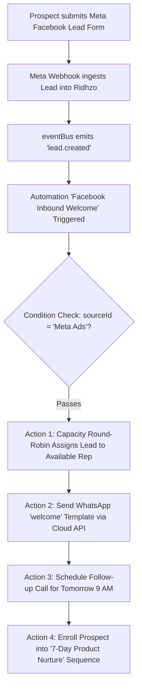

# Ridhzo "Automations" Engine: Product & Marketing Specification

> **Document Type:** Product Architecture, Feature Analysis & Website Marketing Reference  
> **Target Audience:** Chief Revenue Officers, Sales Directors, Revenue Operations Managers, Growth Engineers  
> **Scope:** Automations Hub (`/automations`), Workflow Builder (`/automations/create`, `/automations/[id]/edit`), Event Bus Dispatcher (`handlers.ts`), Execution Engine (`AutomationEngine.ts`), Distributed Worker (`automationWorker.ts`), Prebuilt Templates, and Multi-Condition Matching (`conditions.ts`).  
> **Source Verification:** Verified against live Ridhzo codebase (`src/app/(dashboard)/automations/page.tsx`, `AutomationBuilder.tsx`, `AutomationCard.tsx`, `AutomationTemplates.tsx`, `engine.ts`, `schema.ts`, `templates.ts`, `automationWorker.ts`, `handlers.ts`, `conditions.ts`, and PostgreSQL schema `src/db/schema/automations.ts`).

---

## 1. Executive Overview

Speed and consistency define modern revenue teams. When a high-intent lead submits an inquiry, every second of delay reduces conversion probability. Yet, in most organizations, high-friction administrative tasks—manually routing leads, assigning sales representatives, sending welcome messages, setting reminder tasks, and enrolling prospects into nurture sequences—rely on human memory and manual entry.

**Ridhzo’s Automations Engine** is an event-driven, distributed workflow automation platform built directly into the CRM core:
1. **Event-Driven Reactive Architecture:** Listens directly to domain events emitted across the application (lead creation, assignment changes, status mutations, follow-up completions, and overdue escalations).
2. **Visual "WHEN → IF → THEN" Builder:** A clean interface enabling non-technical revenue leaders to define triggers, filter rules (source, company, status, custom fields, tags), and multi-step action sequences without writing code.
3. **1-Click Prebuilt Templates:** Out-of-the-box workflow recipes for the four most critical revenue workflows (instant WhatsApp welcome, automatic next-day follow-up, overdue manager alert, and won-deal referral request).
4. **Capacity-Aware Smart Routing:** Beyond basic 1-to-1 rep assignment, the engine supports automated round-robin assignment load-balanced by real-time rep workload and capacity caps.
5. **Enterprise-Grade Resilience:** Built on a distributed BullMQ queue with strict idempotency keys, automatic 3-attempt exponential backoff, recursive loop suppression, and partial-action fault tolerance.

```
┌────────────────────────────────────────────────────────────────────────────────────────┐
│                        RIDHZO EVENT-DRIVEN AUTOMATION LIFECYCLE                        │
└────────────────────────────────────────────────────────────────────────────────────────┘
                                              │
                      ┌───────────────────────┴───────────────────────┐
                      ▼                                               ▼
         [Inbound Lead Capture]                             [CRM State Change]
        Meta Ads, Webhooks, Forms                   Status changed, Follow-up overdue
                      │                                               │
                      └───────────────────────┬───────────────────────┘
                                              ▼
                               ┌─────────────────────────────┐
                               │     eventBus (emitter.ts)   │
                               │  lead.created, etc.         │
                               └─────────────────────────────┘
                                              │
                                              ▼
                               ┌─────────────────────────────┐
                               │  handlers.ts: dispatchTrigger│
                               │  • Loop Guard: source≠auto  │
                               │  • Org Tenancy Isolation    │
                               │  • Deduplication Key        │
                               └─────────────────────────────┘
                                              │
                                              ▼
                               ┌─────────────────────────────┐
                               │  BullMQ: automations Queue  │
                               │  Attempts: 3, Backoff: 30s  │
                               └─────────────────────────────┘
                                              │
                                              ▼
                               ┌─────────────────────────────┐
                               │   automationWorker.ts       │
                               │  Idempotency check in DB    │
                               │  (automation_runs table)    │
                               └─────────────────────────────┘
                                              │
                                              ▼
                               ┌─────────────────────────────┐
                               │    AutomationEngine.ts      │
                               └─────────────────────────────┘
                                              │
                     ┌────────────────────────┴────────────────────────┐
                     ▼                                                 ▼
             [EVALUATE CONDITIONS]                             [EXECUTE ACTIONS]
          • Source ID match                                  1. assign_round_robin (Capacity)
          • Advanced field / tag match                       2. schedule_follow_up (dueInDays)
          • Custom fields: customData.foo                    3. send_whatsapp (Meta Cloud API)
          • Boolean AND / OR trees                           4. enroll_in_sequence (Drip)
```

---

## 2. Everything Included in the Automations Subsystem

### A. The Automations Hub (`/automations`)
The control center for organizational workflow automation:
* **Workflow Directory:** Displays all active and inactive automations configured within the tenant organization.
* **1-Tap Power Toggles (`AutomationCard.tsx`):** Enable or pause workflows instantly with a single click. Active workflows execute immediately upon receiving events; paused workflows are skipped safely.
* **Inline Management:** Direct triggers for editing existing workflows (`/automations/[id]/edit`) or deleting outdated automations with relational cascade cleanup.
* **Empty State Guidance:** Contextual guidance and instant access to templates when no workflows are active.

### B. Prebuilt Automation Templates (`AutomationTemplates.tsx`)
Four enterprise templates designed for immediate time-to-value:
1. **Welcome WhatsApp on new lead:**  
   * *Trigger:* `lead.created`  
   * *Action:* Sends an instant Meta-approved WhatsApp welcome template (`welcome`) with personal token variables (`{{name}}`). Guarantees sub-minute speed-to-lead.
2. **Schedule a first follow-up:**  
   * *Trigger:* `lead.created`  
   * *Action:* Automatically creates a scheduled follow-up task due exactly 24 hours out (`dueInDays: 1`), ensuring zero inbound prospects are neglected.
3. **Nudge on overdue follow-ups:**  
   * *Trigger:* `follow_up.overdue`  
   * *Action:* Posts an urgent alert note on the lead's activity timeline, prompting the rep to take immediate corrective action.
4. **Ask for a referral on won deals:**  
   * *Trigger:* `lead.status_changed` (filtered to `won`)  
   * *Action:* Logs a reminder task prompting the account manager to thank the buyer and request customer referrals.

### C. Visual "WHEN → IF → THEN" Builder (`AutomationBuilder.tsx`)
A flexible, three-tier rule builder:

#### 1. "WHEN" (Triggers)
Defines the real-time event that initiates the workflow:
* `lead.created`: Fires immediately when a lead is captured via Meta Lead Ads, API webhooks, CSV import, or manual entry.
* `lead.assigned`: Fires when a lead ownership transitions to a representative.
* `lead.status_changed`: Fires when a lead moves across lifecycle states (e.g., `new` → `active`, `contacted` → `won`).
* *Underlying Engine Triggers:* Also supports `lead.stage_changed`, `lead.tag_added`, `follow_up.scheduled`, `follow_up.completed`, `follow_up.overdue`, and `task.completed`.

#### 2. "IF" (Conditions & Filtering)
Filters which leads should execute the workflow to prevent unwanted mass execution:
* **Source Filtering:** Dropdown selector filtering by lead channel (e.g., *Facebook Ads*, *Google Search*, *Website Consultation Form*, or *Any Source*).
* **Advanced Field Matching:** Matches any standard lead attribute (`status`, `company`, `email`, `phone`, `expectedValue`).
* **Tags & Segmentation:** Evaluates organizational tags assigned to the lead.
* **Custom Fields (`customData.*`):** Dynamically inspects unstructured JSON custom fields (e.g., `customData.budget`, `customData.industry`).
* **Operators:** `equals`, `not_equals`, `contains`, `does_not_contain`, `greater_than`, `less_than`.
* **Boolean Nesting:** Pure recursive condition tree engine supporting complex `AND` / `OR` group logic.

#### 3. "THEN" (Sequential Multi-Step Actions)
Executes an ordered list of tasks sequentially:
* **Assign Lead (`assign_lead`):** Direct assignment to a specific team member.
* **Assign Round-Robin (`assign_round_robin`):** Automatic capacity-aware distribution across active reps, respecting configurable capacity limits (`maxCapacity`).
* **Change Status (`change_status`):** Advances the lead’s stage automatically (e.g., marks a lead `contacted` once outreach is sent).
* **Schedule Follow-up (`schedule_follow_up`):** Generates a formal follow-up task with relative offsets (`dueInDays`, `dueInHours`, `dueInMinutes`) or an absolute datetime override.
* **Create Task (`create_task`):** Logs internal rep to-dos linked to the lead.
* **Add Note (`add_note`):** Injects automated operational or audit notes onto the customer's timeline.
* **Send WhatsApp (`send_whatsapp`):** Dispatches pre-approved Meta Business API WhatsApp templates with personalized token substitution (`{{name}}`, etc.).
* **Enroll in Sequence (`enroll_in_sequence`):** Enrolls the lead into multi-day automated drip campaigns.

---

## 3. Technical Architecture & Database Models

### Database Schema (`src/db/schema/automations.ts`)

Ridhzo structures automations into five specialized relational tables:

```typescript
export const automations = pgTable('automations', {
  id: uuid('id').defaultRandom().primaryKey(),
  organizationId: uuid('organization_id').references(() => organizations.id, { onDelete: 'cascade' }).notNull(),
  name: varchar('name', { length: 255 }).notNull(),
  isActive: boolean('is_active').default(true).notNull(),
  createdAt: timestamp('created_at').defaultNow().notNull(),
  updatedAt: timestamp('updated_at').defaultNow().notNull(),
}, (table) => ({
  orgIdx: index('automations_org_idx').on(table.organizationId),
}));

export const automationTriggers = pgTable('automation_triggers', {
  id: uuid('id').defaultRandom().primaryKey(),
  automationId: uuid('automation_id').references(() => automations.id, { onDelete: 'cascade' }).notNull(),
  type: varchar('type', { length: 255 }).notNull(), // 'lead.created', 'lead.status_changed', etc.
  config: jsonb('config').default({}),
});

export const automationConditions = pgTable('automation_conditions', {
  id: uuid('id').defaultRandom().primaryKey(),
  automationId: uuid('automation_id').references(() => automations.id, { onDelete: 'cascade' }).notNull(),
  config: jsonb('config').default({}), // Recursive { type: 'AND' | 'OR', conditions: [...] }
});

export const automationActions = pgTable('automation_actions', {
  id: uuid('id').defaultRandom().primaryKey(),
  automationId: uuid('automation_id').references(() => automations.id, { onDelete: 'cascade' }).notNull(),
  type: varchar('type', { length: 255 }).notNull(), // 'assign_lead', 'send_whatsapp', etc.
  config: jsonb('config').default({}),
  orderIndex: integer('order_index').default(0),
});

export const automationRuns = pgTable('automation_runs', {
  id: uuid('id').defaultRandom().primaryKey(),
  automationId: uuid('automation_id').references(() => automations.id, { onDelete: 'cascade' }).notNull(),
  leadId: uuid('lead_id').references(() => leads.id, { onDelete: 'cascade' }),
  status: varchar('status', { length: 50 }).notNull(), // 'pending' | 'running' | 'completed' | 'skipped' | 'failed'
  error: varchar('error', { length: 255 }),
  startedAt: timestamp('started_at').defaultNow().notNull(),
  completedAt: timestamp('completed_at'),
  idempotencyKey: varchar('idempotency_key', { length: 255 }).unique(),
  retryCount: integer('retry_count').default(0).notNull(),
});
```

---

## 4. Resilience, Safety & Enterprise Reliability

### 1. Cascading Loop Prevention (Infinite Trigger Guard)
A common vulnerability in CRM automation engines occurs when an automation modifies a lead, which emits a new event, inadvertently re-triggering another automation in an infinite loop.
* **The Guard:** In [`src/lib/events/handlers.ts`](file:///Users/naveenadicharla/Documents/ridhzo/src/lib/events/handlers.ts):
  ```typescript
  if (payload.source === "automation") return;
  ```
* Every database mutation executed by `AutomationEngine` tags its operation with `source: "automation"`. The event dispatcher immediately suppresses these secondary events, preventing status ping-pong or assignment loops.

### 2. Multi-Tenant Boundary Isolation
* Triggers look up the lead's owner organization in the database (`leads.organizationId`).
* Only active automations strictly belonging to the lead's organization (`automations.organizationId = lead.organizationId`) are retrieved. Cross-tenant event leakage is architecturally impossible.

### 3. Distributed Idempotency & De-duplication
* **Composite Idempotency Key:**
  $$\text{idempotencyKey} = \text{automationId} + \text{"-"} + \text{leadId} + \text{"-"} + \text{eventType} [ + \text{"-"} + \text{discriminator} ]$$
* **Event Discriminator:** For one-time events like `lead.created`, the key is unique per lead. For recurring triggers (`lead.status_changed`, `lead.assigned`), the key includes the new status or assignee to allow valid future transitions while suppressing duplicate firings of the exact same transition.
* **BullMQ + DB Unique Constraint:** BullMQ enforces `jobId = idempotencyKey`, immediately discarding duplicate enqueues. Concurrently, `automation_runs.idempotency_key` uses `.onConflictDoNothing()`.

### 4. Fault-Tolerant Partial Execution
* Actions execute sequentially. If a non-fatal third-party action fails (e.g., a WhatsApp message fails because the recipient's phone number is malformed or the tenant has not configured their WhatsApp BSP), the engine does **not** abort.
* It continues executing remaining steps (e.g., assigning the lead, logging the audit note, and enrolling the lead in a nurture sequence).
* Only when **all** actions fail does the engine throw an error, triggering BullMQ's 3-attempt exponential backoff (30-second delay).

### 5. Automated Database Hygiene
* To prevent unbounded database growth from high-volume lead capture, `pruneOldAutomationRuns(retentionDays = 30)` runs periodically to purge execution logs older than 30 days.

---

## 5. Master Trigger & Action Reference

### Supported Triggers

| Trigger Identifier | UI Label | Event Source | Description & Payload |
| :--- | :--- | :--- | :--- |
| `lead.created` | **Lead created** | `eventBus.emit('lead.created')` | Fires on lead intake via web form, Meta Ad, API, or manual creation. |
| `lead.assigned` | **Lead assigned** | `eventBus.emit('lead.assigned')` | Fires when lead owner changes. Payload contains `ownerId` and `assignedById`. |
| `lead.status_changed` | **Lead status changed** | `eventBus.emit('lead.status_changed')` | Fires when lifecycle status is updated. Discriminates by `newStatus`. |
| `lead.stage_changed` | **Stage changed** | `eventBus.emit('lead.stage_changed')` | Fires on pipeline Kanban movement. Discriminates by `stageId`. |
| `lead.tag_added` | **Tag added** | `eventBus.emit('lead.tag_added')` | Fires when a representative or import attaches a tag. |
| `follow_up.scheduled` | **Follow-up scheduled** | `eventBus.emit('follow_up.scheduled')` | Fires when a task is booked. |
| `follow_up.completed` | **Follow-up completed** | `eventBus.emit('follow_up.completed')` | Fires when a task is marked done. |
| `follow_up.overdue` | **Follow-up overdue** | `eventBus.emit('follow_up.overdue')` | Fires when a follow-up crosses its deadline. |
| `task.completed` | **Task completed** | `eventBus.emit('task.completed')` | Fires when a general task is finished. |

### Supported Actions

| Action Identifier | Action Name | Configuration Schema | Operational Effect |
| :--- | :--- | :--- | :--- |
| `assign_lead` | **Assign lead** | `{"userId": "<UUID>"}` | Directly assigns the lead to a specific team member. |
| `assign_round_robin` | **Round-robin balance** | `{"maxCapacity": 25}` | Evaluates active rep workloads and assigns to the rep with greatest available capacity. |
| `change_status` | **Change status** | `{"status": "contacted"}` | Updates lead status, records status history, and fires conversion tracking. |
| `schedule_follow_up` | **Schedule follow-up** | `{"title": "...", "dueInDays": 1}` | Creates a pending follow-up task with a relative offset, updating `leads.nextFollowUpAt`. |
| `create_task` | **Create task** | `{"title": "...", "dueInHours": 4}` | Schedules an internal rep task. |
| `add_note` | **Add note** | `{"content": "..."}` | Writes an automated entry onto the lead's chronological activity timeline. |
| `send_whatsapp` | **Send WhatsApp** | `{"templateName": "welcome", "variables": ["{{name}}"]}` | Dispatches a Meta Business Cloud API template message to the lead. |
| `enroll_in_sequence` | **Enroll in sequence** | `{"sequenceId": "<UUID>"}` | Enrolls the lead into a multi-day automated drip communication sequence. |

---

## 6. Daily Workflows & Real-World Use Cases

### 1. Inbound Facebook Ad Intake (Zero-Touch Speed-to-Lead)

1. **Intake:** A prospect submits a form on a Meta Instagram ad.
2. **Evaluation:** Ridhzo verifies the lead originated from the Meta Ads source.
3. **Execution:**
   * Rep assignment is balanced across the sales team based on capacity.
   * A personalized WhatsApp greeting arrives on the prospect’s phone in under 30 seconds.
   * A reminder task is automatically booked on the assigned rep’s calendar for 9:00 AM tomorrow.
   * The prospect is enrolled into a nurture drip sequence.

### 2. High-Value Escalation Workflow
1. **Trigger:** `lead.created`.
2. **Condition:** `customData.budget greater_than 50000`.
3. **Action:**
   * Assign directly to Senior Enterprise Account Executive.
   * Set lead priority to `high`.
   * Post timeline alert note: *"High-budget enterprise inbound. Priority response required."*
   * Book immediate 1-hour follow-up task.

---

## 7. Marketing-Friendly Feature Explanation

### Why Revenue Leaders Build on Ridhzo Automations

In sales, timing is everything. Studies prove that reaching out to an inbound lead within 5 minutes makes you 21 times more likely to qualify the opportunity. Yet most sales teams lose hours manually copying lead details, pinging reps on Slack, and typing repetitive welcome messages.

**Ridhzo Automations turns your sales playbook into an autonomous 24/7 revenue engine.**

* **Respond Before Your Competitors Wake Up:** The instant a prospect fills out a form, Ridhzo triggers personalized WhatsApp greetings, assigns the right representative, and books their discovery call—completely hands-free.
* **No-Code Simplicity, Enterprise Power:** Build sophisticated multi-step workflows in minutes using our intuitive "When → If → Then" visual builder. Choose from prebuilt templates or create custom logic tailored to your exact sales process.
* **Intelligent Capacity-Aware Routing:** Stop dumping leads on overloaded reps. Ridhzo’s smart round-robin distribution balances deals across your team based on real-time rep capacity.
* **Bulletproof Reliability:** Engineered with distributed BullMQ queues, de-duplication locks, and infinite loop protection, Ridhzo automations execute flawlessly at enterprise scale.

---

## 8. Feature List for Website Marketing

* **Visual "When → If → Then" Workflow Builder**  
  A drag-and-drop, no-code automation canvas that empowers sales operations to design multi-step lead workflows in minutes.

* **Instant-Response Speed-to-Lead**  
  Eliminate manual delays by triggering automated WhatsApp greetings and calendar invites the moment a lead arrives.

* **1-Click Prebuilt Revenue Recipes**  
  Deploy proven workflow templates for inbound welcomes, next-day follow-ups, overdue deal nudges, and referral requests.

* **Capacity-Aware Round-Robin Routing**  
  Automatically balance inbound lead distribution across your sales team based on individual rep capacity and active deal load.

* **Deep Multi-Condition Filtering**  
  Filter automations by lead source, deal size, custom fields, company attributes, and organizational tags using advanced `AND` / `OR` logic.

* **Multi-Channel Sequential Execution**  
  Execute ordered action chains: assign reps, update statuses, schedule follow-up tasks, log notes, send WhatsApps, and trigger drip sequences.

* **Automated Drip Sequence Enrollment**  
  Seamlessly route qualified inbound leads directly into multi-step nurture sequences based on source or customer intent.

* **Infinite Loop & Race Condition Protection**  
  Enterprise safety guards prevent cascading trigger loops, status ping-pong, and duplicate outbound messages.

* **Real-Time Audit Trail & Run Logs**  
  Full transparency into every workflow execution with detailed status indicators, retry counts, and error diagnostics.

---

## 9. Page Blueprints & Wireframes

### Automations Hub (`/automations`)
```
+====================================================================================+
| Automations                                                [+ Create Automation]   |
+====================================================================================+
| START FROM A TEMPLATE                                                              |
| +--------------------+ +--------------------+ +--------------------+ +------------+|
| | [Zap] Welcome WA   | | [Zap] First Call   | | [Zap] Overdue Alert| | [Zap] Won  ||
| | Instant WhatsApp   | | Book call 1d out   | | Nudge rep on stall | | Referral   ||
| | [Use template]     | | [Use template]     | | [Use template]     | | [Use templ]||
| +--------------------+ +--------------------+ +--------------------+ +------------+|
+====================================================================================+
| ACTIVE AUTOMATIONS                                                                 |
|                                                                                    |
| +--------------------------------------------------------------------------------+ |
| | Facebook Ads -> Instant Welcome & Sequence               [Active]              | |
| | Trigger: lead.created | Conditions: Source = Facebook    [Pause] [Edit] [Trash]| |
| +--------------------------------------------------------------------------------+ |
| | High-Value Inbound Escalation                            [Active]              | |
| | Trigger: lead.created | Conditions: Budget > $50,000     [Pause] [Edit] [Trash]| |
| +--------------------------------------------------------------------------------+ |
| | Stalled Deal Manager Nudge                               [Inactive]            | |
| | Trigger: follow_up.overdue                               [Activate][Edit][Trash| |
| +--------------------------------------------------------------------------------+ |
+====================================================================================+
```

### Automation Builder Layout (`/automations/create`)
```
+====================================================================================+
| [<- Go back]  Create Automation                                                    |
+====================================================================================+
| Automation Name: [ Facebook leads -> welcome + nurture                           ] |
|                                                                                    |
| 1. WHEN (trigger)                                                                  |
|    [ Lead created                                                       v ]        |
|                                                                                    |
| 2. IF (conditions) — optional                                                      |
|    Lead source:           [ Facebook Ads                                v ]        |
|    Advanced field match:  [ status           ] [ Equals v ] [ new                ] |
|                                                                                    |
| 3. THEN (actions) — Runs in order                                                  |
|    +-----------------------------------------------------------------------------+ |
|    | (1) [ Assign round-robin (balance across team)                            v ] |
|    |     Config: {"maxCapacity": 25}                                             | |
|    +-----------------------------------------------------------------------------+ |
|    | (2) [ Send WhatsApp                                                       v ] |
|    |     Config: {"templateName": "welcome", "variables": ["{{name}}"]}          | |
|    +-----------------------------------------------------------------------------+ |
|    | (3) [ Enroll in sequence                                                  v ] |
|    |     Sequence: [ 7-Day Product Onboarding Nurture                          v ] |
|    +-----------------------------------------------------------------------------+ |
|    [+ Add action]                                                                  |
|                                                                                    |
| [ Save automation ]                                                                |
+====================================================================================+
```

---

## 10. Technical Reference

### Routes & Entry Points
* **Automations Dashboard:** [`src/app/(dashboard)/automations/page.tsx`](file:///Users/naveenadicharla/Documents/ridhzo/src/app/(dashboard)/automations/page.tsx)
* **Create Automation:** [`src/app/(dashboard)/automations/create/page.tsx`](file:///Users/naveenadicharla/Documents/ridhzo/src/app/(dashboard)/automations/create/page.tsx)
* **Edit Automation:** [`src/app/(dashboard)/automations/[id]/edit/page.tsx`](file:///Users/naveenadicharla/Documents/ridhzo/src/app/(dashboard)/automations/[id]/edit/page.tsx)

### UI Components (`src/components/automations/`)
* **Visual Builder:** [AutomationBuilder.tsx](file:///Users/naveenadicharla/Documents/ridhzo/src/components/automations/AutomationBuilder.tsx)
* **Workflow Card:** [AutomationCard.tsx](file:///Users/naveenadicharla/Documents/ridhzo/src/components/automations/AutomationCard.tsx)
* **Template Selector:** [AutomationTemplates.tsx](file:///Users/naveenadicharla/Documents/ridhzo/src/components/automations/AutomationTemplates.tsx)

### Core Engine & Services
* **Automation Engine:** [`src/lib/automation/engine.ts`](file:///Users/naveenadicharla/Documents/ridhzo/src/lib/automation/engine.ts) (`AutomationEngine.evaluateAndExecute`, `resolveDueAt`)
* **Event Dispatcher & Loop Guard:** [`src/lib/events/handlers.ts`](file:///Users/naveenadicharla/Documents/ridhzo/src/lib/events/handlers.ts) (`dispatchTrigger`, loop suppression `source === "automation"`)
* **Condition Evaluator:** [`src/lib/leads/conditions.ts`](file:///Users/naveenadicharla/Documents/ridhzo/src/lib/leads/conditions.ts) (`evaluateConditionGroup`, `readField`)
* **Template Definitions:** [`src/lib/automation/templates.ts`](file:///Users/naveenadicharla/Documents/ridhzo/src/lib/automation/templates.ts) (`AUTOMATION_TEMPLATES`, `buildTemplatePayload`)
* **Server Actions:** [`src/lib/actions/automations.ts`](file:///Users/naveenadicharla/Documents/ridhzo/src/lib/actions/automations.ts) (`createAutomation`, `updateAutomation`, `createAutomationFromTemplate`, `toggleAutomation`, `deleteAutomation`)

### Background Queue & Workers
* **BullMQ Worker:** [`src/lib/jobs/workers/automationWorker.ts`](file:///Users/naveenadicharla/Documents/ridhzo/src/lib/jobs/workers/automationWorker.ts) (`automationWorker`, `AUTOMATION_QUEUE_NAME = "automations"`, concurrency 3)
* **Database Maintenance:** [`pruneOldAutomationRuns`](file:///Users/naveenadicharla/Documents/ridhzo/src/lib/jobs/workers/automationWorker.ts) (purges runs $>30$ days)

### Database Tables (`src/db/schema/automations.ts`)
* `automations`: Primary tenant automation records and active state.
* `automationTriggers`: Event trigger definitions.
* `automationConditions`: JSONB condition trees.
* `automationActions`: Ordered action pipeline.
* `automationRuns`: Execution audit trail with unique idempotency keys.
