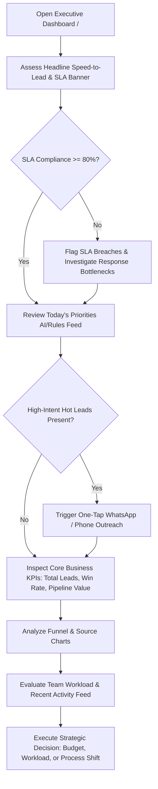

# Ridhzo Executive Dashboard: Product & Marketing Specification

> **Document Type:** Product Architecture, Feature Analysis & Website Marketing Reference  
> **Target Audience:** Business Executives, Product Marketing Managers, Enterprise Buyers  
> **Source Verification:** Verified against live Ridhzo codebase (`src/app/(dashboard)/page.tsx`, `AnalyticsService`, `SlaAnalyticsService`, `ContentSharingService`, `NextBestActionService`, and PostgreSQL/Drizzle schema).

---

## 1. Executive Dashboard Overview

### What the Executive Dashboard Is
The **Ridhzo Executive Dashboard** (`/`) is the central intelligence and control center of the Ridhzo lead management and sales execution platform. It aggregates organization-wide commercial performance into a unified, real-time command surface. Rather than requiring senior business leaders to navigate through disjointed operational lists, spreadsheets, or raw activity logs, the Executive Dashboard distills high-velocity sales pipelines into four critical dimensions:
1. **Speed-to-Lead & SLA Compliance:** Real-time visibility into how rapidly incoming leads receive first contact.
2. **High-Intent Content Engagement:** Immediate tracking of leads actively viewing shared documents, quotes, and collateral.
3. **Pipeline Volume & Commercial Health:** Dynamic tracking of total active volume, weighted pipeline currency value, and conversion efficiency.
4. **Team Capacity & Channel Attribution:** Source-by-source inbound performance, team workload distribution, and live operational activity feeds.

### Why It Exists in Ridhzo
In modern B2B and high-touch B2C sales environments (such as performance marketing agencies, real estate, financial services, and consultancy), deals are won or lost in the first few minutes after a lead expresses interest. Traditional Customer Relationship Management (CRM) tools operate as passive databases where data is buried and reports lag behind by days. 

Ridhzo was engineered with an opinionated commercial philosophy: **"First-to-respond wins the deal."** The Executive Dashboard exists to give leadership uninterrupted transparency into this response velocity, identifying revenue bottlenecks, operational breaches, and high-value conversion windows as they occur.

### Who Uses It
* **Chief Executive Officers (CEOs) & Founders:** Gain an instant, single-pane-of-glass overview of company revenue trajectory, marketing channel effectiveness, and conversion health.
* **Chief Commercial Officers (CCOs) & VPs of Sales:** Monitor pipeline capacity, hold teams accountable to Service Level Agreements (SLAs), evaluate individual rep workloads, and forecast revenue.
* **Heads of Marketing & Growth Directors:** Assess lead generation channel ROI, identify which inbound marketing campaigns produce qualified pipeline, and track whether sales teams are converting marketing-generated opportunities.
* **Sales Directors & Branch/Team Managers:** Maintain visibility across sales representatives, track overdue follow-up tasks, and intervene on high-priority opportunities before deals go cold.

### Business Problems It Solves
* **The "Lead Black Hole":** Marketing spends significant budgets generating leads that sit uncontacted for hours or days. The dashboard tracks average first response time and SLA breaches to eradicate neglected inquiries.
* **Fragmented Sales Pipeline Visibility:** Eliminates the guesswork regarding active pipeline value and current deal distribution across different funnel stages.
* **Invisible Buyer Intent:** In traditional workflows, sales reps have no idea when a prospect is reviewing a proposal. Ridhzo detects real-time document and link engagement, surfacing active interest directly on the executive interface.
* **Unbalanced Workload Allocation:** Visualizes lead counts per representative to prevent rep burnout and eliminate unassigned or bottlenecked leads.
* **Delayed Decision-Making:** Removes dependency on end-of-month manual spreadsheet reconciliations by delivering live database aggregations.

### Decisions It Helps Executives Make
* **Marketing Budget Allocation:** Double down on top-performing acquisition channels (e.g., Meta Ads vs. Organic vs. Partner Portals) and cut spend on low-yield sources.
* **Staffing & Resource Balancing:** Reallocate inbound leads from overburdened sales representatives to reps with available capacity.
* **Sales Process & SLA Optimization:** Pinpoint whether missed targets stem from slow initial outreach (SLA failure), poor mid-funnel follow-ups (high overdue tasks), or low closing efficiency.
* **Urgent Deal Intervention:** Intervene or prompt reps to act on high-intent buyer signals (e.g., a lead repeatedly opening a shared proposal).

### How It Differs from Operational Dashboards and Regular Reports
| Dimension | Executive Dashboard (`/`) | Operational Dashboards (e.g., `/my-dashboard`, `/follow-ups`) | Static / Scheduled Reports |
| :--- | :--- | :--- | :--- |
| **Scope** | Tenant-wide, strategic overview across all reps, teams, and channels | Individual sales representative's assigned leads and personal tasks | Historical, snapshot-in-time exports (CSV/PDF) |
| **Primary Goal** | High-level business governance, SLA enforcement, and pipeline health | Daily task execution, calling leads, and clearing pending follow-ups | Post-mortem accounting, board decks, and compliance auditing |
| **Data Cadence** | Live database aggregations rendered per request (no stale cache) | Live personal workflow queue | Asynchronous, delayed (daily, weekly, or monthly) |
| **Interactivity** | High-level date filtering, cross-channel breakdowns, executive priorities | Task checking, call logging, note taking, status updating | Read-only static charts or tabular data |

### How an Executive Uses It During a Working Day
1. **Morning Briefing (08:30 AM):** 
   The executive opens the dashboard and checks the **Speed to First Response** banner and **SLA Compliance Rate** from the previous 24 hours. If SLA compliance drops below 80%, the executive immediately flags response bottlenecks to sales team leads.
2. **Mid-Day Pipeline Inspection (01:00 PM):** 
   The executive reviews the **MetricsCards** and **Pipeline Distribution** area chart to assess deal movement. They inspect **Follow-up Tasks**; a surge in overdue tasks signals operational drag requiring operational escalation.
3. **High-Value Opportunity Check (03:30 PM):** 
   In the **Today's Priorities** panel, the executive reviews top opportunities that are actively opening shared proposals or collateral. If an enterprise deal shows high engagement, the executive can initiate a one-tap WhatsApp message or phone call directly from the interface.
4. **Evening Review & Resource Rebalancing (06:00 PM):** 
   Using the **Leads by Source** and **Lead Distribution by Owner** charts, the executive identifies which inbound sources drove today's growth and ensures that leads distributed across representatives remain balanced.

---

## 2. Everything Included in the Executive Dashboard

Based directly on the live implementation in `src/app/(dashboard)/page.tsx`, `src/components/dashboard/`, and associated backend services, the Executive Dashboard contains the following components and features:

### 1. Executive Headline & Date Filter Bar
* **Feature Name:** Dashboard Header & Date Filter (`DashboardDateFilter`)
* **What It Shows:** Page title, strategic subtitle, and interactive range buttons (`All Time`, `Today`, `Last 7 Days`, `Last 30 Days`, `This Month`).
* **Why It Matters:** Enables instant temporal slicing of pipeline performance without page reloading or complex configuration.
* **Data Source:** URL Search Parameters (`?range=...`) passed to server-side database aggregations.
* **Calculation:** Computes dynamic UTC calendar boundaries:
  * `today`: Current date from `00:00:00.000` to now.
  * `7d`: Rolling 7-day timestamp (`now - 7 * 86400000ms`).
  * `30d`: Rolling 30-day timestamp (`now - 30 * 86400000ms`).
  * `this_month`: 1st day of the current calendar month at `00:00:00.000` to now.
  * `all`: Unbounded time horizon.
* **Filters:** Date range selector.
* **Interactions:** One-click button toggle updating URL state via Next.js router.
* **Action Supported:** Isolates recent marketing campaign performance vs. cumulative historical pipeline metrics.

### 2. Onboarding Zero-State Banner (`GettingStarted`)
* **Feature Name:** First-Run Setup Guide
* **What It Shows:** A structured 4-step onboarding pathway shown exclusively when `sla.totalLeads === 0`.
  1. *Connect a lead source* (Routes to `/settings/sources` for Website or Facebook Lead Ads integration).
  2. *Choose how you message* (Routes to `/settings` for Personal WhatsApp or Meta Cloud Business API selection).
  3. *Add your first lead* (Routes to `/leads` for manual creation or CSV import).
  4. *Turn on instant auto-reply* (Routes to `/automations` for the automated Welcome WhatsApp flow).
* **Why It Matters:** Eliminates blank dashboard paralysis for newly created tenant workspaces.
* **Data Source:** `SlaAnalyticsService.getSlaMetrics(organizationId)`.
* **Calculation:** Rendered if `totalLeads === 0`.
* **Action Supported:** Accelerates time-to-value for new enterprise accounts.

### 3. Response Velocity & Buying Intent Banner
* **Feature Name:** SLA & Content Engagement Bar
* **What It Shows:** Three mission-critical executive health indicators in a unified visual container:
  1. **Avg. Speed to First Response:** Mean elapsed minutes between lead creation and the first recorded contact event (`lastContactedAt`), accompanied by total contacted count (`X of Y leads contacted`).
  2. **Content Opened (7d):** Total views of shared trackable links in the past 7 days, paired with an alert linking to cold/unopened content (`/leads/hot`) when unviewed shares exist.
  3. **SLA Compliance:** Percentage of leads contacted within the organizational SLA threshold (default: 15 minutes). Breached count is explicitly stated.
* **Why It Matters:** Focuses management directly on response velocity and active client interest—the two highest predictors of deal closing.
* **Data Source:** `SlaAnalyticsService.getSlaMetrics(organizationId)` and `ContentSharingService.orgEngagementStats(organizationId)`.
* **Calculation:**
  * *Avg First Contact Minutes:* $\frac{\sum (\text{lastContactedAt} - \text{createdAt})}{\text{contactedLeads Count}}$ (converted to minutes, formatted into minutes, hours, or days).
  * *SLA Compliance Rate:* $\frac{\text{Compliant Leads Count}}{\text{Total Leads Count}} \times 100$. Dynamic visual badge: Emerald (`>= 80%`), Orange (`< 80%`).
  * *Content Opens:* Count of rows in `shared_link_views` where `viewed_at >= now - 7 days`.
* **Interactions:** Interactive hyperlink to `/leads/hot` for unengaged collateral re-targeting.
* **Action Supported:** Enforces operational discipline on lead responsiveness and identifies proposals that require follow-up nudges.

### 4. Today's Priorities Panel (`PriorityActions`)
* **Feature Name:** Next Best Action Intelligence Feed
* **What It Shows:** A ranked list (top 6) of urgent, high-priority opportunities requiring leadership or rep intervention.
* **Why It Matters:** Moves beyond passive analytics into proactive execution, showing *who* to contact, *why* to contact them, and providing *direct communication triggers*.
* **Data Source:** `LeadService.listPriorityCandidates()`, cross-referenced with `ContentSharingService.recentlyEngagedLeadIds()` and evaluated via `NextBestActionService.getRecommendation()`.
* **Calculation & Scoring Logic:**
  * Pulls up to 200 high-priority candidates: leads with status `new` and uncontacted; leads with open status and overdue follow-up; active leads with lead score $\ge 70$; or leads with content views in the last 72 hours.
  * Sorts engaged content viewers to the very top, followed by descending `score`.
  * Generates rule-based contextual reasons (e.g., *"Opened 'your shared content' 1 time recently — strike while interest is high"* or *"New lead requires initial outreach within 24 hours"*).
* **Interactions:**
  * Clickable lead name navigating to `/leads/[id]`.
  * Contextual status badge (`destructive`, `default`, `secondary`).
  * **One-Tap WhatsApp Button:** Direct web/app link to `https://wa.me/[phone]?text=[pre-filled follow-up]`.
  * **Click-to-Call Button:** Native `tel:[phone]` link.
* **Action Supported:** Enables instant, friction-free outreach to high-probability converting leads.

### 5. Core Metric KPI Cards (`MetricsCards`)
* **Feature Name:** Executive KPI Cards (4 Cards)
* **What It Shows:**
  1. **Total Leads:** Total volume, split into new and active count.
  2. **Conversion Rate:** Win rate percentage, with exact won vs. lost/unqualified ratio.
  3. **Pipeline Value:** Total monetary value of active deals formatted in workspace currency.
  4. **Follow-up Tasks:** Overdue task count, tasks due today, and overall completion rate percentage.
* **Why It Matters:** Provides standard executive financial and operational sanity checks.
* **Data Source:** `AnalyticsService.getLeadMetrics(filters)` and `AnalyticsService.getFollowUpMetrics(filters)`.
* **Calculation:**
  * *Total Leads:* Count of non-deleted leads matching filters.
  * *Conversion Rate:* $\frac{\text{Won}}{\text{Won} + \text{Lost} + \text{Unqualified}} \times 100$. (Unqualified leads are calculated as closed losses to avoid flattering conversion percentages).
  * *Pipeline Value:* Sum of `expectedValue` for leads in the `in_progress` status category.
  * *Follow-up Completion Rate:* $\frac{\text{Completed Follow-ups}}{\text{Total Follow-ups}} \times 100$.
* **Filters:** Inherits active date range, owner ID, and team ID filters.
* **Action Supported:** Evaluates cash pipeline trajectory and operational backlog.

### 6. Leads by Source Chart (`LeadsBySourceChart`)
* **Feature Name:** Inbound Acquisition Channel Breakdown
* **What It Shows:** Vertical bar chart illustrating lead volume generated across every configured source (e.g., Facebook Ads, Google Ads, Website Forms, Organic, Direct).
* **Why It Matters:** Demonstrates where marketing spend is converting into real sales volume.
* **Data Source:** `AnalyticsService.getLeadsBySource(filters)`.
* **Calculation:** Grouped SQL aggregation joining `leads` with `lead_sources` on `leads.source_id = lead_sources.id`.
* **Interactions:** Recharts dark-mode tooltip displaying exact lead counts and percentages.
* **Action Supported:** Informs budget allocation decisions across marketing channels.

### 7. Pipeline Distribution Chart (`LeadsByStageChart`)
* **Feature Name:** Pipeline Stage Volume Curve
* **What It Shows:** Smooth gradient Area Chart depicting lead distribution across pipeline stages (`New`, `Active`, `Won`, `Lost`, `Unqualified`).
* **Why It Matters:** Highlights pipeline bottlenecks (e.g., a bulge at "Active" with low throughput to "Won").
* **Data Source:** `AnalyticsService.getPipelineDistribution(filters)`.
* **Calculation:** Grouped counts across status categories mapped via `CustomStatusSchemaService`.
* **Interactions:** Interactive hover tooltip displaying stage name and volume.
* **Action Supported:** Identifies where deals are dropping off or stalling in the qualification funnel.

### 8. Lead Distribution by Owner Chart (`LeadsByOwnerChart`)
* **Feature Name:** Representative Workload Allocation
* **What It Shows:** Horizontal bar chart displaying the total number of assigned leads per sales team member (or "Unassigned").
* **Why It Matters:** Prevents uneven lead distribution, ensuring high performers are adequately supplied and leads are not neglected in "Unassigned" status.
* **Data Source:** `AnalyticsService.getLeadsByOwner(filters)`.
* **Calculation:** SQL join between `leads` and `users` on `leads.owner_id = users.id`.
* **Interactions:** Interactive hover tooltip indicating exact lead load per rep.
* **Action Supported:** Prompts rebalancing of automated round-robin assignment rules.

### 9. Recent Activity Timeline Feed (`RecentActivityFeed`)
* **Feature Name:** Real-Time Operational Audit Feed
* **What It Shows:** The 10 most recent chronological actions performed across the entire organization, with icon-coded event types (`Message`, `Note`, `Assignment`, `Tag`, `System/Clock`), actor name, lead link, and localized relative time.
* **Why It Matters:** Gives executives a pulse check on whether sales reps are actively working deals.
* **Data Source:** `AnalyticsService.getRecentActivity(filters)`.
* **Calculation:** Queries `activities` joined with `leads` and `users`, ordered by `occurredAt DESC` limited to 10 rows.
* **Interactions:** Direct clickable navigation link to the individual lead's profile (`/leads/[id]`).
* **Action Supported:** Instant spot-checking of representative notes, outbound WhatsApp messages, and lead reassignments.

---

## 3. Executive Dashboard Features

Below is the complete categorization of features supported by the live application codebase, clearly distinguishing what is displayed directly in the Executive Dashboard, what exists in the backend analytics engine, and what is located in secondary modules:

### Business Overview
* **Tenant-Scoped Executive Control:** Isolated multi-tenant workspace architecture (`requireOrg()`) ensuring that data is strictly partitioned per organization.
* **Dynamic Currency & Locale Formatting:** All monetary and date metrics automatically adapt to the organization's regional settings (configured in `organizations.currency`, `locale`, `dateFormat`, `timezone`) via `getOrgFormat`.
* **First-Run Empty State Guidance:** Automated detection of zero-lead states with structured onboarding recommendations.

### Lead Performance & Speed-to-Lead
* **Average Speed to First Contact:** Quantifies operational response time from lead generation to first recorded outreach.
* **SLA Threshold Compliance Monitoring:** Tracks percentage of leads contacted within 15 minutes and flags SLA breaches.
* **Lead Volume Status Tracking:** Real-time visibility into open vs. in-progress volume.

### Sales Performance & Pipeline Health
* **Pipeline Stage Distribution:** Multi-stage funnel visualization covering New, Active, Won, Lost, and Unqualified stages.
* **Custom Status Category Normalization:** Support for enterprise-customized lead stages via `CustomStatusSchemaService` (mapping arbitrary custom status keys into standard analytical categories: `open`, `in_progress`, `won`, `lost`, `unqualified`).
* **Follow-up Operational Accountability:** Tracks task completion rates, overdue follow-up counts, and same-day task deadlines.

### Revenue & Financial Metrics
* **Active Pipeline Valuation:** Real-time cumulative calculation of `expectedValue` for active opportunities.
* **Win/Loss Conversion Rate:** Accurate closed-loop calculation factoring in both disqualified and lost deals to prevent artificial inflation.
* **Backend Expected Revenue Calculation (Engine Feature):** `AnalyticsService.getLeadMetrics` calculates cumulative closed-won revenue (`expectedRevenue`), accessible via the API and backend analytics.

### Customer & Buyer Insights
* **7-Day Document & Content Engagement:** Tracks total views on shared collateral (proposals, brochures, spec sheets).
* **Unengaged Content Detection:** Identifies shared proposals that prospects have ignored for over 24 hours, offering direct re-engagement paths.
* **Predictive Next Best Action:** Proprietary heuristic engine identifying warm buying signals and recommending high-impact sales maneuvers.

### Team & Representative Performance
* **Owner Lead Allocation:** Horizontal comparative visualization of active workload per representative.
* **Team-Level Aggregation (Engine Feature):** `AnalyticsService.getLeadsByTeam` provides lead grouping by designated sales teams. *(Available in the analytics service and backend API)*.
* **Multi-Branch Hierarchy Note:** *Ridhzo does not use a physical "Branch" schema.* Instead, Ridhzo organizes sales operations using **Organizations (Tenants)**, **Teams**, and **Individual Users (Owners)**. Enterprise branch models map cleanly to Ridhzo's Team and Organization structures.

### Activity Monitoring & Auditability
* **Multi-Channel Activity Stream:** Real-time feed capturing notes, outbound messaging, team reassignments, and tagging.
* **Localized Timestamp Formatting:** User-facing timestamps rendered according to workspace timezone settings.

### Filters & Controls
* **Temporal Presets:** Single-click date boundary switching (`All Time`, `Today`, `7d`, `30d`, `This Month`).
* **URL Parameter Filtering:** Support for `ownerId` and `teamId` URL parameters to filter dashboard queries down to specific reps or teams.

### Complementary Advanced Analytics (Located in `/insights`)
To maintain high responsiveness, deep statistical analyses are separated into the dedicated **Insights** interface (`src/app/(dashboard)/insights/page.tsx`). These include:
* *Pipeline Health Scorecard & Composite Grading (A/B/C/D)*
* *Revenue Forecasting (Weighted Pipeline & Forecast Value)*
* *Win/Loss Reason Analysis (`lostReason` breakdown)*
* *Acquisition Channel ROI & Lead Acquisition Cost*
* *Pipeline Velocity & Cycle Time (Average Days to Close)*
* *Stage Stagnation & Pipeline Aging Matrix*
* *Customer Lifetime Value (LTV) & Cohort Retention*
* *Geographic Concentration Analytics*
* *Rep Capacity & Workload Balancing Scorecards*

---

## 4. Dashboard Metrics

The following table documents every Key Performance Indicator (KPI) presented on the Ridhzo Executive Dashboard:

| KPI | Meaning | Calculation | Business Use |
| :--- | :--- | :--- | :--- |
| **Avg. Speed to First Response** | Average time elapsed from when an inbound lead is created to when a rep initiates contact. | $\frac{\sum (\text{lastContactedAt} - \text{createdAt})}{\text{contactedLeads Count}}$ | Identifies response bottlenecks. Faster response directly correlates with higher win rates. |
| **SLA Compliance Rate** | Percentage of all organization leads contacted within the designated SLA window (default 15 minutes). | $\frac{\text{Leads Contacted in } \le 15\text{m}}{\text{Total Leads}} \times 100$ | Enforces service standards and holds sales management accountable for lead decay. |
| **SLA Breached Count** | Absolute count of leads that exceeded the SLA window without outreach or remain uncontacted past 15 minutes. | Count of leads where response time $> 15\text{m}$ or age $> 15\text{m}$ uncontacted | Pinpoints the exact volume of neglected prospective customers. |
| **Content Opened (7d)** | Total number of client views logged on trackable shared links/documents over the past 7 days. | Count of rows in `shared_link_views` where `viewed_at >= now - 7 days` | Measures active customer buying intent and interest in shared collateral. |
| **Ignored Content Count** | Number of shared documents that have registered 0 opens after 24 hours. | Count of `shared_links` where `view_count = 0` and `created_at < now - 24h` | Flags prospects who may require follow-up nudges or alternative outreach channels. |
| **Total Leads** | Total count of active, non-deleted leads matching the current workspace and date filter. | $\text{Count of leads where deletedAt IS NULL}$ | Core operational volume indicator showing overall business top-of-funnel scale. |
| **New Leads** | Leads in the initial intake stage awaiting engagement. | Count of leads where status category = `'open'` | Monitors intake backlog awaiting sales rep assignment or qualification. |
| **Active Leads** | Leads currently engaged in active sales conversations. | Count of leads where status category = `'in_progress'` | Represents work-in-progress pipeline requiring ongoing nurturing. |
| **Conversion Rate (Win Rate)** | Percentage of closed opportunities that resulted in a successfully won customer. | $\frac{\text{Won}}{\text{Won} + \text{Lost} + \text{Unqualified}} \times 100$ | Primary sales efficiency metric. Unqualified leads count against win rate to maintain calculation integrity. |
| **Pipeline Value** | Cumulative monetary expected value of all active in-progress opportunities. | $\sum \text{expectedValue for active leads}$ | Indicates short-term revenue pipeline formatted in the workspace's currency. |
| **Overdue Follow-ups** | Count of scheduled follow-up tasks whose due date has elapsed without completion. | Count of `follow_ups` where $\text{status} = \text{'pending'}$ and $\text{dueAt} < \text{now}$ | Immediate indicator of operational slippage or rep burnout. |
| **Due Today Follow-ups** | Tasks scheduled for completion before the end of the current calendar day. | Count of `follow_ups` where $\text{status} = \text{'pending'}$ and $\text{dueAt}$ is today | Operational work queue volume for the current day. |
| **Follow-up Completion Rate** | Percentage of all assigned follow-up tasks that have been successfully closed. | $\frac{\text{Completed Follow-ups}}{\text{Total Follow-ups}} \times 100$ | Measures overall team task compliance and execution discipline. |
| **Median Response Time (Engine)** | Statistical midpoint response time across all contacted leads. | $\text{Median of } (\text{lastContactedAt} - \text{createdAt})$ | Provides an un-skewed benchmark immune to historical outlier leads. |
| **< 5-Min Response Rate (Engine)** | Percentage of incoming leads contacted within 5 minutes of creation. | $\frac{\text{Leads Contacted in } \le 300\text{s}}{\text{Total Leads}} \times 100$ | Measures elite speed-to-lead capability (the gold standard in performance marketing). |

---

## 5. Charts and Visualizations

Every chart on the Ridhzo Executive Dashboard is rendered using a unified monochrome aesthetic designed for readability and dark-mode elegance:

```
+------------------------------------------------------------------------------------+
|  Leads by Source [Bar Chart, col-span-4]  |  Pipeline Distribution [Area Chart]    |
|  (Distribution across channels)           |  (Leads broken down by current stage)  |
+-------------------------------------------+----------------------------------------+
|  Lead Distribution by Owner [H-Bar]       |  Recent Activity [Timeline Feed]       |
|  (Assigned leads per sales rep)           |  (Live chronological actions across org)|
+------------------------------------------------------------------------------------+
```

### 1. Leads by Source Chart
* **Component:** `LeadsBySourceChart` (`src/components/dashboard/Charts.tsx`)
* **Chart Type:** Vertical Bar Chart (`BarChart` via Recharts).
* **Data Represented:** Total count of incoming leads grouped by originating channel (e.g., Meta Ads, Google Ads, Inbound Website, Partner API, Direct/Organic).
* **Time Period:** Dictated by the global Date Filter (`all`, `today`, `7d`, `30d`, `this_month`).
* **Available Filters:** Date Range, Owner ID, Team ID.
* **Executive Takeaway:** Directly identifies which customer acquisition channels are generating volume, allowing marketing leaders to optimize ad spend.

### 2. Pipeline Distribution Chart
* **Component:** `LeadsByStageChart` (`src/components/dashboard/Charts.tsx`)
* **Chart Type:** Area Chart with Gradient Fill (`AreaChart` via Recharts).
* **Data Represented:** Volume of leads positioned across each stage of the sales pipeline (`New`, `Active`, `Won`, `Lost`, `Unqualified`).
* **Time Period:** Dictated by global Date Filter.
* **Available Filters:** Date Range, Owner ID, Team ID.
* **Executive Takeaway:** Visualizes the conversion funnel shape. Bulges in intermediate stages highlight workflow friction or lack of follow-up velocity.

### 3. Lead Distribution by Owner Chart
* **Component:** `LeadsByOwnerChart` (`src/components/dashboard/Charts.tsx`)
* **Chart Type:** Horizontal Bar Chart (`BarChart layout="vertical"` via Recharts).
* **Data Represented:** Total volume of leads actively assigned to each sales representative or categorized as "Unassigned".
* **Time Period:** Dictated by global Date Filter.
* **Available Filters:** Date Range, Owner ID, Team ID.
* **Executive Takeaway:** Reveals workload equity across the sales force. Highlights whether unassigned leads are accumulating or certain reps are over-allocated.

### 4. Recent Activity Timeline Feed
* **Component:** `RecentActivityFeed` (`src/components/dashboard/RecentActivityFeed.tsx`)
* **Widget Type:** Chronological Activity Timeline Feed (10 latest actions).
* **Data Represented:** Real-time log entries capturing user notes, customer calls, outgoing messages, lead stage movements, and tags.
* **Time Period:** Rolling real-time window.
* **Available Filters:** Date Range, Organization Scope.
* **Executive Takeaway:** Confirms ongoing sales outreach in real time. Provides immediate verification that team members are active.

---

## 6. Filters and Controls

The Executive Dashboard provides flexible filtering to segment organization-wide data:

### 1. Date Range Filter (`DashboardDateFilter`)
* **UI Location:** Top right header.
* **Control Mechanism:** 5 quick-toggle buttons updating the `?range=` URL query string without losing page state.
* **Filter Options:**
  * **All Time (`range=all`):** Removes date constraints; calculates historical aggregates.
  * **Today (`range=today`):** Limits queries to records created from midnight of the current day to the present moment.
  * **Last 7 Days (`range=7d`):** Rolling 168-hour window.
  * **Last 30 Days (`range=30d`):** Rolling 720-hour window.
  * **This Month (`range=this_month`):** Constrains data from the 1st day of the current calendar month.
* **Impact on Dashboard:** Re-executes server-side queries for `getLeadsBySource`, `getPipelineDistribution`, `getLeadsByOwner`, `getLeadMetrics`, `getFollowUpMetrics`, and `getRecentActivity`.

### 2. Owner & Team URL Filtering (`ownerId`, `teamId`)
* **Control Mechanism:** Query parameters parsed directly by `ExecutiveDashboardPage` (`?ownerId=...` and `?teamId=...`).
* **Backend Support:** `AnalyticsFilters` natively applies SQL `eq(leads.ownerId, filters.ownerId)` and `eq(leads.teamId, filters.teamId)` across all metrics and charts.
* **Impact on Dashboard:** Enables executive managers to drill into a single team or individual sales representative while using the executive view.

### 3. Structural Comparison: Branches vs. Teams in Ridhzo
* Traditional ERP software often enforces rigid geographic "Branch" tables.
* Ridhzo employs a flexible multi-tenant model: **Organizations** represent independent business entities, **Teams** represent commercial divisions or regional offices, and **Users** represent individual sales representatives.
* Filtering by `teamId` serves the exact business function of comparing regional branches or specialized business units.

---

## 7. Executive Use Cases

### 1. Morning Review: First-Response Velocity Audit
* **Scenario:** An executive arrives at 08:30 AM to evaluate overnight lead handling.
* **Dashboard Action:** Checks the **Speed to First Response** banner and **SLA Compliance Rate**.
* **Outcome:** Discovers that overnight web leads averaged 45 minutes to first contact, breaching the 15-minute SLA. The executive can adjust overnight shift routing or activate the automated instant WhatsApp response flow.

### 2. Marketing ROI & Inbound Channel Assessment
* **Scenario:** The company recently launched a major paid marketing campaign across Meta and Google Ads.
* **Dashboard Action:** The executive toggles the date filter to `Last 7 Days` and evaluates the **Leads by Source** chart alongside the **Conversion Rate** card.
* **Outcome:** Identifies that while Meta Ads generated 60% of inbound volume, Google Ads converted at 3.5x higher efficiency. Informs marketing to reallocate budget toward higher-intent search terms.

### 3. Intervening on Hot Prospect Engagement
* **Scenario:** Mid-afternoon review of sales activity.
* **Dashboard Action:** Inspects the **Today's Priorities** panel and notes that an active high-value lead just viewed a proposal document multiple times.
* **Outcome:** The executive clicks the **One-Tap WhatsApp** button directly on the dashboard card to send a pre-filled follow-up message to the prospect while their buying interest is active.

### 4. Resolving Follow-Up Backlog & Operational Drag
* **Scenario:** Deal closing velocity has slowed down toward the end of the quarter.
* **Dashboard Action:** Checks the **Follow-up Tasks** card and notes 38 overdue follow-ups alongside a low completion rate (42%).
* **Outcome:** Identifies that sales representatives are bottlenecked on manual administrative tasks, prompting team leads to run a follow-up clearing session.

### 5. Workload Equity & Rep Capacity Balancing
* **Scenario:** Certain sales representatives report feeling overwhelmed while overall deal velocity is uneven.
* **Dashboard Action:** Inspects the **Lead Distribution by Owner** chart.
* **Outcome:** Discovers that one senior rep is holding 85 active leads while two newer reps have fewer than 15 each. Management updates assignment rules to balance incoming lead distribution.

---

## 8. Executive Workflow

A structured step-by-step workflow illustrating how an executive navigates the Ridhzo Executive Dashboard during daily operations:



1. **Access Command Center:** Navigate to the root URL (`/`) with tenant session authenticated via RBAC.
2. **Review SLA & Response Velocity:** Review the top headline bar for average response minutes and SLA compliance percentage.
3. **Scan Real-Time Buying Signals:** Check the 7-day content open count. If unviewed proposals exist, click through to `/leads/hot` to trigger nudges.
4. **Inspect High-Priority Opportunities:** Review **Today's Priorities** for immediate deal triggers, utilizing one-tap WhatsApp links for rapid outreach.
5. **Verify Financial & Operational KPIs:** Assess Total Leads, Conversion Rate, Currency Pipeline Value, and Overdue Follow-up counts.
6. **Evaluate Funnel Geometry:** Analyze the **Pipeline Distribution** area chart to detect mid-funnel stalls.
7. **Audit Channel Yield & Team Allocation:** Compare lead sources in the bar chart and inspect owner assignments for workload balance.
8. **Verify Operational Activity:** Glance at the **Recent Activity Feed** to confirm current team engagement.
9. **Take Informed Strategic Action:** Reallocate marketing budget, adjust round-robin rules, or address sales execution hurdles.

---

## 9. Marketing-Friendly Feature Explanation

### Why Executives Use the Ridhzo Executive Dashboard

In high-growth companies, revenue is lost not because sales reps cannot close, but because leads grow cold before the first conversation ever happens. The **Ridhzo Executive Dashboard** transforms lead management from an administrative chore into an automated revenue engine.

* **Radical Pipeline Visibility:** Gain an instant, comprehensive view of your entire sales engine. No more waiting for end-of-week spreadsheet reports; Ridhzo gives you real-time commercial clarity the moment you log in.
* **Enforce Speed-to-Lead as a Culture:** Research consistently proves that reaching a prospect within minutes increases conversion rates by multiples. Ridhzo puts response velocity and SLA tracking front and center, establishing accountability across your sales floor.
* **Capitalize on Live Buyer Intent:** Traditional CRMs can't tell you when a prospect is reviewing your proposal. Ridhzo alerts you the moment shared collateral is opened, allowing you to strike while buyer interest is highest.
* **Proactive Next Best Actions:** Rather than sifting through hundreds of leads, your leadership team and sales reps receive a curated list of top priority opportunities ranked by engagement and conversion probability.
* **Balanced Workload Management:** Eliminate sales rep burnout and prevent unassigned leads from slipping through the cracks with clear visual workload distribution across all team members.
* **Agile Marketing Allocation:** Immediately distinguish between channels that merely generate clicks and channels that deliver actual closed-won revenue.

---

## 10. Feature List for Website

A marketing-ready feature list highlighting key Executive Dashboard capabilities:

* **Executive Command Header**  
  Instantly filter organization-wide performance across custom time horizons (Today, 7 Days, 30 Days, This Month, or All Time) with real-time recalculations.

* **Speed-to-Lead Response Tracker**  
  Real-time tracking of average time to first contact, keeping sales teams accountable to the standard that first-to-respond wins the deal.

* **Automated SLA Compliance Monitoring**  
  Visual tracking of organizational response thresholds (15-minute target) with instant alerts on SLA breaches.

* **Live Content Engagement Radar**  
  Monitors prospect interactions with shared quotes, decks, and documents over rolling 7-day windows to detect active buying signals.

* **Today's Priorities AI Recommendation Panel**  
  A prioritized daily execution queue that surfaces top opportunities based on lead scores, follow-up deadlines, and live document views.

* **One-Tap Instant Outreach**  
  Direct, friction-free WhatsApp messaging and click-to-call buttons embedded directly on priority cards for immediate lead contact.

* **Integrity-Driven Conversion Rate Analytics**  
  True closed-loop conversion metrics that factor in disqualified leads to give leadership realistic, un-inflated win rates.

* **Dynamic Multi-Currency Pipeline Valuation**  
  Real-time valuation of active deals formatted automatically in your organization’s native currency and regional locale.

* **Channel Attribution Bar Visualization**  
  Comparative breakdown of inbound lead volume across acquisition channels to evaluate marketing spend efficiency.

* **Pipeline Stage Distribution Funnel**  
  Gradient-mapped stage distribution charts displaying deal flow from new intake to won and lost stages.

* **Sales Representative Workload Matrix**  
  Workload distribution charts that highlight rep allocation and identify unassigned opportunities.

* **Live Audit Activity Feed**  
  Real-time chronological timeline tracking client messaging, notes, and lead assignments across the company.

* **Zero-State Guided Onboarding**  
  Contextual step-by-step setup guides that assist new organizations in connecting lead sources and messaging channels on day one.

---

## 11. Executive Dashboard Page Structure

The Executive Dashboard (`src/app/(dashboard)/page.tsx`) is structured from top to bottom as follows:

```
+====================================================================================+
| HEADER: Title ("Executive Dashboard") + Subtitle                                    |
| [All Time] [Today] [Last 7 Days] [Last 30 Days] [This Month] (DashboardDateFilter) |
+====================================================================================+
| [OPTIONAL] GETTING STARTED BANNER (Rendered only when total leads === 0)           |
|  1. Connect Source  2. Choose Messaging  3. Add Lead  4. Turn On Auto-Reply        |
+====================================================================================+
| SPEED & ENGAGEMENT HEADLINE BANNER (rounded-2xl border bg-card p-6)                |
|  [Timer] Avg Speed to First Response  |  [Eye] Content Opened (7d)  | SLA Compl. % |
|  e.g. "12m" (X of Y contacted)       |  e.g. "14 opens" (nudge)    | e.g. "92%"   |
+====================================================================================+
| TODAY'S PRIORITIES PANEL (PriorityActions - Suspense Loaded)                       |
|  [Sparkles] "Today's priorities — Your next best actions, ranked by buying signal" |
|  - Lead Name | Action Badge | Reason String | [WhatsApp] [Call] (Top 6 leads)      |
+====================================================================================+
| CORE METRIC CARDS (MetricsCards - Suspense Loaded - 4 Column Grid)                 |
|  [Total Leads]        [Conversion Rate]    [Pipeline Value]    [Follow-up Tasks]   |
|  e.g. 142 total       e.g. 24.5% win rate  e.g. $145,000       e.g. 4 overdue      |
+====================================================================================+
| CHARTS ROW 1 (7-Column Responsive Grid)                                            |
|  - [Col-Span 4] Leads by Source (Vertical Bar Chart - Inbound channels)            |
|  - [Col-Span 3] Pipeline Distribution (Gradient Area Chart - Stages)               |
+====================================================================================+
| CHARTS ROW 2 (7-Column Responsive Grid)                                            |
|  - [Col-Span 4] Lead Distribution by Owner (Horizontal Bar Chart - Rep workload)   |
|  - [Col-Span 3] Recent Activity Feed (Live 10-event audit log with lead links)     |
+====================================================================================+
```

1. **Header & Date Filter (`DashboardDateFilter`):** Title, real-time subtitle, and range selection buttons (`/components/dashboard/DashboardDateFilter.tsx`).
2. **Zero-State Onboarding Banner (`GettingStarted`):** Conditional setup card displayed when `sla.totalLeads === 0`.
3. **Speed & SLA Headline Banner:** Unified metric card featuring `Avg. speed to first response`, `Content opened (7d)` (with deep-link to `/leads/hot`), and `SLA compliance %`.
4. **Today's Priorities Panel (`PriorityActions`):** Suspense-wrapped next-best-action list displaying up to 6 high-intent opportunities with direct WhatsApp and phone actions.
5. **Key Performance Cards (`MetricsCards`):** Suspense-wrapped 4-card grid for Total Leads, Conversion Rate, Pipeline Value, and Follow-up Tasks.
6. **Primary Visualizations (Row 1):**
   * *Left (4/7 width):* `LeadsBySourceChart` (Channel distribution).
   * *Right (3/7 width):* `LeadsByStageChart` (Pipeline stage area curve).
7. **Secondary Visualizations & Activity (Row 2):**
   * *Left (4/7 width):* `LeadsByOwnerChart` (Rep workload bar chart).
   * *Right (3/7 width):* `RecentActivityFeed` (Live chronological event log).

---

## 12. Technical Reference

A complete technical inventory of all files, components, services, and queries supporting the Executive Dashboard:

### Routes and Entry Points
* **Dashboard Page Component:** [`src/app/(dashboard)/page.tsx`](file:///Users/naveenadicharla/Documents/ridhzo/src/app/(dashboard)/page.tsx)
* **Dashboard Layout:** [`src/app/(dashboard)/layout.tsx`](file:///Users/naveenadicharla/Documents/ridhzo/src/app/(dashboard)/layout.tsx)
* **REST API Endpoint:** [`src/app/api/v1/dashboard/route.ts`](file:///Users/naveenadicharla/Documents/ridhzo/src/app/api/v1/dashboard/route.ts)
* **Secondary Sales Rep Route:** [`src/app/(dashboard)/my-dashboard/page.tsx`](file:///Users/naveenadicharla/Documents/ridhzo/src/app/(dashboard)/my-dashboard/page.tsx)
* **Secondary In-Depth Analytics Route:** [`src/app/(dashboard)/insights/page.tsx`](file:///Users/naveenadicharla/Documents/ridhzo/src/app/(dashboard)/insights/page.tsx)

### UI Components
* **KPI Metrics Cards:** [`src/components/dashboard/MetricsCards.tsx`](file:///Users/naveenadicharla/Documents/ridhzo/src/components/dashboard/MetricsCards.tsx)
* **Priority Actions Panel:** [`src/components/dashboard/PriorityActions.tsx`](file:///Users/naveenadicharla/Documents/ridhzo/src/components/dashboard/PriorityActions.tsx)
* **Recent Activity Feed:** [`src/components/dashboard/RecentActivityFeed.tsx`](file:///Users/naveenadicharla/Documents/ridhzo/src/components/dashboard/RecentActivityFeed.tsx)
* **Date Filter Component:** [`src/components/dashboard/DashboardDateFilter.tsx`](file:///Users/naveenadicharla/Documents/ridhzo/src/components/dashboard/DashboardDateFilter.tsx)
* **Zero-State Onboarding Component:** [`src/components/dashboard/GettingStarted.tsx`](file:///Users/naveenadicharla/Documents/ridhzo/src/components/dashboard/GettingStarted.tsx)
* **Recharts Chart Primitives:** [`src/components/dashboard/Charts.tsx`](file:///Users/naveenadicharla/Documents/ridhzo/src/components/dashboard/Charts.tsx)
* **Lazy Dynamic Chart Loaders:** [`src/components/dashboard/ChartsLazy.tsx`](file:///Users/naveenadicharla/Documents/ridhzo/src/components/dashboard/ChartsLazy.tsx)
* **Localized Timestamp Helper:** [`src/components/LocalTime.tsx`](file:///Users/naveenadicharla/Documents/ridhzo/src/components/LocalTime.tsx)

### Backend Services & Domain Logic
* **Core Analytics Service:** [`src/lib/analytics/service.ts`](file:///Users/naveenadicharla/Documents/ridhzo/src/lib/analytics/service.ts)  
  *Methods:* `getLeadMetrics()`, `getFollowUpMetrics()`, `getLeadsBySource()`, `getPipelineDistribution()`, `getLeadsByOwner()`, `getLeadsByTeam()`, `getRecentActivity()`.
* **SLA & Response Velocity Service:** [`src/domains/leads/slaAnalyticsService.ts`](file:///Users/naveenadicharla/Documents/ridhzo/src/domains/leads/slaAnalyticsService.ts)  
  *Method:* `getSlaMetrics(organizationId, slaMinutesThreshold = 15)`.
* **Content Sharing & Tracking Service:** [`src/domains/leads/contentSharingService.ts`](file:///Users/naveenadicharla/Documents/ridhzo/src/domains/leads/contentSharingService.ts)  
  *Methods:* `orgEngagementStats(organizationId, windowMs)`, `recentlyEngagedLeadIds(organizationId)`.
* **Next Best Action Scoring Engine:** [`src/domains/leads/nextBestActionService.ts`](file:///Users/naveenadicharla/Documents/ridhzo/src/domains/leads/nextBestActionService.ts)  
  *Method:* `getRecommendation(input)`.
* **Lead Priority Candidate Query:** [`src/domains/leads/service.ts`](file:///Users/naveenadicharla/Documents/ridhzo/src/domains/leads/service.ts)  
  *Method:* `LeadService.listPriorityCandidates(organizationId, engagedIds, limit)`.
* **Custom Status Schema Normalizer:** [`src/domains/leads/customStatusSchemaService.ts`](file:///Users/naveenadicharla/Documents/ridhzo/src/domains/leads/customStatusSchemaService.ts)  
  *Method:* `CustomStatusSchemaService.getStatusCategoryMap(organizationId)`.

### Authentication & Multi-Tenancy
* **RBAC & Tenant Guard:** [`src/lib/rbac/index.ts`](file:///Users/naveenadicharla/Documents/ridhzo/src/lib/rbac/index.ts) (`requireOrg()`).
* **Multi-Currency & Regional Formatting:**  
  * Client Formatter: [`src/lib/format.ts`](file:///Users/naveenadicharla/Documents/ridhzo/src/lib/format.ts) (`formatCurrency`, `formatDateTime`).
  * Server Memoized Resolver: [`src/lib/format.server.ts`](file:///Users/naveenadicharla/Documents/ridhzo/src/lib/format.server.ts) (`getOrgFormat`).

### Database Models & Schema
* **Leads & Lead Sources:** [`src/db/schema/leads.ts`](file:///Users/naveenadicharla/Documents/ridhzo/src/db/schema/leads.ts) (`leads`, `leadSources`, `customStatusConfigs`).
* **Activities & Follow-ups:** [`src/db/schema/activities.ts`](file:///Users/naveenadicharla/Documents/ridhzo/src/db/schema/activities.ts) (`activities`, `followUps`).
* **Shared Trackable Links & Views:** [`src/db/schema/sharedContent.ts`](file:///Users/naveenadicharla/Documents/ridhzo/src/db/schema/sharedContent.ts) (`sharedLinks`, `sharedLinkViews`).
* **Users, Teams & Roles:** [`src/db/schema/users.ts`](file:///Users/naveenadicharla/Documents/ridhzo/src/db/schema/users.ts) (`users`, `teams`, `roles`).
* **Tenants / Organizations:** [`src/db/schema/organizations.ts`](file:///Users/naveenadicharla/Documents/ridhzo/src/db/schema/organizations.ts) (`organizations`).

### Automated Test Coverage
* **Analytics Service Unit & Calculation Tests:** [`src/lib/analytics/service.test.ts`](file:///Users/naveenadicharla/Documents/ridhzo/src/lib/analytics/service.test.ts)
* **End-to-End Playwright Dashboard Tests:** [`e2e/dashboard.spec.ts`](file:///Users/naveenadicharla/Documents/ridhzo/e2e/dashboard.spec.ts)
