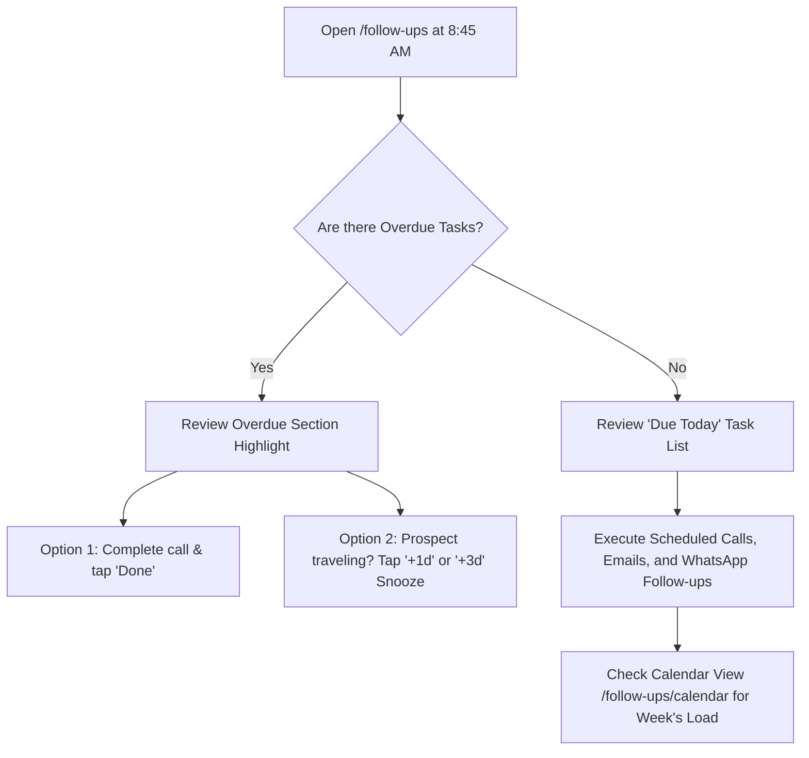
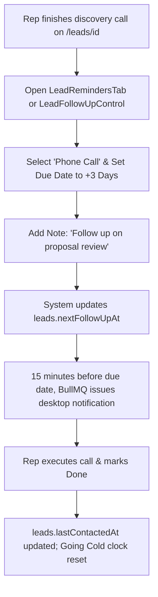

# Ridhzo "Follow-ups" & Task Management: Product & Marketing Specification

> **Document Type:** Product Architecture, Feature Analysis & Website Marketing Reference  
> **Target Audience:** Sales Directors, Revenue Operations, Account Executives, SDRs, Field Agents  
> **Scope:** Follow-ups Hub (`/follow-ups`), Interactive Calendar View (`/follow-ups/calendar`), Lead Profile Controls (`LeadFollowUpControl` & `LeadRemindersTab`), Background Reminder Workers (`followUpReminderWorker`), State Synchronization (`syncLeadFollowUpState`), Overdue Escalation Engine (`FollowUpEscalationService`), and Google Calendar Sync.  
> **Source Verification:** Verified against live Ridhzo codebase (`src/app/(dashboard)/follow-ups/page.tsx`, `src/app/(dashboard)/follow-ups/calendar/page.tsx`, `FollowUpActions.tsx`, `LeadFollowUpControl.tsx`, `LeadRemindersTab.tsx`, `FollowUpService.ts`, `state.ts`, `followUpReminderWorker.ts`, `followUpEscalationService.ts`, `googleCalendarService.ts`, `BookingService.ts`, and PostgreSQL schema).

---

## 1. Executive Overview

In modern B2B and high-touch sales, deals are won or lost in the follow-up. Industry research consistently proves that 80% of sales require at least five touchpoints, yet 44% of sales reps abandon outreach after just one attempt. When follow-ups live in dispersed sticky notes, unlinked spreadsheets, or mental to-do lists, deals silently slip through the cracks, response times explode, and high-intent buyers sign with competitors.

**Ridhzo’s Follow-up & Task Management Engine** provides an institutionalized, closed-loop task execution system directly tethered to the customer record:
1. **The Follow-ups List Hub (`/follow-ups`):** A rep-focused daily action center organizing pending, due-today, and overdue commitments into a clean triage queue with 1-click completion and rapid snoozing.
2. **The Interactive Calendar (`/follow-ups/calendar`):** A high-visibility, month-by-month scheduling matrix showing touchpoint density, past-due obligations, and direct lead navigation.
3. **In-Dossier Quick Controls & Reminders Tab:** Precision controls on `/leads/[id]` offering 1-click scheduling presets alongside a multi-channel reminder suite (Calls, WhatsApp, Emails, Meetings).
4. **Automated 15-Minute Background Reminders:** BullMQ-powered cron scanning that evaluates impending deadlines and issues in-app alerts and timeline events without relying on fragile client timers.
5. **State Synchronization & Going Cold Prevention:** Every follow-up action automatically recalculates the lead's next scheduled touchpoint (`nextFollowUpAt`) and completion automatically logs a customer contact (`lastContactedAt`), instantly resetting the 14-day "Going Cold" inactivity clock.

```
┌────────────────────────────────────────────────────────────────────────────────────────┐
│                          RIDHZO FOLLOW-UP LIFECYCLE ARCHITECTURE                       │
└────────────────────────────────────────────────────────────────────────────────────────┘
                                              │
                ┌─────────────────────────────┼─────────────────────────────┐
                ▼                             ▼                             ▼
     [Quick Presets on Lead]     [Lead Reminders Tab]           [Public Booking Link]
      Today, +1d, +7d, +1m        Call, Email, Meeting          Google Calendar Sync
                │                             │                             │
                └─────────────────────────────┬─────────────────────────────┘
                                              ▼
                             ┌─────────────────────────────────┐
                             │  DATABASE: follow_ups Table     │
                             │  due_at, status, type, user_id  │
                             └─────────────────────────────────┘
                                              │
                     ┌────────────────────────┴────────────────────────┐
                     ▼                                                 ▼
        [state.ts: syncLeadFollowUpState]            [followUpReminderWorker (BullMQ)]
         Single source of truth: updates              Scans every 5m for items due in ≤15m.
         leads.next_follow_up_at = soonest            Issues in-app notification & audit note.
                     │                                                 │
                     └────────────────────────┬────────────────────────┘
                                              ▼
                     ┌─────────────────────────────────────────────────┐
                     │             REPRESENTATIVE SURFACES             │
                     ├────────────────────────┬────────────────────────┤
                     │ /follow-ups (List Hub) │ /follow-ups/calendar   │
                     │ • Overdue highlight    │ • Monthly date matrix  │
                     │ • Done / +1d / +3d     │ • Time-stamped badges  │
                     └────────────────────────┴────────────────────────┘
                                              │
                               [Representative Completes]
                                              │
                                              ▼
                             ┌─────────────────────────────────┐
                             │    state.ts: markLeadContacted  │
                             │  • leads.lastContactedAt = now  │
                             │  • Resets 14-day Going Cold     │
                             │  • Feeds Rep Performance Stats  │
                             └─────────────────────────────────┘
```

---

## 2. Everything Included in Follow-ups & Task Management

### A. The Follow-ups Dashboard Hub (`/follow-ups`)
The central execution cockpit for frontline sales reps and account managers:
* **Personal Scoping with Team Backup:** Evaluates `or(eq(followUps.userId, userId), eq(leads.ownerId, userId))`—ensuring reps see tasks explicitly assigned to them as well as tasks on leads they personally own, while strictly filtering out soft-deleted leads (`isNull(leads.deletedAt)`).
* **4 High-Level Metric Tiles:**
  1. **Due Today:** Count of all pending follow-ups scheduled for today's calendar date (including items whose timestamp has passed earlier in the day).
  2. **Overdue:** Prominent counter of pending items where `dueAt < now`.
  3. **Upcoming:** Future pending items beyond today.
  4. **Completed:** Historical count of successfully fulfilled tasks.
* **Triage Sections:**
  * **Overdue Section:** Highlighted container grouping past-due items at the top of the feed to drive urgent remediation.
  * **Upcoming Section:** Clean chronological grouping of scheduled future outreach.
* **One-Click Rapid Execution Toolbar (`FollowUpActions.tsx`):**
  * **Done (`Check`):** Instant completion via `completeFollowUp(id)`. Updates status, logs completion time, sets `leads.lastContactedAt`, and fires the event bus.
  * **+1d Snooze (`Clock`):** Postpones the follow-up by 24 hours, resetting the target time to 9:00 AM the next business morning.
  * **+3d Snooze:** Postpones the follow-up by 3 days at 9:00 AM (ideal for weekend or post-demo buffer).
  * **Cancel (`X`):** Cancels the follow-up with confirmation toast, recalculating the lead's next pending date.

### B. The Interactive Calendar Matrix (`/follow-ups/calendar`)
A visual bird's-eye view of task distribution across the month:
* **Dynamic Date Grid (`date-fns`):** Renders Sunday through Saturday columns using `startOfWeek(startOfMonth(cursor))` and `endOfWeek(endOfMonth(cursor))`.
* **Month Navigation & Quick-Jumps:** Previous month (`?month=YYYY-MM`), Next month, and a dedicated **"Today"** quick jump button.
* **Smart Cell Indicators:**
  * Dates outside the active month are rendered with subtle opacity (`opacity-40`).
  * Current date is highlighted with a circular primary badge (`isToday`).
* **Lead Task Pills:**
  * Shows formatted time (`<LocalTime iso={it.dueAt} mode="time" />`), Lead Name, and Task Title.
  * **Completed Tasks:** Rendered with muted styling and strike-through text.
  * **Overdue Tasks:** Rendered with emphasized border and foreground contrast.
  * **Deep Linking:** Clicking any pill navigates directly into that lead’s profile dossier (`/leads/[leadId]`).

### C. In-Dossier Quick Scheduler (`LeadFollowUpControl.tsx`)
Positioned on the lead dossier header/sidebar for zero-friction date setting:
* **Smart Overdue Detection:** If `nextFollowUpAt < now`, the button turns into a warning-red badge with a clock icon (*"Follow-up overdue"*).
* **1-Tap Schedule Presets:**
  * *Set to today (9:00 AM)*
  * *Set to tomorrow (9:00 AM)*
  * *Set to 1 week from now*
  * *Set to 1 month from now*
  * *Set to someday (+3 months)*
  * *Remove follow up (Trash trigger)*

### D. Comprehensive Reminders & Tasks Suite (`LeadRemindersTab.tsx`)
An enterprise-grade multi-channel task manager embedded directly inside `/leads/[id]`:
* **Multi-Channel Task Types:** Categorizes tasks with dedicated visual icons:
  * 📞 **Phone Call** (`Phone` icon — emerald)
  * ✉️ **Email** (`Mail` icon — blue)
  * 📹 **Meeting** (`Video` icon — purple)
  * 🔔 **Follow-up / Task** (`Bell` icon — amber)
* **Creation Modal / Inline Drawer:** Captures Title, Type, Due Date & Time (`datetime-local`), and optional detailed Description/Notes.
* **Interactive Status Toggles:** Clickable status circles allow reps to mark tasks done (`CheckCircle2`) or reopen completed tasks directly from the timeline.
* **In-Place Editing:** Modal dialog allowing reps to change task titles, switch communication types, or adjust due dates on the fly.
* **Archival Separation:** Cleanly separates active tasks from completed historical items with completion date stamps.

### E. Overdue Escalation Engine (`FollowUpEscalationService.ts`)
A background intelligence service that monitors follow-up hygiene and enforces managerial accountability:
* **3-Tier Severity Classification:**
  * **Medium Severity:** Overdue by $< 24\text{ hours}$.
  * **High Severity:** Overdue by $24 - 48\text{ hours}$.
  * **Critical Severity:** Overdue by $\ge 48\text{ hours}$.
* **Automated Activity Alerts (`escalateOverdueFollowUps`):** Automatically injects urgent managerial alerts into the lead's activity log:  
  *`"ALERT: Scheduled follow-up is overdue by 52 hours (Escalation level: CRITICAL). Immediate contact required."`*
* **Surfaced on Insights Page:** Feeds the overdue follow-up table on `/insights`, ranking delayed tasks by total hours overdue.

### F. Automated Background Reminders Worker (`followUpReminderWorker.ts`)
* **BullMQ Distributed Queue (`follow-up-reminder-scan`):** Runs every 5 minutes in the background.
* **15-Minute Lookahead Horizon:** Scans for pending tasks due within the next 15 minutes (`dueAt <= now + 15m`).
* **Snooze-Aware & Idempotent:** Respects `snoozedUntil` timestamps and cross-references the `reminders` table (`sentAt IS NOT NULL`) so no duplicate notifications are ever sent.
* **Notification & Audit Dispatch:** Triggers in-app alerts (`NotificationService.create({ type: "follow_up_due" })`) and logs an activity record (`"Reminder sent: [Title]"`).

### G. Public Booking & Google Calendar Synchronization (`BookingService.ts`)
* **Inbound Meeting Intake (`/book/[slug]`):** When a prospect books a consultation via Ridhzo's public booking link, the engine:
  1. Matches or creates the lead record.
  2. Sets `leads.nextFollowUpAt = bookingDate`.
  3. Records a meeting entry on the activity timeline.
  4. Automatically synchronizes a 30-minute calendar block to the assigned rep's connected Google Calendar via `GoogleCalendarService.createEvent`.

---

## 3. Technical Architecture & Database Models

### Database Schema (`follow_ups` & `reminders`)

Ridhzo unifies "Follow-ups" and "Reminders" under a single PostgreSQL table defined in [`src/db/schema/activities.ts`](file:///Users/naveenadicharla/Documents/ridhzo/src/db/schema/activities.ts):

```typescript
export const followUps = pgTable('follow_ups', {
  id: uuid('id').defaultRandom().primaryKey(),
  leadId: uuid('lead_id').references(() => leads.id).notNull(),
  userId: uuid('user_id').references(() => users.id),
  type: varchar('type', { length: 50 }).notNull(), // 'Call' | 'WhatsApp' | 'Email' | 'Meeting' | 'Task' | 'Note'
  title: varchar('title', { length: 255 }).notNull(),
  description: text('description'),
  status: varchar('status', { length: 50 }).default('pending').notNull(), // 'pending' | 'completed' | 'cancelled'
  dueAt: timestamp('due_at').notNull(),
  snoozedUntil: timestamp('snoozed_until'),
  completedAt: timestamp('completed_at'),
  createdAt: timestamp('created_at').defaultNow().notNull(),
  updatedAt: timestamp('updated_at').defaultNow().notNull(),
}, (table) => ({
  userDueIdx: index('follow_ups_user_due_idx').on(table.userId, table.status, table.dueAt),
  leadIdx: index('follow_ups_lead_idx').on(table.leadId),
}));

export const reminders = pgTable('reminders', {
  id: uuid('id').defaultRandom().primaryKey(),
  followUpId: uuid('follow_up_id').references(() => followUps.id).notNull(),
  remindAt: timestamp('remind_at').notNull(),
  sentAt: timestamp('sent_at'),
  createdAt: timestamp('created_at').defaultNow().notNull(),
}, (table) => ({
  followUpIdx: index('reminders_follow_up_idx').on(table.followUpId),
}));
```

### The State Synchronization Principle (`syncLeadFollowUpState`)

To eliminate "ghost overdue" alerts and stale badges across the CRM, Ridhzo enforces an architectural contract in [`src/domains/follow-ups/state.ts`](file:///Users/naveenadicharla/Documents/ridhzo/src/domains/follow-ups/state.ts):

* **Single Source of Truth:** The denormalized column `leads.next_follow_up_at` is guaranteed to represent the **soonest pending follow-up** across all active tasks for that lead.
* **Automatic Recalculation:** Every time a follow-up is created, marked completed, cancelled, snoozed, or deleted, `syncLeadFollowUpState(leadId)` executes:
  ```sql
  SELECT due_at FROM follow_ups 
  WHERE lead_id = :leadId AND status = 'pending' 
  ORDER BY due_at ASC LIMIT 1;
  ```
  It updates `leads.nextFollowUpAt` to this value (or `NULL` if all tasks are cleared).
* **Contact Verification (`markLeadContacted`):** When any follow-up is marked as completed, `markLeadContacted(leadId, completedAt)` immediately updates `leads.lastContactedAt`. This resets the 14-day inactivity clock, removing the lead from the "Going Cold" list and updating lead engagement scores.

---

## 4. Master Data Points & Operational Metrics

| Metric / Attribute | Source Component / Service | Technical Calculation | Operational Business Value |
| :--- | :--- | :--- | :--- |
| **Due Today Count** | `FollowUpsDashboard` (`/follow-ups`) | `status = 'pending' AND dueAt::date = today` | Gives reps their exact immediate target quota for the current day. |
| **Overdue Count** | `FollowUpsDashboard` / `MetricsCards` | `status = 'pending' AND dueAt < now` | Identifies broken commitments and operational pipeline backlog. |
| **Completion Rate (%)** | `AnalyticsService.getFollowUpMetrics` | $\frac{\text{Completed Tasks}}{\text{Total Tasks}} \times 100$ | Evaluates rep discipline and task fulfillment efficiency. |
| **Overdue Severity** | `FollowUpEscalationService` | $\lfloor (\text{now} - \text{dueAt}) / 3600000 \rfloor$ (Med $<24$h, High $24-48$h, Crit $\ge 48$h) | Allows management to intervene on chronically neglected deals before churn. |
| **Completed Tasks per Rep** | `TeamPerformanceService` | `COUNT(follow_ups) WHERE status='completed' GROUP BY userId` | Measures sales rep activity volume independent of win rate. |
| **Upcoming Queue** | `FollowUpsDashboard` | `status = 'pending' AND dueAt > endOfToday` | Gives reps visibility into pipeline commitments over the coming weeks. |

---

## 5. Daily Sales & Management Workflows

### 1. The Rep's Morning Triage Routine (Zero Overdue Inbox)

1. **8:45 AM:** Sales rep opens `/follow-ups`.
2. **Clear Overdue:** Rep immediately addresses items in the highlighted Overdue container. If a client is temporarily unavailable, the rep clicks **`+1d`** or **`+3d`** to snooze cleanly without leaving overdue debt.
3. **Execute Due Today:** Rep completes today's calls, tapping **`Done`** after each touchpoint. This logs contact timestamps, triggers event bus emissions, and updates their completion rate.

### 2. The Mid-Funnel Re-engagement Cadence


### 3. Management Escalation & Audit Sweep
1. **Pipeline Review:** Sales Manager navigates to `/insights`.
2. **Inspect Overdue Table:** Evaluates all tasks flagged as **CRITICAL** ($\ge 48$ hours past deadline).
3. **Trigger Escalation:** The manager or system runs `escalateOverdueFollowUps`, injecting audit warnings into the lead's permanent timeline and prompting team leads to reassign the lead if necessary.

---

## 6. Marketing-Friendly Feature Explanation

### Why High-Velocity Sales Teams Win with Ridhzo Follow-ups

Deals aren't lost because your product is inferior; they are lost because reps forget to follow up. In competitive markets, the sales team that responds fastest and follows through consistently wins the contract. **Ridhzo transforms follow-ups from an afterthought into an automated execution machine.**

* **Never Drop the Ball:** Whether it’s an urgent call scheduled for this afternoon or a long-term check-in three months out, Ridhzo keeps every promise visible and organized.
* **1-Click Triage:** Sales reps shouldn't waste 10 minutes updating dropdown menus. Complete tasks in one click, or snooze follow-ups by 1 or 3 days with a single tap.
* **Automated 15-Minute Radar:** Ridhzo’s background intelligence monitors your calendar and alerts you 15 minutes before every call, ensuring you never show up unprepared.
* **Automatic Contact Sync:** When you complete a task, Ridhzo automatically logs customer contact and resets your "Going Cold" inactivity counter—keeping your pipeline clean without manual data entry.
* **Visual Calendar Matrix:** Switch effortlessly between your daily to-do list and a full month calendar to balance your workload and prevent scheduling bottlenecks.

---

## 7. Feature List for Website Marketing

* **Unified Daily Follow-up Cockpit**  
  A centralized, rep-focused dashboard organizing overdue, due-today, and upcoming obligations into a friction-free action queue.

* **Interactive Monthly Calendar View**  
  A drag-free, visual scheduling grid displaying task density, appointment times, and direct lead navigation across the entire month.

* **1-Click Rapid Triage & Snooze**  
  Mark tasks done instantly, or postpone follow-ups to 9:00 AM tomorrow (`+1d`) or next week (`+3d`) with one tap.

* **Multi-Channel Reminder Suite**  
  Schedule and categorize outreach specifically for Phone Calls, WhatsApp chats, Emails, and Meetings with distinct visual icons.

* **Autonomous 15-Minute Background Reminders**  
  Server-side BullMQ cron scans alert reps 15 minutes before commitments, ensuring zero missed appointments.

* **Single-Source State Synchronization**  
  Guarantees that lead dossier cards, pipeline badges, and triage feeds always point to the next real pending task—eliminating ghost overdue alerts.

* **3-Tier Managerial Escalation**  
  Automatically flags overdue tasks as Medium ($<24\text{h}$), High ($24-48\text{h}$), or Critical ($\ge 48\text{h}$) and injects urgency alerts into the activity timeline.

* **Automated Inactivity Protection**  
  Completing any follow-up automatically timestamps customer contact, keeping active deals off the "Going Cold" radar.

* **Google Calendar Integration**  
  Public booking requests automatically schedule follow-up tasks and sync 30-minute meeting slots directly to the rep's Google Calendar.

---

## 8. Page Blueprints & Wireframes

### Follow-ups List Dashboard (`/follow-ups`)
```
+====================================================================================+
| My Follow-ups                                                 [Calendar view ->]   |
+====================================================================================+
| [DUE TODAY: 8]       | [OVERDUE: 3]          | [UPCOMING: 14]     | [COMPLETED: 42]|
+====================================================================================+
| PENDING ACTIONS                                                                    |
|                                                                                    |
| [!] OVERDUE (3)                                                                    |
| +--------------------------------------------------------------------------------+ |
| | Follow-up on pricing quote (Call)          | Due: Yesterday, 4:00 PM           | |
| | Lead: Marcus Vance                         | [Done] [+1d] [+3d] [X]            | |
| +--------------------------------------------------------------------------------+ |
| | Send product spec sheet (Email)            | Due: Sep 18, 10:00 AM             | |
| | Lead: Apex Dynamics                        | [Done] [+1d] [+3d] [X]            | |
| +--------------------------------------------------------------------------------+ |
|                                                                                    |
| UPCOMING (14)                                                                      |
| +--------------------------------------------------------------------------------+ |
| | Demo walkthrough (Meeting)                 | Due: Today, 2:30 PM               | |
| | Lead: Elena Rostova                        | [Done] [+1d] [+3d] [X]            | |
| +--------------------------------------------------------------------------------+ |
| | Contract signature review (Call)           | Due: Tomorrow, 9:00 AM            | |
| | Lead: Bluefin Capital                      | [Done] [+1d] [+3d] [X]            | |
| +--------------------------------------------------------------------------------+ |
+====================================================================================+
```

### Calendar View Layout (`/follow-ups/calendar`)
```
+====================================================================================+
| September 2026                         [List] [<] [Today] [>]                     |
+====================================================================================+
|  Sun    |  Mon    |  Tue    |  Wed    |  Thu    |  Fri    |  Sat    |
+---------+---------+---------+---------+---------+---------+---------+
| 31      | 1       | 2       | 3       | 4       | 5       | 6       |
| (dim)   |         | [10:00] |         | [14:00] |         |         |
|         |         | Acme-Call|        | Glob-Demo|        |         |
+---------+---------+---------+---------+---------+---------+---------+
| 7       | 8       | 9       | 10      | 11      | 12      | 13      |
|         | [09:00] |         | [11:30] |         | [16:00] |         |
|         | Rex-Task|         | Nova-Mtg|         | Tech-Call|        |
+---------+---------+---------+---------+---------+---------+---------+
| 14      | 15      | 16      | 17      | 18      | 19      | 20      |
|         |         | [!]OVER | [Done]  | [Done]  | (TODAY) |         |
|         |         | Apex-Qte| SentDoc | Review  | [14:30] |         |
|         |         |         |         |         | Elena-Mtg|        |
+====================================================================================+
```

---

## 9. Technical Reference

### Routes & Entry Points
* **List Dashboard:** [`src/app/(dashboard)/follow-ups/page.tsx`](file:///Users/naveenadicharla/Documents/ridhzo/src/app/(dashboard)/follow-ups/page.tsx)
* **Calendar View:** [`src/app/(dashboard)/follow-ups/calendar/page.tsx`](file:///Users/naveenadicharla/Documents/ridhzo/src/app/(dashboard)/follow-ups/calendar/page.tsx)

### UI Components
* **List Action Bar:** [`src/components/leads/FollowUpActions.tsx`](file:///Users/naveenadicharla/Documents/ridhzo/src/components/leads/FollowUpActions.tsx)
* **Lead Dossier Quick Control:** [`src/components/leads/LeadFollowUpControl.tsx`](file:///Users/naveenadicharla/Documents/ridhzo/src/components/leads/LeadFollowUpControl.tsx)
* **Lead Profile Reminders Tab:** [`src/components/leads/LeadRemindersTab.tsx`](file:///Users/naveenadicharla/Documents/ridhzo/src/components/leads/LeadRemindersTab.tsx)
* **Dashboard Metric Cards:** [`src/components/dashboard/MetricsCards.tsx`](file:///Users/naveenadicharla/Documents/ridhzo/src/components/dashboard/MetricsCards.tsx)

### Domain Services & Server Actions
* **Follow-up Domain Service:** [`src/domains/follow-ups/service.ts`](file:///Users/naveenadicharla/Documents/ridhzo/src/domains/follow-ups/service.ts) (`createFollowUp`, `completeFollowUp`, `snoozeFollowUp`, `rescheduleFollowUp`, `cancelFollowUp`)
* **State Synchronization:** [`src/domains/follow-ups/state.ts`](file:///Users/naveenadicharla/Documents/ridhzo/src/domains/follow-ups/state.ts) (`syncLeadFollowUpState`, `markLeadContacted`)
* **Overdue Escalations:** [`src/domains/leads/followUpEscalationService.ts`](file:///Users/naveenadicharla/Documents/ridhzo/src/domains/leads/followUpEscalationService.ts) (`getOverdueFollowUps`, `escalateOverdueFollowUps`)
* **Team Performance Metrics:** [`src/domains/leads/teamPerformanceService.ts`](file:///Users/naveenadicharla/Documents/ridhzo/src/domains/leads/teamPerformanceService.ts) (completed tasks per user)
* **Public Booking & Calendar Sync:** [`src/domains/booking/service.ts`](file:///Users/naveenadicharla/Documents/ridhzo/src/domains/booking/service.ts), [`src/domains/integrations/googleCalendarService.ts`](file:///Users/naveenadicharla/Documents/ridhzo/src/domains/integrations/googleCalendarService.ts)
* **Server Actions:**
  * [`src/lib/actions/follow-ups.ts`](file:///Users/naveenadicharla/Documents/ridhzo/src/lib/actions/follow-ups.ts) (`createFollowUp`, `completeFollowUp`, `snoozeFollowUp`, `cancelFollowUp`, `assignFollowUp`)
  * [`src/lib/actions/reminders.ts`](file:///Users/naveenadicharla/Documents/ridhzo/src/lib/actions/reminders.ts) (`createReminderAction`, `updateReminderAction`, `toggleReminderStatusAction`, `deleteReminderAction`)
  * [`src/lib/actions/leads.ts`](file:///Users/naveenadicharla/Documents/ridhzo/src/lib/actions/leads.ts) (`updateLeadFollowUpAction`)

### Background Workers
* **Follow-up Reminder Cron:** [`src/lib/jobs/workers/followUpReminderWorker.ts`](file:///Users/naveenadicharla/Documents/ridhzo/src/lib/jobs/workers/followUpReminderWorker.ts) (`processFollowUpReminderScan`, `scheduleFollowUpReminderScan`)
