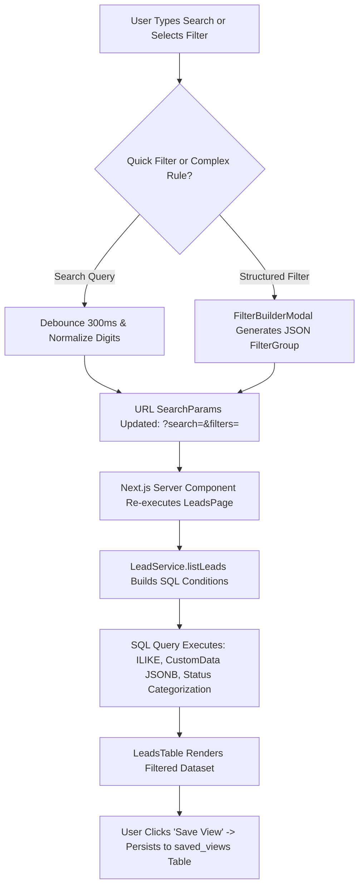
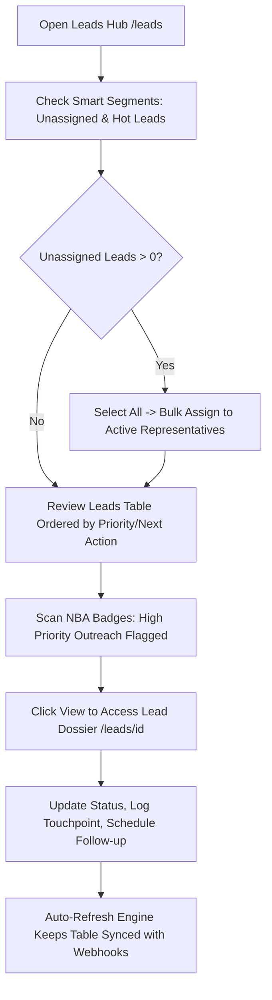

# Ridhzo "Leads": Product & Marketing Specification

> **Document Type:** Product Architecture, Feature Analysis & Website Marketing Reference  
> **Target Audience:** Sales Operations, Inbound Sales Teams, Business Development Reps (BDRs/SDRs), Growth Marketers  
> **Scope:** Main Leads Hub & Management Surface (`/leads`) — *Excludes individual lead profile dossier (`/leads/[id]`)*  
> **Source Verification:** Verified against live Ridhzo codebase (`src/app/(dashboard)/leads/page.tsx`, `LeadsTable.tsx`, `LeadsFilterBar.tsx`, `SmartSegments.tsx`, `QuickAddLeadDrawer.tsx`, `LeadImportWizard.tsx`, `LeadService.listLeads`, and PostgreSQL/Drizzle schema).

---

## 1. Leads Management Overview

### What the Leads Hub Is
The **Ridhzo Leads Hub** (`/leads`) is the central operational workstation and command grid for managing an organization's prospective customer database. Designed for high-velocity sales teams handling inbound marketing inquiries, cold outbound prospects, and high-touch B2B opportunities, the Leads Hub combines real-time webhook ingestion, intelligent multi-attribute filtering, instant bulk operations, and automated speed-to-lead execution in a single responsive table interface.

### Why It Exists in Ridhzo
In high-performing sales organizations, leads are perishable assets. If prospective customer data is trapped in static spreadsheets or sluggish legacy CRMs, response times degrade, duplicate inquiries slip in, and reps waste hours manually assigning or updating records one by one.

Ridhzo's Leads Hub was engineered to eliminate pipeline friction through four foundational capabilities:
1. **Zero-Latency Inbound Ingestion:** New leads from Meta Lead Ads, Webhook APIs, and Inbound Web Forms appear automatically on the table within seconds via an active polling auto-refresh mechanism.
2. **Dynamic Smart Segmentation:** Real-time categorical chips isolate hot leads, high-value opportunities at risk, unassigned new leads, and stale records with a single click.
3. **High-Impact Bulk Operations:** Reps and managers can bulk-assign leads, bulk-update pipeline statuses, apply taxonomy tags, export custom CSVs, and fire personalized multi-lead WhatsApp campaigns in seconds.
4. **Preserved Context & Data Hygiene:** Native deduplication, human-friendly sequential display IDs (`Lead #1042`), custom field extensibility, and a 30-day recoverable recycle bin prevent accidental data loss.

### Who Uses It
* **Frontline Sales Reps & Account Executives:** Work through assigned lead queues, execute one-click outreach, and advance deals through pipeline stages.
* **Business Development Reps (BDRs / SDRs):** Rapidly qualify inbound inquiries, add enrichment notes, and route qualified opportunities to senior closers.
* **Sales Managers & Team Leads:** Triage unassigned intake backlogs, distribute lead volume across representatives, and balance workload equity.
* **Marketing & Growth Operations:** Track inbound channel attribution (including Meta Ad Campaign, Ad Set, and Ad Name metadata) and import bulk campaign lists via the CSV Import Wizard.

### Business Problems It Solves
* **The Delayed Intake Problem:** Inbound marketing leads sit unviewed because pages require manual reloads. Ridhzo's auto-refresh engine checks for new database entries while the user's tab is active.
* **Cluttered Data Grids:** Sales reps drown in irrelevance when viewing massive lead lists. Ridhzo provides multi-parameter search, customizable column views, and Boolean filter builders.
* **Manual Follow-up Fatigue:** Sending individual outreach messages across dozens of new leads is labor-intensive. Ridhzo integrates bulk WhatsApp campaign broadcasts with dynamic `{{first_name}}` merge tags directly on the table.
* **Accidental Deletions:** Permanent deletion causes panic and lost revenue. Ridhzo soft-deletes records into a 30-day recoverable Recycle Bin.

### How It Differs from Dashboards and the Lead Profile
| Dimension | Leads Hub (`/leads`) | Executive Dashboard (`/`) | Individual Lead Profile (`/leads/[id]`) |
| :--- | :--- | :--- | :--- |
| **Focus** | **Operational Execution & Triage:** Multi-lead list management | **Strategic Governance:** Macro KPIs, SLAs, and channel charts | **Deep Customer Dossier:** Single-lead timeline, notes, tasks & chat |
| **View Type** | High-density data grid with pagination and bulk selection | Executive KPI cards, area curves, and workload bar charts | Tabbed client dossier (Activity, WhatsApp, Files, Reminders) |
| **Actions** | Bulk assign, bulk status change, bulk WhatsApp, CSV import/export | Date filtering, high-level SLA auditing, priority drill-down | Logging calls, drafting proposals, updating custom BANT data |

### How a Sales Team Uses It During a Working Day
1. **08:30 AM — Inbound Triage:** 
   The sales team lead opens `/leads`. Using the **Smart Segments** bar, they click the `Unassigned New` chip, select all overnight inquiries, and trigger **Bulk Assign** to distribute them across the morning shift reps.
2. **10:00 AM — Outreach Power Hour:** 
   A sales rep searches for leads tagged `Event-Webinar` using the **Filter Builder**, checks 25 matching leads, clicks **Message**, and broadcasts a personalized WhatsApp follow-up using `{{first_name}}`.
3. **02:00 PM — Custom Column Inspection:** 
   The rep reviews active deals using custom company fields (e.g., "Property Type" or "Annual Budget") exposed directly on the table header without opening individual tabs.
4. **04:30 PM — Hygiene & Bulk Organization:** 
   Disqualified leads are selected and updated to `Unqualified` in bulk, or moved to the Recycle Bin with a single confirmation prompt.

---

## 2. Everything Included in the Leads Hub

Based on the live implementation across `src/app/(dashboard)/leads/page.tsx` and accompanying components:

### 1. Navigation & Quick-Action Header
* **Hot Leads Link (`/leads/hot`):** One-tap navigation to high-intent leads who have recently engaged with shared content or scored $\ge 70$.
* **Pipeline Board Link (`/leads/kanban`):** Visual drag-and-drop Kanban view of leads across stages.
* **Recycle Bin Link (`/leads/recycle-bin`):** Access to soft-deleted leads recoverable within 30 days.
* **Import Leads Trigger (`LeadImportWizard`):** Opens the multi-step CSV import wizard.
* **Add Lead Trigger (`QuickAddLeadDrawer`):** Opens a responsive slide-over drawer for manual lead creation.

### 2. Real-Time Auto-Refresh Engine (`LeadsAutoRefresh`)
* **Mechanism:** Background polling timer executing every 20 seconds (`intervalMs = 20_000`) while the browser tab is active (`document.visibilityState === "visible"`).
* **Instant Re-Sync:** Triggers an immediate server re-render the exact moment a user returns to a backgrounded tab.
* **Performance Safeguard:** Automatically pauses polling when the tab is hidden, preventing unnecessary database queries.

### 3. Smart Segments Bar (`SmartSegments`)
* **What It Shows:** Dynamic filter chips with live numerical count badges:
  * **Hot Leads (`Flame` icon):** High-intent opportunities with active engagement signals.
  * **High Value at Risk (`AlertTriangle` icon):** Open leads with high deal value that are aging without contact.
  * **Unassigned New (`UserPlus` icon):** Newly ingested leads lacking an assigned owner.
  * **Stale High Priority (`Snowflake` icon):** High-priority deals that have gone cold (`/leads/cold`).
* **Interaction:** One-click filtering that immediately scopes the table.

### 4. Advanced Filter & Saved Views Bar (`LeadsFilterBar`)
* **Real-Time Debounced Search:** 300ms debounced input searching across **Lead Name**, **Email**, **Company**, and **Phone** (featuring custom regex telephone normalization that strips spaces, dashes, and country codes to match raw digits).
* **Saved Views Dropdown:** Switch between custom saved configurations (e.g., "My Active Deals", "Unassigned Inbound", "Q3 High Value").
* **Filter Builder Modal Trigger:** Opens complex Boolean query builder.
* **Save View Dialog Trigger:** Allows reps to persist active filters, sort orders, and column configurations.
* **Sort Controls:** Order by Creation Date, Updated Date, Name, Status, Owner, Next Follow-up, Priority, or Score.

### 5. Multi-Attribute Filter Builder (`FilterBuilderModal`)
* **Capabilities:** Multi-rule filtering with `AND` / `OR` logic.
* **Supported Fields:**
  * Standard Attributes: `Status`, `Owner`, `Source`, `Tag`, `Priority`, `Name`, `Email`, `Phone`, `Company`, `Score`, `Expected Value`, `Created Date`, `Updated Date`, `Follow-up Date`.
  * **Meta / Facebook Ad Attribution Fields:** Ingested lead ad metadata: `customData.meta_campaign_name` (FB Campaign), `customData.meta_adset_name` (FB Ad Set), `customData.meta_ad_name` (FB Ad), and `customData.facebook_form_id`.
  * Operators: `contains`, `equals`, `not_equals`, `does_not_contain`, `is_empty`, `is_not_empty`, `greater_than`, `less_than`, `is_between`.

### 6. Quick Add Lead Slide-Over Drawer (`QuickAddLeadDrawer`)
* **Form Attributes:** Full Name (required), Email Address, Phone Number, Company Name, Owner Selection dropdown.
* **Dynamic Custom Fields Integration:** Renders active organization custom fields (text, numbers, dropdowns, dates) defined in the custom fields schema.
* **Offline Outbox Support:** If internet connectivity drops, the drawer enqueues the lead in local storage (`enqueueOfflineLead`) for automatic background sync when reconnected.

### 7. Lead Import Wizard (`LeadImportWizard`)
* **Step 1: Upload:** Drag-and-drop CSV upload with real-time file size and header validation. Includes sample CSV template download.
* **Step 2: Field Mapping:** Visual mapping between CSV headers and standard fields (`Name`, `Email`, `Phone`, `Company`, `Status`, `Expected Value`) or Custom Fields.
* **Step 3: Simulation & Dry Run:** Validates rows without writing to the database, surfacing new records, syntax errors, and duplicate contacts.
* **Step 4: Commit:** Bulk insert with automatic attribution to a selected lead source and default sales representative.

### 8. Interactive Leads Data Grid (`LeadsTable`)
* **Table Columns:**
  1. **Checkbox:** Individual and "Select All" page toggles.
  2. **Display ID:** Per-tenant sequential number (`#1042`) assigned by atomic database trigger.
  3. **Name:** Clickable lead name navigating to the lead profile dossier (`/leads/[id]`).
  4. **Email & Phone:** Formatted contact information.
  5. **Status Badge:** Color-coded badge dynamically resolved from the tenant's custom status configuration (`CustomStatusSchemaService`).
  6. **Dynamic Custom Columns:** User-configured custom field columns (`showOnTable: true`) with role-based security (admin-only fields automatically hidden from non-admin clients).
  7. **Next Best Action:** Algorithmic badge generated by `NextBestActionService` showing the recommended next move (`label`, `priority`, and hover reason tooltip).
  8. **Created Date:** Localized relative timestamp via `<LocalTime mode="shortDate" />`.
  9. **Row Actions:** One-click **View** link, inline **Edit Lead Dialog**, and **Move to Recycle Bin** button.

### 9. Multi-Lead Bulk Action Toolbar
When one or more checkboxes are checked, an interactive bulk operations toolbar appears:
* **Selected Count:** Indicates number of selected leads.
* **Bulk Assign:** Reassign selected leads to any team member via dropdown (`bulkAssignLeadAction`).
* **Bulk Status Change:** Transition selected leads to any valid status category (`bulkChangeLeadStatusAction`).
* **Bulk Tagging:** Type a tag name and apply it across all selected records (`bulkAddTagAction`).
* **Bulk WhatsApp Broadcast:** Opens an inline messaging drawer with dynamic merge tags (`{{first_name}}`) to dispatch mass WhatsApp communications via `sendCampaignAction`.
* **Export Selected CSV:** Generates an immediate browser client download of selected rows.
* **Bulk Delete:** Prompts confirmation dialog to move all selected leads to the 30-day Recycle Bin.

### 10. Pagination & Responsive Controls
* **Page Size Selector:** Configurable between `10`, `20`, `50`, and `100` leads per page.
* **Summary Counter:** "Showing X - Y of Z leads".
* **Pagination Controls:** Previous and Next button controls with URL search parameter persistence.

---

## 3. Leads Management Features

### Intake & Acquisition
* **Atomic Sequential Display IDs:** Every lead receives an immutable, human-friendly number (`#1042`) per organization via atomic PostgreSQL triggers.
* **Automated Lead Ingestion:** Continuous background refresh detects new webhook entries without page reloads.
* **Multi-Format Contact Normalization:** Phone numbers with country codes, spaces, or dashes are indexed and searchable.

### Segmentation & Querying
* **Full-Text Multi-Field Search:** Searches name, email, company, and phone simultaneously.
* **Meta / Facebook Ad Attribution Filtering:** Filter leads directly by campaign name, ad set name, and form ID.
* **Saved View Persistence:** Save frequently used filter combinations for individual or organization-wide use.
* **One-Tap Smart Segments:** Instant access to Hot Leads, At-Risk deals, Unassigned leads, and Stale records.

### Mass Execution & Automation
* **Bulk WhatsApp Messaging:** Broadcast messages directly from the table with personalization tokens.
* **Bulk Ownership Transfer:** Rebalance workloads across sales representatives in seconds.
* **Bulk Status Lifecycle Transitions:** Advance groups of leads from New $\to$ Active $\to$ Won/Lost.
* **On-the-Fly CSV Export:** Export filtered segments directly to CSV without third-party tools.

### Data Governance & Safety
* **Role-Based Custom Field Protection:** Admin-only custom fields are stripped server-side from non-admin payloads.
* **30-Day Recoverable Recycle Bin:** Soft-deletes records with user attribution, eliminating accidental data loss.
* **Offline Outbox Resiliency:** Captures manually added leads in browser storage when operating without internet.

---

## 4. Leads Operational Data Points

| Column / Data Point | Source Field | Type & Calculation | Operational Business Meaning |
| :--- | :--- | :--- | :--- |
| **Display ID** | `leads.displayId` | Sequential integer | Clear, human-friendly identifier for team callouts and customer reference. |
| **Lead Name** | `leads.name` | String (1-255 chars) | Primary prospective customer or client name. |
| **Contact Email** | `leads.email` | RFC-compliant email | Validated email address for quotes, proposals, and updates. |
| **Contact Phone** | `leads.phone` | String (E.164 compatible) | Normalized mobile number used for phone calls and one-tap WhatsApp. |
| **Status Badge** | `leads.status` | Dynamic tenant schema | Current pipeline lifecycle stage with custom tenant brand color. |
| **Next Best Action** | `NextBestActionService` | Algorithmic heuristic | Prescribes immediate sales action based on buying signals, scores, and SLA windows. |
| **Custom Fields** | `leads.customData` | JSONB key-value store | Tenant-specific business data (e.g., Property Type, Budget, Lead Score). |
| **Created Timestamp** | `leads.createdAt` | UTC Timestamp | Ingestion date, formatted into the user's localized timezone. |

---

## 5. UI Drawers, Modals, and Action Overlays

### 1. Quick Add Lead Drawer (`QuickAddLeadDrawer.tsx`)
A right-hand slide-over drawer enabling rapid manual entry. Uses Zod schema validation to verify email formatting and phone integrity. If custom fields are configured for the tenant, they render dynamically below standard contact fields.

### 2. Lead Import Wizard Modal (`LeadImportWizard.tsx`)
A four-stage modal window that handles batch CSV onboarding. Features automated header detection, duplicate screening against existing database emails/phones, and dry-run error reporting before committing records to the database.

### 3. Filter Builder Modal (`FilterBuilderModal.tsx`)
A visual query builder supporting nested rules and multi-type operators. Allows users to combine standard contact attributes, scoring thresholds, and Meta ad campaign parameters into reusable filters.

### 4. Bulk WhatsApp Messaging Drawer
An inline composition panel that expands directly above the table when leads are selected. Supports multi-line templates and auto-populates `{{first_name}}` tokens during outbound dispatch.

---

## 6. Search, Filter, and Saved View Architecture



### Search Engine Normalization
When a user searches for a phone number (e.g., `+1 (555) 234-5678`), standard SQL searches fail if the database stores numbers in different formats. Ridhzo detects when a search term contains 3 or more digits and compiles a PostgreSQL regular expression:
```sql
regexp_replace(leads.phone, '[^0-9]', '', 'g') ILIKE '%5552345678%'
```
This guarantees that customer searches succeed regardless of how spaces, parentheses, or international dialing prefixes were entered.

---

## 7. Frontline Sales & Marketing Use Cases

### 1. Instant Triage of High-Volume Facebook Ad Campaigns
* **Scenario:** A paid marketing campaign generates 150 leads overnight.
* **Leads Hub Action:** The marketing manager opens `/leads`, launches the **Filter Builder**, selects `customData.meta_campaign_name equals "Summer Promo"`, and isolates the campaign leads.
* **Execution:** Using the bulk action bar, the manager selects all 150 leads, assigns them to the "Inbound Sales Team", and applies the tag `Summer-Promo-2026`.

### 2. High-Touch Personal Follow-up via WhatsApp Broadcast
* **Scenario:** A sales rep wants to follow up with 18 leads who attended a product demo yesterday.
* **Leads Hub Action:** The rep selects the leads on the table and clicks **Message**.
* **Execution:** Enters: *"Hi {{first_name}} — thanks for attending yesterday's session! Let me know if you have questions on the quote."* The platform personalizes and dispatches the messages across all 18 leads.

### 3. Rapid CSV Data Migration Without Duplicates
* **Scenario:** Migrating 2,000 legacy contacts from an external spreadsheet.
* **Leads Hub Action:** The operations lead launches the **Lead Import Wizard**, uploads the CSV, and runs the simulation dry run.
* **Execution:** The wizard flags 142 duplicate phone numbers already existing in Ridhzo, preventing database corruption and duplicate lead assignments.

---

## 8. Daily Sales Execution Workflow



1. **Access Hub:** Load `/leads` with tenant-scoped authentication.
2. **Review Inbound Intake:** Inspect the `Unassigned New` Smart Segment chip.
3. **Execute Bulk Assignments:** Distribute newly ingested leads across team members.
4. **Follow Next Best Action:** Work through leads prioritized by high-intent buying signals.
5. **Maintain Clean Hygiene:** Apply tags, update pipeline stages, and clear disqualified records.

---

## 9. Marketing-Friendly Feature Explanation

### Why Sales Teams Win Deals with the Ridhzo Leads Engine

Your sales pipeline is only as fast as your lead management interface. When prospective buyers express interest, every second spent fighting cumbersome CRM grids is an opportunity handed to your competitors. **Ridhzo Leads Hub** gives your sales team an agile, real-time command center built for speed, clarity, and conversion.

* **Real-Time Webhook Synchronization:** Never miss an inbound prospect. As soon as a lead submits a Facebook ad or website form, Ridhzo's live auto-refresh surfaces them on your screen automatically.
* **Effortless Bulk Productivity:** Stop updating records one by one. Reassign hundreds of leads, change pipeline stages, apply tags, and launch personalized WhatsApp broadcasts in seconds.
* **Targeted Smart Segmentation:** Instantly cut through database noise. One-tap smart chips surface hot prospects, neglected inquiries, and high-value deals at risk before they slip away.
* **Frictionless CSV Importing:** Bring your contacts into Ridhzo with zero headaches. Our intelligent import wizard simulates imports, catches duplicates, and maps custom fields automatically.
* **Bulletproof Data Hygiene:** Protect your revenue engine. With atomic sequential lead numbering, phone normalization, role-based field security, and a 30-day recoverable recycle bin, your customer data remains pristine.

---

## 10. Feature List for Website

* **Live Auto-Refresh Grid**  
  Background polling synchronization that automatically surfaces newly ingested leads from webhooks and ads without manual page reloads.

* **One-Tap Smart Segments**  
  Dynamic quick-filter chips highlighting Hot Leads, High Value at Risk, Unassigned New Leads, and Stale Opportunities.

* **Bulk WhatsApp Campaign Broadcast**  
  Select multiple leads directly on the table and dispatch personalized WhatsApp messages with dynamic `{{first_name}}` tokens.

* **Multi-Attribute Boolean Filter Builder**  
  Build complex multi-condition queries combining contact information, deal values, lead scores, and Meta/Facebook ad attribution.

* **Intelligent CSV Import Wizard**  
  Multi-step onboarding wizard featuring automated header mapping, dry-run simulation, syntax checking, and duplicate prevention.

* **Next Best Action Prescriptions**  
  Built-in AI/rules recommendation badges indicating the immediate next move to advance every deal.

* **Sequential Human-Friendly Display IDs**  
  Atomic database triggers assign clean, memorable numbers (`Lead #1042`) to simplify team communication.

* **Dynamic Custom Fields & Table Columns**  
  Tailor your data grid with custom business fields, complete with role-based visibility controls that protect confidential data.

* **Recoverable 30-Day Recycle Bin**  
  Soft-delete protection ensures that accidentally removed records can be restored with full activity histories intact.

* **Client-Side CSV Export**  
  Instant one-click browser download of selected leads for fast external reporting and executive briefings.

---

## 11. Leads Page Structure

```
+====================================================================================+
| HEADER: Title ("Leads") + Subtitle ("Search, filter, and manage...")               |
| [Hot Leads] [Pipeline Board] [Recycle Bin] [Import Leads] [+ Add Lead Drawer]      |
+====================================================================================+
| SMART SEGMENTS BAR (Dynamic One-Tap Filter Chips with Count Badges)                |
|  [Flame] Hot Leads (12) | [Alert] High Value at Risk (4) | [UserPlus] Unassigned (9)|
+====================================================================================+
| FILTER & SAVED VIEWS BAR                                                           |
|  [Search Input (Debounced 300ms)] [Saved Views Dropdown] [Filter Builder] [Save]   |
+====================================================================================+
| [OPTIONAL] BULK ACTIONS TOOLBAR (Visible only when >= 1 checkbox selected)         |
|  "X selected" | [Assign to...] [Set status...] [Add Tag...] [Message] [Export] [Del]|
+====================================================================================+
| LEADS DATA GRID (LeadsTable - Responsive Table Container)                          |
|  [ ] | ID    | Name         | Email      | Phone      | Status  | NBA  | Created  |
|  [✓] | #1042 | Sarah Jenkins| s@corp.com | +155523456 | Active  | Call | 2h ago   |
|  [✓] | #1041 | Acme Holdings| info@ac.me | +659123456 | New     | WA   | 4h ago   |
+====================================================================================+
| PAGINATION & DENSITY FOOTER                                                        |
|  Rows per page: [20 v] | Showing 1 - 20 of 142 leads | Page 1 of 8 [< Prev] [Next >]|
+====================================================================================+
```

---

## 12. Technical Reference

### Routes and Entry Points
* **Main Leads Page:** [`src/app/(dashboard)/leads/page.tsx`](file:///Users/naveenadicharla/Documents/ridhzo/src/app/(dashboard)/leads/page.tsx)
* **Associated Route Links:**
  * Kanban Board: [`src/app/(dashboard)/leads/kanban/page.tsx`](file:///Users/naveenadicharla/Documents/ridhzo/src/app/(dashboard)/leads/kanban/page.tsx)
  * Hot Leads: [`src/app/(dashboard)/leads/hot/page.tsx`](file:///Users/naveenadicharla/Documents/ridhzo/src/app/(dashboard)/leads/hot/page.tsx)
  * Recycle Bin: [`src/app/(dashboard)/leads/recycle-bin/page.tsx`](file:///Users/naveenadicharla/Documents/ridhzo/src/app/(dashboard)/leads/recycle-bin/page.tsx)
  * Duplicates: [`src/app/(dashboard)/leads/duplicates/page.tsx`](file:///Users/naveenadicharla/Documents/ridhzo/src/app/(dashboard)/leads/duplicates/page.tsx)

### UI Components (`src/components/leads/`)
* **Leads Table:** [`LeadsTable.tsx`](file:///Users/naveenadicharla/Documents/ridhzo/src/components/leads/LeadsTable.tsx)
* **Filter Bar:** [`LeadsFilterBar.tsx`](file:///Users/naveenadicharla/Documents/ridhzo/src/components/leads/LeadsFilterBar.tsx)
* **Smart Segments:** [`SmartSegments.tsx`](file:///Users/naveenadicharla/Documents/ridhzo/src/components/leads/SmartSegments.tsx)
* **Filter Builder Modal:** [`FilterBuilderModal.tsx`](file:///Users/naveenadicharla/Documents/ridhzo/src/components/leads/FilterBuilderModal.tsx)
* **Quick Add Lead Drawer:** [`QuickAddLeadDrawer.tsx`](file:///Users/naveenadicharla/Documents/ridhzo/src/components/leads/QuickAddLeadDrawer.tsx)
* **Lead Import Wizard:** [`LeadImportWizard.tsx`](file:///Users/naveenadicharla/Documents/ridhzo/src/components/leads/LeadImportWizard.tsx)
* **Auto Refresh Controller:** [`LeadsAutoRefresh.tsx`](file:///Users/naveenadicharla/Documents/ridhzo/src/components/leads/LeadsAutoRefresh.tsx)
* **Edit Lead Dialog:** [`EditLeadDialog.tsx`](file:///Users/naveenadicharla/Documents/ridhzo/src/components/leads/EditLeadDialog.tsx)
* **Save View Dialog:** [`SaveViewDialog.tsx`](file:///Users/naveenadicharla/Documents/ridhzo/src/components/leads/SaveViewDialog.tsx)

### Backend Services & Server Actions
* **Core Query Engine:** [`src/domains/leads/service.ts`](file:///Users/naveenadicharla/Documents/ridhzo/src/domains/leads/service.ts) (`LeadService.listLeads`, `LeadService.deleteLead`)
* **Smart Segmentation Service:** [`src/domains/leads/smartSegmentationService.ts`](file:///Users/naveenadicharla/Documents/ridhzo/src/domains/leads/smartSegmentationService.ts) (`getSmartSegments`)
* **Saved Views Service:** [`src/domains/savedViews/service.ts`](file:///Users/naveenadicharla/Documents/ridhzo/src/domains/savedViews/service.ts) (`listViews`)
* **Next Best Action Engine:** [`src/domains/leads/nextBestActionService.ts`](file:///Users/naveenadicharla/Documents/ridhzo/src/domains/leads/nextBestActionService.ts) (`getRecommendation`)
* **Custom Status Schema:** [`src/domains/leads/customStatusSchemaService.ts`](file:///Users/naveenadicharla/Documents/ridhzo/src/domains/leads/customStatusSchemaService.ts)
* **Bulk Server Actions:**
  * [`src/lib/actions/leads.ts`](file:///Users/naveenadicharla/Documents/ridhzo/src/lib/actions/leads.ts) (`bulkAssignLeadAction`, `bulkChangeLeadStatusAction`, `bulkDeleteLeadsAction`, `createLeadAction`)
  * [`src/lib/actions/campaigns.ts`](file:///Users/naveenadicharla/Documents/ridhzo/src/lib/actions/campaigns.ts) (`sendCampaignAction`)
  * [`src/lib/actions/tags.ts`](file:///Users/naveenadicharla/Documents/ridhzo/src/lib/actions/tags.ts) (`bulkAddTagAction`)
  * [`src/lib/actions/import.ts`](file:///Users/naveenadicharla/Documents/ridhzo/src/lib/actions/import.ts) (`parseImportCsvAction`, `simulateImportAction`, `commitImportAction`)

### Database Models (`src/db/schema/`)
* **Leads Schema:** [`src/db/schema/leads.ts`](file:///Users/naveenadicharla/Documents/ridhzo/src/db/schema/leads.ts) (`leads`, `leadSources`, `customStatusConfigs`, `leadTags`, `tags`)
* **Saved Views:** [`src/db/schema/savedViews.ts`](file:///Users/naveenadicharla/Documents/ridhzo/src/db/schema/savedViews.ts) (`savedViews`)
* **Custom Fields:** [`src/db/schema/system.ts`](file:///Users/naveenadicharla/Documents/ridhzo/src/db/schema/system.ts) (`customFieldDefinitions`)
* **Users & Teams:** [`src/db/schema/users.ts`](file:///Users/naveenadicharla/Documents/ridhzo/src/db/schema/users.ts) (`users`, `teams`)
