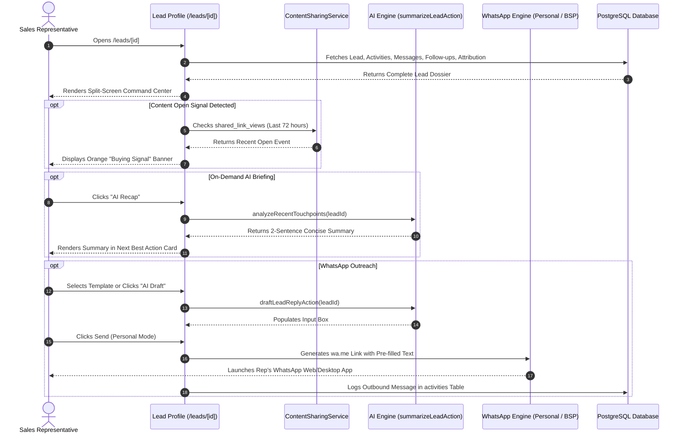

# Ridhzo "Lead Profile": Product & Marketing Specification

> **Document Type:** Product Architecture, Feature Analysis & Website Marketing Reference  
> **Target Audience:** Account Executives, Inbound Sales Representatives, Customer Success Managers, Sales Operations  
> **Scope:** Individual Lead Profile Dossier (`/leads/[id]`, e.g., `/leads/b30e02f7-f320-4a2b-9f03-312d7b6c557b`)  
> **Source Verification:** Verified against live Ridhzo codebase (`src/app/(dashboard)/leads/[id]/page.tsx`, `LeadHeaderQuickActions.tsx`, `WhatsAppSendBox.tsx`, `WhatsAppThread.tsx`, `ShareContentCard.tsx`, `LeadAiRecap.tsx`, `LeadRemindersTab.tsx`, `LeadAttachmentsTab.tsx`, and PostgreSQL/Drizzle schema).

---

## 1. Lead Profile Overview

### What the Lead Profile Dossier Is
The **Ridhzo Lead Profile** (`/leads/[id]`, as demonstrated by sample route `/leads/b30e02f7-f320-4a2b-9f03-312d7b6c557b`) is the comprehensive 360-degree customer dossier and conversational command cockpit for an individual prospective client. While the **Leads Hub** (`/leads`) organizes multi-lead queue distribution and bulk triage, the Lead Profile is where deals are actively worked, nurtured, negotiated, and closed.

Every customer touchpoint—inbound Meta ad attributes, two-way WhatsApp message threads, AI-generated conversation recaps, scheduled follow-up tasks, shared document read-receipts, internal collaboration notes, and contract attachments—is consolidated into a unified, high-density split-screen interface.

### Why It Exists in Ridhzo
Traditional CRM contact records are static, administrative databases where sales reps waste time logging past events rather than executing next steps. Reps frequently suffer from "pre-call amnesia," forgetting what the prospect said three days ago or whether they reviewed the sent proposal.

Ridhzo's Lead Profile was engineered around an active execution philosophy:
1. **Context at a Glance:** The moment a rep opens a lead, prominent contextual banners alert them to duplicate records, buying signals (e.g., *"Opened proposal 3× in the last 24h"*), and algorithmic Next Best Actions.
2. **Dual-Mode Omnichannel Outreach:** Reps can communicate instantly via personal WhatsApp (one-tap native routing without Meta 24-hour restrictions) or enterprise Meta Cloud API (BSP), alongside direct click-to-call and email composition.
3. **Buyer Intent Radar (Trackable Content):** Replaces blind PDF attachments with trackable `/s/:slug` links that notify reps the moment a prospect opens a quote or deck.
4. **AI-Powered Acceleration:** Delivers on-demand AI conversation recaps and intelligent one-click reply drafting based on full thread history.

### Who Uses It
* **Frontline Sales Reps & Account Executives:** Review prospect history before calls, dispatch WhatsApp messages, update opportunity stages, and log meeting outcomes.
* **Business Development Reps (BDRs):** Qualify inbound inquiries against BANT criteria and enroll prospects into multi-step nurture sequences.
* **Sales Managers & Deal Coaches:** Inspect stalled deals, review rep notes, evaluate loss reasons, and verify compliance with follow-up schedules.

### Business Problems It Solves
* **Pre-Call Information Scrambling:** Consolidates contact information, custom form submissions, and interaction history on a single screen.
* **The "Proposal Black Hole":** Eliminates guessing whether a prospect received or reviewed a proposal by logging real-time link views and open timestamps.
* **Fragmented WhatsApp Messaging:** Bridges personal WhatsApp conversations with company CRM records, providing auditability across all rep-customer chats.
* **Missed Commitments:** Provides a dedicated follow-up reminder control with snooze, due-date scheduling, and calendar alerts.

### How It Differs from Other Ridhzo Views
| Dimension | Lead Profile Dossier (`/leads/[id]`) | Leads Hub (`/leads`) | Executive Dashboard (`/`) |
| :--- | :--- | :--- | :--- |
| **Granularity** | **Micro:** Single prospect's entire lifecycle and history | **Macro Operations:** Multi-lead queues, bulk lists, and triage | **Macro Strategy:** Org-wide KPIs, SLAs, and channel charts |
| **Primary Goal** | Closing the individual deal through direct communication | Queue management, bulk assignment, and status updates | Monitoring response velocity, team workload, and revenue health |
| **Core Tools** | Two-way WhatsApp thread, trackable links, file tabs, AI recap | Mass WhatsApp broadcast, CSV import/export, filter builder | Recharts velocity charts, priority feed, date range presets |

### How a Sales Rep Uses It During a Live Call
1. **Pre-Call Briefing (60 Seconds Before):** 
   The rep clicks into `/leads/[id]`. They glance at the **Next Best Action** card and click **AI Recap** to generate an instant 2-sentence summary of previous interactions.
2. **Reviewing Buying Signals:** 
   The rep notices an orange **Buying Signal Banner**: *"Sarah opened 'Q3 Enterprise Proposal' 2× recently."* The rep now knows the buyer is actively reviewing pricing.
3. **During the Call:** 
   The rep references the **Lead Source & Attribution Card** (confirming the lead came from the "Executive Webinar" ad set) and updates the **Custom Attributes** (e.g., setting budget to $25,000).
4. **Post-Call Wrap-up (Immediate):** 
   The rep switches the status from `New` to `Active`, enters an internal summary in the **Notes Tab**, schedules a follow-up for Thursday at 10:00 AM using the **Follow-up Control**, and shares a trackable product brochure link via **Share Content**.

---

## 2. Everything Included in the Lead Profile Dossier

Based on the live implementation in `src/app/(dashboard)/leads/[id]/page.tsx`:

```
+====================================================================================+
| [DUPLICATE BANNER] "Potential duplicate detected (matches email/phone)"           |
+====================================================================================+
| [BUYING SIGNAL BANNER] "Buying signal: Sarah opened 'Enterprise Quote' 3x recently"|
+====================================================================================+
| HEADER: [<- Back] (Initials) Lead Name [Status Badge] Lead #1042 · Created 2d ago  |
| Quick Actions Toolbar: [Call] [WhatsApp] [Email] [Schedule Follow-up] [Edit] [Del] |
+====================================================================================+
| LEFT COLUMN (1/3 Width)                   | RIGHT COLUMN (2/3 Width)               |
|                                           |                                        |
| 1. NEXT BEST ACTION & AI RECAP            | 10. AUTOMATED DRIP SEQUENCES CARD      |
|    - Priority label & reason              |     - Active enrollments & step status |
|    - On-demand "AI Recap" trigger         |     - One-click "+ Enroll" modal       |
|                                           |                                        |
| 2. LEAD INSIGHTS & QUALIFICATION          | 11. MULTI-TAB COMMUNICATION & AUDIT    |
|    - Lead score & enrichment evidence     |     +--------------------------------+ |
|    - Inbound message & activity flags     |     | Activity (12) | Follow-ups (2) | |
|                                           |     | Attachments(3)| WhatsApp (8)   | |
| 3. FOLLOW-UP REMINDER WIDGET              |     | Notes (4)     | Send Email     | |
|    - Next scheduled date & quick snooze   |     +--------------------------------+ |
|                                           |                                        |
| 4. SHARE & TRACK CONTENT CARD             |     [Tab 1: Activity Audit Timeline]   |
|    - Create trackable /s/:slug links      |     - Chronological event stream       |
|    - Real-time read receipt counters      |     - Author badges & relative time    |
|                                           |                                        |
| 5. RE-ENGAGEMENT PLAN CARD (Cold leads)   |     [Tab 2: Follow-ups & Reminders]    |
|                                           |     - Due dates, alerts, completion    |
| 6. LEAD MANAGEMENT CONTROLS               |                                        |
|    - Status dropdown (custom schema)      |     [Tab 3: Attachments Manager]       |
|    - Assignee dropdown (team users)       |     - Direct file upload & download    |
|    - Tag management pill badges           |                                        |
|    - Stage selector & Expected Value ($)  |     [Tab 4: WhatsApp Chat Engine]      |
|                                           |     - Two-way scrollable chat thread   |
| 7. LEAD SOURCE & MARKETING ATTRIBUTION    |     - Read delivery status receipts    |
|    - Channel name & source type badge     |     - Template picker & AI reply draft |
|    - Meta Campaign, Ad Set, Ad Name, Form |     - Personal (wa.me) vs BSP toggle   |
|    - Full UTM tags (Source, Medium, Term) |                                        |
|                                           |     [Tab 5: Collaboration Notes]       |
| 8. CONTACT INFORMATION CARD               |     - Rich text notes & user pins      |
|    - Email (mailto link)                  |                                        |
|    - Phone (tel: & WhatsApp direct web)   |     [Tab 6: Direct Email Composer]     |
|    - Company name                         |     - Subject, body & delivery toast   |
|                                           |                                        |
| 9. CUSTOM ATTRIBUTES (JSONB Custom Fields)|                                        |
|    - Live editable custom business fields |                                        |
+====================================================================================+
```

### 1. Contextual Notification Banners
* **Duplicate Detection Banner (`LeadDuplicateBanner`):** Compares `email` and `phone` against existing organization leads, alerting reps to potential duplicates to prevent conflicting outreach.
* **Buying Signal Banner:** Fires automatically when a lead views shared collateral within the last 72 hours (`ContentSharingService`), displaying: *"Buying signal: [Lead] opened '[Title]' X times recently — reach out now while you're top of mind."*
* **Lost / Disqualification Banner:** Rendered if the status is `lost` or `unqualified`, displaying the recorded `lostReason` (e.g., *"Lost — reason: Competitor pricing"*).

### 2. Header & Quick-Action Toolbar (`LeadHeaderQuickActions`)
* **Identity Block:** Back navigation to `/leads`, circular initials avatar, Lead Name, dynamic custom-colored Status Badge, sequential `Lead #[displayId]`, and localized creation timestamp.
* **Quick Actions Toolbar:**
  * **Click-to-Call (`tel:`):** Launches device dialer or VoIP client.
  * **Instant WhatsApp:** Opens WhatsApp web/desktop app pre-populated with lead number.
  * **Direct Email:** Jumps directly to email composition tab.
  * **Quick Follow-up Scheduler:** Popover with one-click presets: *Later Today (+3h)*, *Tomorrow Morning (09:00 AM)*, *In 2 Days*, *Next Week*, or *Custom Date Picker*.
  * **Edit Lead Dialog:** Inline modal for editing primary contact details.
  * **Delete Button:** Moves lead to the 30-day recoverable Recycle Bin.

### 3. Next Best Action & AI Recap Card
* **Next Best Action Prescription (`NextBestActionService`):** Evaluates lead status, recency, scores, and buying signals to output an actionable recommendation badge (`high`, `medium`, `low`) and tactical reason string.
* **On-Demand AI Recap (`LeadAiRecap`):** Server action (`summarizeLeadAction`) executing an on-demand AI call that distills activities, notes, and WhatsApp messages into a concise executive summary.

### 4. Lead Insights & Qualification Card (`LeadInsightsCard`)
* **Lead Score Meter:** Displays composite score (0-100) based on profile completeness, engagement frequency, and BANT qualification.
* **Enrichment Evidence:** Highlights buying signals, inbound message presence, and company details.

### 5. Follow-Up Control Widget (`LeadFollowUpControl`)
* **Next Follow-up Date:** Clear display of upcoming scheduled deadlines with overdue alert styling.
* **Quick Update:** Select new date/time presets to keep the deal on track.

### 6. Share & Track Content Card (`ShareContentCard`)
* **Trackable Page Creation:** Generates a unique, trackable link (`/s/:slug`) for proposals, brochures, contracts, or target URLs.
* **Read Receipts & View Counters:** Displays exact view count and relative timestamp of last open (e.g., *"Viewed 4 times · 2 hours ago"*).
* **One-Click Share:** Copy link or share directly via WhatsApp.

### 7. Re-engagement Plan Card (`ReengagementPlanCard`)
* **Automated Cold Cadence:** Renders for inactive or cold leads, prescribing a structured multi-day re-engagement schedule.

### 8. Lead Management Controls Card
* **Status Control (`LeadStatusControl`):** Dropdown reflecting the organization's custom status schema (`CustomStatusSchemaService`), updating status across all boards and metrics.
* **Assignee Control (`LeadAssignControl`):** Reassign lead ownership across active team members.
* **Tag Manager (`LeadTags`):** Add or remove organizational taxonomy tags.
* **Stage & Expected Value (`LeadStageAndValueControl`):** Update pipeline stage and enter monetary expected deal value formatted in the workspace's localized currency (`getOrgFormat`).

### 9. Lead Source & Ad Attribution Card
* **Source & Channel Type:** Displays source name and channel badge (e.g., Facebook Lead Ads, Google Lead Ads, Webhook).
* **Granular Attribution Metadata:** Automatically parses parameters stored in `customData`:
  * *Campaign Name (`meta_campaign_name` / `utm_campaign`)*
  * *Ad Set Name (`meta_adset_name`)*
  * *Ad Name (`meta_ad_name`)*
  * *Facebook Form Name (`facebook_form_id`)*
  * *UTM Source, Medium, Term, Content, GCLID, Page URL, Referrer*

### 10. Contact Information Card
* **Email:** Clickable `mailto:` link.
* **Phone:** Clickable `tel:` phone call link and native WhatsApp routing link.
* **Company:** Organization name.

### 11. Custom Attributes Card (`LeadCustomFields`)
* **Dynamic Business Fields:** Renders custom organizational fields (text, number, dropdown, date) configured in settings.
* **Inline Editing:** Reps can update custom field values directly from the card.
* **Role-Based Security:** Admin-only custom fields are hidden from non-admin users.

### 12. Automated Sequences Card (`LeadSequencesCard`)
* **Drip Sequence Enrollment:** Displays currently enrolled nurture sequences, current step progress, and completion status.
* **Sequence Picker:** Enroll lead into pre-configured multi-channel sequences with a single click.

### 13. Multi-Tab Communication & History Hub
* **Tab 1: Activity Log (`activities.length`):** Chronological timeline of calls, meetings, notes, status changes, and assignments with user attribution and timestamps.
* **Tab 2: Follow-ups (`reminders.length`):** List of pending and completed follow-up tasks with due dates, reminder alerts, and completion checkboxes.
* **Tab 3: Attachments (`attachments.length`):** Upload documents, PDFs, proposals, and images with file size tracking and download actions.
* **Tab 4: WhatsApp (`waMessages.length`):** 
  * *Thread History (`WhatsAppThread`):* Interactive chat history with timestamps and status ticks (sent, delivered, read).
  * *Messaging Sendbox (`WhatsAppSendBox`):* Template picker, AI-assisted reply drafting (`draftLeadReplyAction`), and dual-mode toggle (Personal `wa.me` vs. Meta Cloud API).
* **Tab 5: Notes (`notesCount`):** Internal team collaboration notes with timestamps and author details.
* **Tab 6: Send Email (`EmailSendBox`):** Dedicated email composer with subject, body, and status toast notifications.

---

## 3. Lead Profile Features

### Conversational Intelligence
* **Two-Way WhatsApp Chat Thread:** Complete conversational audit trail directly inside the CRM.
* **Dual WhatsApp Dispatch Modes:** Choose between Personal WhatsApp (zero Meta fees, no 24h template restrictions) and Enterprise Cloud BSP.
* **AI Reply Drafting:** Evaluates recent chat history to draft professional, personalized responses in seconds.
* **Template Picker:** Instant insertion of approved WhatsApp outreach templates.

### Buyer Engagement & Content Tracking
* **Trackable Branded Links:** Generate unique `/s/:slug` URLs for quotes and proposals.
* **Real-Time Read Receipts:** View exact customer open counts and timestamps.
* **Buying Signal Automation:** Real-time banner alerts when prospects interact with shared collateral.

### Deal & Pipeline Governance
* **Multi-Currency Deal Valuation:** Input expected deal values formatted in the workspace's native currency and locale.
* **Custom Status Normalization:** Seamless alignment with enterprise-configured lead lifecycle stages.
* **Sequential Display IDs:** Memorable, human-friendly numbers (`Lead #1042`) for team coordination.

### Marketing & Inbound Attribution
* **Paid Ad Attribution:** Deep-dive tracking into Meta Ad Campaign, Ad Set, Ad, and Form Name.
* **Full UTM Parameter Parsing:** Capture UTM source, medium, campaign, keyword, and click IDs.

---

## 4. Master Data Points & Attributes

| Field / Attribute | Database Source | Type & Format | Business Function |
| :--- | :--- | :--- | :--- |
| **Display ID** | `leads.displayId` | Integer (`#1042`) | Human-friendly reference for quick team communication. |
| **Lead Name** | `leads.name` | String (1-255) | Prospect primary contact name. |
| **Email Address** | `leads.email` | RFC-compliant email | Electronic communication and duplicate matching key. |
| **Phone Number** | `leads.phone` | String (E.164) | Normalized dialing number and WhatsApp routing ID. |
| **Company** | `leads.company` | String | Organization or business entity name. |
| **Status** | `leads.status` | Custom Schema Key | Current stage in the sales lifecycle. |
| **Expected Value** | `leads.expectedValue` | Numeric(12,2) | Monetary opportunity valuation. |
| **Lead Score** | `leads.score` | Integer (0-100) | Engagement and qualification score. |
| **Lost Reason** | `leads.lostReason` | String (120) | Root-cause categorization when a deal is closed-lost. |
| **Next Follow-up** | `leads.nextFollowUpAt` | Timestamp | Scheduled deadline for next sales touchpoint. |
| **Last Contacted** | `leads.lastContactedAt` | Timestamp | Timestamp of most recent outreach event. |
| **Custom Data** | `leads.customData` | JSONB Store | Dynamic attributes (ad attribution, custom fields). |

---

## 5. Technical Architecture & Communication Flow



---

## 6. Frontline Sales Use Cases

### 1. Capitalizing on Live Proposal Views
* **Scenario:** A commercial real estate broker sent a $450,000 property brochure yesterday.
* **Lead Profile Action:** The broker opens `/leads/[id]` and sees: *"Buying signal: Prospect opened 'Harbor Point Brochure' 3× recently."*
* **Outcome:** The broker immediately clicks the header **Call** button to contact the prospect while their interest is active, securing a site tour.

### 2. Rapid Pre-Call Catchup via AI Recap
* **Scenario:** An Account Executive has back-to-back demo calls and only 30 seconds to prepare for the next prospect.
* **Lead Profile Action:** The AE opens `/leads/[id]` and clicks **AI Recap**.
* **Outcome:** In 3 seconds, the AI outputs: *"Prospect inquired via Meta Lead Ads regarding enterprise SSO; had 2 WhatsApp touchpoints discussing pricing tiers; scheduled demo today to review multi-user permissions."* The AE conducts the call with full context.

### 3. Re-engaging Cold Inactive Prospects
* **Scenario:** A lead has been silent for 18 days.
* **Lead Profile Action:** The rep reviews the **Re-engagement Plan Card**, selects the prescribed 3-touch cadence, and enrolls the lead into the **Re-engagement Sequence**.
* **Outcome:** Automated personalized touchpoints re-open the sales dialogue without manual drafting.

---

## 7. Marketing-Friendly Feature Explanation

### Why Top Closers Rely on the Ridhzo Lead Profile

In modern sales, deals are won by the reps who have the best context and fastest execution. When every second counts, flipping between different tools to read customer notes, find phone numbers, and draft WhatsApp messages slows you down. The **Ridhzo Lead Profile** gives sales professionals an unfair advantage by placing complete customer intelligence and multi-channel outreach in a single view.

* **Complete Customer Context in One View:** No more digging through scattered email threads or CRM tabs. See your prospect's entire history—from their initial Facebook ad click to their latest WhatsApp message—in one clean dossier.
* **Never Call Blind Again:** With on-demand AI Recaps, you can get fully up to speed on any opportunity in 3 seconds before picking up the phone.
* **Know the Exact Moment to Strike:** Stop wondering if clients opened your proposal. Trackable document links notify you the instant collateral is opened so you can follow up with perfect timing.
* **Frictionless WhatsApp Execution:** Communicate the way your customers prefer. Choose between personal WhatsApp routing (zero Meta approval delays) or enterprise Cloud API, complete with AI reply drafting.
* **Stay on Top of Follow-ups:** Never let a commitment slip through the cracks. Built-in follow-up scheduling with quick-snooze controls ensures you always follow through.

---

## 8. Feature List for Website

* **360-Degree Customer Dossier**  
  Consolidates contact information, pipeline stages, custom fields, interaction timelines, and file attachments in a unified interface.

* **Live Buying Signal Detection**  
  Visual alerts notify reps the moment a prospect opens shared proposals, quotes, or marketing collateral.

* **Dual-Mode WhatsApp Messaging**  
  Switch seamlessly between one-tap personal WhatsApp routing and enterprise Meta Cloud API, complete with full thread history.

* **AI Conversation Recap & Reply Drafting**  
  Generate instant executive summaries of lead history and draft intelligent WhatsApp responses with a single click.

* **Trackable Branded Document Sharing**  
  Share proposals and brochures via trackable `/s/:slug` links with real-time read receipts and view counters.

* **Paid Ad Attribution Transparency**  
  Deep tracking into originating Meta Campaigns, Ad Sets, Ads, and Form Names alongside full UTM parameter sets.

* **Algorithmic Next Best Action**  
  Actionable recommendations based on lead buying signals, scores, and SLA response windows.

* **Automated Drip Sequence Enrollment**  
  Enroll leads directly into automated multi-step nurture sequences with live progress tracking.

* **Quick Follow-up Scheduler**  
  Schedule and snooze follow-up tasks with one-click presets to maintain outreach discipline.

* **Centralized File Attachment Vault**  
  Upload, preview, and download contracts, proposals, and images associated with the customer record.

* **30-Day Recoverable Protection**  
  Safely remove leads to the recycle bin with full 30-day restoration capabilities.

---

## 9. Lead Profile Page Structure

```
+====================================================================================+
| NOTIFICATION BANNERS                                                               |
|  - Duplicate Warning Banner (matches existing phone/email)                         |
|  - Buying Signal Banner (content opened in last 72 hours)                          |
|  - Lost / Disqualified Reason Banner (lostReason breakdown)                        |
+====================================================================================+
| HEADER BAR                                                                         |
|  [<- Back to Leads] [Avatar] Lead Name [Status Badge] | Lead #1042 · Created 2d ago |
|  Quick Actions Toolbar: [Call] [WhatsApp] [Email] [Follow-up] [Edit] [Delete]      |
+====================================================================================+
| 2-COLUMN RESPONSIVE LAYOUT (grid-cols-1 lg:grid-cols-3 gap-6)                      |
|                                                                                    |
| [LEFT COLUMN: lg:col-span-1]                | [RIGHT COLUMN: lg:col-span-2]        |
|  1. Next Best Action & AI Recap Card        |  10. Automated Sequences Card        |
|  2. Lead Insights & Qualification Card      |  11. Multi-Tab Workstation Container |
|  3. Follow-up Reminder Widget               |      [Activity] Chronological feed   |
|  4. Share & Track Content Card              |      [Follow-ups] Task checklist     |
|  5. Re-engagement Plan Card (Cold leads)    |      [Attachments] Document vault    |
|  6. Lead Management Controls Card           |      [WhatsApp] Live chat & sendbox  |
|  7. Lead Source & Attribution Card          |      [Notes] Internal team notes     |
|  8. Contact Information Card                |      [Send Email] Direct composer    |
|  9. Custom Attributes Card                  |                                      |
+====================================================================================+
```

---

## 10. Technical Reference

### Routes and Entry Points
* **Lead Profile Page:** [`src/app/(dashboard)/leads/[id]/page.tsx`](file:///Users/naveenadicharla/Documents/ridhzo/src/app/(dashboard)/leads/[id]/page.tsx)
* **Parent Leads Hub:** [`src/app/(dashboard)/leads/page.tsx`](file:///Users/naveenadicharla/Documents/ridhzo/src/app/(dashboard)/leads/page.tsx)

### UI Components (`src/components/leads/`)
* **Header Actions:** [`LeadHeaderQuickActions.tsx`](file:///Users/naveenadicharla/Documents/ridhzo/src/components/leads/LeadHeaderQuickActions.tsx)
* **Duplicate Banner:** [`LeadDuplicateBanner.tsx`](file:///Users/naveenadicharla/Documents/ridhzo/src/components/leads/LeadDuplicateBanner.tsx)
* **AI Conversation Recap:** [`LeadAiRecap.tsx`](file:///Users/naveenadicharla/Documents/ridhzo/src/components/leads/LeadAiRecap.tsx)
* **Insights & Scoring:** [`LeadInsightsCard.tsx`](file:///Users/naveenadicharla/Documents/ridhzo/src/components/leads/LeadInsightsCard.tsx)
* **Follow-up Control:** [`LeadFollowUpControl.tsx`](file:///Users/naveenadicharla/Documents/ridhzo/src/components/leads/LeadFollowUpControl.tsx)
* **Share Content Card:** [`ShareContentCard.tsx`](file:///Users/naveenadicharla/Documents/ridhzo/src/components/leads/ShareContentCard.tsx)
* **Re-engagement Card:** [`ReengagementPlanCard.tsx`](file:///Users/naveenadicharla/Documents/ridhzo/src/components/leads/ReengagementPlanCard.tsx)
* **Status Control:** [`LeadStatusControl.tsx`](file:///Users/naveenadicharla/Documents/ridhzo/src/components/leads/LeadStatusControl.tsx)
* **Assignee Control:** [`LeadAssignControl.tsx`](file:///Users/naveenadicharla/Documents/ridhzo/src/components/leads/LeadAssignControl.tsx)
* **Tag Manager:** [`LeadTags.tsx`](file:///Users/naveenadicharla/Documents/ridhzo/src/components/leads/LeadTags.tsx)
* **Stage & Value Control:** [`LeadStageAndValueControl.tsx`](file:///Users/naveenadicharla/Documents/ridhzo/src/components/leads/LeadStageAndValueControl.tsx)
* **Custom Fields Card:** [`LeadCustomFields.tsx`](file:///Users/naveenadicharla/Documents/ridhzo/src/components/leads/LeadCustomFields.tsx)
* **Sequences Card:** [`LeadSequencesCard.tsx`](file:///Users/naveenadicharla/Documents/ridhzo/src/components/leads/LeadSequencesCard.tsx)
* **Reminders Tab:** [`LeadRemindersTab.tsx`](file:///Users/naveenadicharla/Documents/ridhzo/src/components/leads/LeadRemindersTab.tsx)
* **Attachments Tab:** [`LeadAttachmentsTab.tsx`](file:///Users/naveenadicharla/Documents/ridhzo/src/components/leads/LeadAttachmentsTab.tsx)
* **WhatsApp Thread:** [`WhatsAppThread.tsx`](file:///Users/naveenadicharla/Documents/ridhzo/src/components/leads/WhatsAppThread.tsx)
* **WhatsApp Sendbox:** [`WhatsAppSendBox.tsx`](file:///Users/naveenadicharla/Documents/ridhzo/src/components/leads/WhatsAppSendBox.tsx)
* **Notes Tab:** [`LeadNotesTab.tsx`](file:///Users/naveenadicharla/Documents/ridhzo/src/components/leads/LeadNotesTab.tsx)
* **Email Sendbox:** [`EmailSendBox.tsx`](file:///Users/naveenadicharla/Documents/ridhzo/src/components/leads/EmailSendBox.tsx)

### Backend Services & Server Actions
* **Lead Query Service:** [`src/domains/leads/service.ts`](file:///Users/naveenadicharla/Documents/ridhzo/src/domains/leads/service.ts) (`LeadService.getLead`)
* **Content Sharing Engine:** [`src/domains/leads/contentSharingService.ts`](file:///Users/naveenadicharla/Documents/ridhzo/src/domains/leads/contentSharingService.ts) (`listForLead`)
* **Next Best Action Engine:** [`src/domains/leads/nextBestActionService.ts`](file:///Users/naveenadicharla/Documents/ridhzo/src/domains/leads/nextBestActionService.ts) (`getRecommendation`)
* **WhatsApp Messaging Service:** [`src/lib/messaging/whatsapp/service.ts`](file:///Users/naveenadicharla/Documents/ridhzo/src/lib/messaging/whatsapp/service.ts) (`WhatsAppService.listForLead`)
* **AI Actions:** [`src/lib/actions/ai.ts`](file:///Users/naveenadicharla/Documents/ridhzo/src/lib/actions/ai.ts) (`summarizeLeadAction`, `draftLeadReplyAction`)
* **Activity Engine:** [`src/domains/activities/service.ts`](file:///Users/naveenadicharla/Documents/ridhzo/src/domains/activities/service.ts) (`ActivityService.getLeadActivities`)
* **Custom Status Schema:** [`src/domains/leads/customStatusSchemaService.ts`](file:///Users/naveenadicharla/Documents/ridhzo/src/domains/leads/customStatusSchemaService.ts)

### Database Models (`src/db/schema/`)
* `leads` (`src/db/schema/leads.ts`)
* `leadSources` (`src/db/schema/leads.ts`)
* `leadPipelineStages` (`src/db/schema/leads.ts`)
* `customStatusConfigs` (`src/db/schema/leads.ts`)
* `activities` (`src/db/schema/activities.ts`)
* `followUps` (`src/db/schema/activities.ts`)
* `leadAttachments` (`src/db/schema/activities.ts`)
* `whatsappMessages` (`src/db/schema/whatsapp.ts`)
* `sharedLinks`, `sharedLinkViews` (`src/db/schema/sharedContent.ts`)
* `users`, `organizations` (`src/db/schema/users.ts`, `src/db/schema/organizations.ts`)
