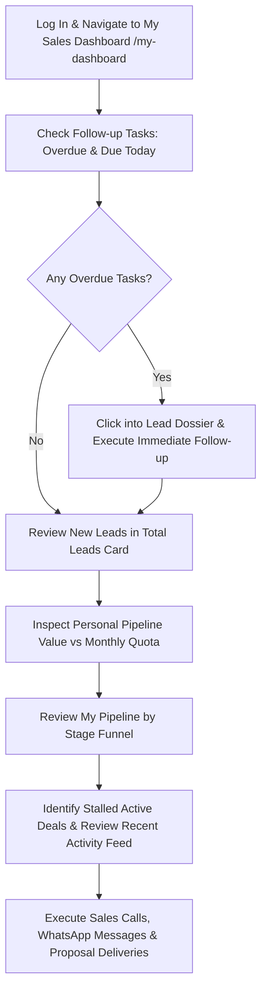

# Ridhzo "My Dashboard": Product & Marketing Specification

> **Document Type:** Product Architecture, Feature Analysis & Website Marketing Reference  
> **Target Audience:** Sales Representatives, Account Executives, Sales Managers, Growth Teams  
> **Source Verification:** Verified against live Ridhzo codebase (`src/app/(dashboard)/my-dashboard/page.tsx`, `AnalyticsService`, `MetricsCards`, `LeadsByStageChart`, `RecentActivityFeed`, and PostgreSQL/Drizzle schema).

---

## 1. My Dashboard Overview

### What "My Dashboard" Is
The **Ridhzo My Dashboard** (`/my-dashboard`), titled **"My Sales Dashboard"** in the application interface, is the dedicated personal cockpit for individual sales representatives, account managers, and business development reps. While the Executive Dashboard provides a high-level, aggregate vantage point across the entire company, My Dashboard isolates and displays the pipeline, conversion efficiency, and operational workload of the authenticated user.

### Why It Exists in Ridhzo
In fast-paced sales operations, cognitive overload kills execution. If a frontline sales rep opens a dashboard populated with hundreds of company-wide leads, competing priorities, and unrelated branch statistics, it creates confusion and dilutes focus. 

Ridhzo created My Dashboard to provide an uncompromised, noise-free workspace. Every metric and chart is scoped directly to the individual:
* **"How many active opportunities am I managing right now?"**
* **"What is my personal expected deal value this month?"**
* **"How many follow-up tasks do I owe today, and how many are slipping overdue?"**
* **"Where are my assigned prospects getting stuck in my pipeline?"**

### Who Uses It
* **Sales Representatives & Account Executives (AEs):** Monitor personal quota achievement, track owned active leads, and clear pending follow-up backlogs.
* **Business Development Reps (BDRs / SDRs):** Track the velocity of newly assigned intake leads and transition them into active qualification.
* **Team Leads & Sales Coaches:** Review individual rep cockpits during 1-on-1 pipeline reviews to diagnose individual conversion rates, stage drop-offs, or task bottlenecks.

### Business Problems It Solves
* **Distraction & Clutter:** Strips away organization-wide noise so reps focus exclusively on the prospects they personally own and are accountable for closing.
* **Slipping Follow-ups:** Highlights overdue tasks and tasks due today immediately upon login, preventing hot prospects from turning cold.
* **Unclear Personal Pipeline Value:** Replaces mental math with a real-time, multi-currency valuation of all active deals currently held by the representative.
* **Subjective Self-Assessment:** Delivers hard, data-driven personal conversion metrics (win rates) so reps can benchmark their performance over time.

### Decisions It Helps Sales Reps Make
* **Daily Prioritization:** Immediately see whether today should be spent clearing overdue follow-ups or working new lead intake.
* **Pipeline Management:** Identify deals stagnating in intermediate stages and initiate stage transitions or close-lost disqualifications.
* **Quota Projection:** Compare current active pipeline value against personal monthly sales targets to know if more prospecting or higher closing velocity is required.

### How It Differs from the Executive Dashboard and Task Lists
| Dimension | My Dashboard (`/my-dashboard`) | Executive Dashboard (`/`) | Follow-up Queue (`/follow-ups`) |
| :--- | :--- | :--- | :--- |
| **User Role** | Frontline Sales Rep, AE, BDR | CEO, CCO, VP of Sales, Branch Manager | All sales roles |
| **Data Scope** | **Strictly Personal:** Filtered to `ownerId = currentUserId` | **Organization-Wide:** Across all reps, teams, and sources | Personal or team task rows |
| **Primary Focus** | Personal pipeline velocity & task clearing | Team governance, SLA tracking & marketing channel attribution | Granular task-by-task execution |
| **Key Visualizations** | Personal Pipeline Area Curve + Recent Activity Feed | Multi-source Bar Chart, Owner Allocation, Pipeline Distribution | Tabular task list & calendar view |

### How a Sales Rep Uses It During a Working Day
1. **Shift Start (09:00 AM):** 
   The sales rep logs in and opens **My Sales Dashboard**. They immediately check the **Follow-up Tasks** card. If 5 tasks are overdue and 8 are due today, these form the morning call priority.
2. **Pipeline Inspection (11:30 AM):** 
   The rep reviews the **My Pipeline by Stage** chart. They notice an accumulation of leads in the "Active" stage and review individual lead records to advance them toward proposal or qualification.
3. **Mid-Day Value Check (02:00 PM):** 
   The rep evaluates **Pipeline Value** ($42,500 active). They know their monthly quota is $50,000, confirming that they need to close at least two more pending opportunities this week.
4. **End-of-Day Review (05:30 PM):** 
   The rep confirms that the Follow-up Tasks completion rate has risen to 95%+, ensuring no prospect was left unserviced before logging off.

---

## 2. Everything Included in My Dashboard

Based directly on `src/app/(dashboard)/my-dashboard/page.tsx`, `MetricsCards.tsx`, `ChartsLazy.tsx`, and `RecentActivityFeed.tsx`, My Dashboard contains the following components and features:

### 1. Header & Identity Context
* **Feature Name:** My Sales Dashboard Header
* **What It Shows:** Page title: `My Sales Dashboard`, Subtitle: `Your personal pipeline and recent activity.`
* **Why It Matters:** Immediately reinforces to the authenticated user that all data displayed is scoped exclusively to their portfolio.
* **Data Source:** User session via `requireOrg()`, providing `userId` and `organizationId`.
* **Available Filters:** Automatically scoped to `ownerId: userId`.
* **Action Supported:** Sets the operational scope for daily sales execution.

### 2. Personal KPI Metric Cards (`MetricsCards`)
* **Feature Name:** Personal KPI Cards (4 Cards)
* **What It Shows:**
  1. **Total Leads:** Total number of non-deleted leads owned by the rep, with subtext breaking down `X new, Y active` (or "No leads yet").
  2. **Conversion Rate:** Personal win rate percentage (`X%`), with subtext showing `X won / Y lost or disqualified`.
  3. **Pipeline Value:** Cumulative monetary value of active opportunities owned by the rep, formatted in the workspace currency (e.g., `$45,000` or `₹3,50,000`).
  4. **Follow-up Tasks:** Direct count of `overdue` tasks (bold text), count of tasks `due today`, and overall `completion rate %`.
* **Why It Matters:** Provides an instant snapshot of pipeline volume, closing efficiency, active cash pipeline, and task urgency.
* **Data Source:** `AnalyticsService.getLeadMetrics({ organizationId, ownerId: userId })` and `AnalyticsService.getFollowUpMetrics({ organizationId, ownerId: userId })`.
* **Calculation:**
  * *Total Leads:* SQL count of leads where `ownerId = userId` and `deletedAt IS NULL`.
  * *New Leads:* Leads owned by user where status maps to category `'open'`.
  * *Active Leads:* Leads owned by user where status maps to category `'in_progress'`.
  * *Personal Conversion Rate:* $\frac{\text{Won}}{\text{Won} + \text{Lost} + \text{Unqualified}} \times 100$. Unqualified leads count as losses to prevent artificial rate flattery.
  * *Pipeline Value:* Sum of `expectedValue` across all leads owned by the user in `in_progress` category.
  * *Follow-up Tasks Overdue:* Count of pending tasks assigned to user where `dueAt < now`.
  * *Follow-up Tasks Due Today:* Count of pending tasks where `dueAt` falls within today's calendar boundaries (`00:00:00` to `23:59:59`).
  * *Completion Rate:* $\frac{\text{Completed Follow-ups}}{\text{Total Follow-ups}} \times 100$.
* **Interactions:** Cards load via React Suspense with an animated pulse skeleton fallback (`h-32 bg-muted rounded-2xl animate-pulse`).
* **Action Supported:** Prompts the rep to clear overdue backlogs and work newly assigned intake leads.

### 3. Personal Pipeline by Stage Chart (`LeadsByStageChart`)
* **Feature Name:** My Pipeline by Stage Area Chart
* **What It Shows:** An Area Chart with linear opacity gradient displaying lead volume across pipeline stages (`New`, `Active`, `Won`, `Lost`, `Unqualified`) exclusively for the logged-in rep.
* **Why It Matters:** Visualizes personal funnel health. A large hump in "New" indicates neglected intake; a bulge in "Active" indicates deal progression stalls; high "Lost" points to qualification issues.
* **Data Source:** `AnalyticsService.getPipelineDistribution({ organizationId, ownerId: userId })`.
* **Calculation:** Aggregates status keys normalized via `CustomStatusSchemaService`.
* **Interactions:** Hover tooltip displaying stage name and exact count. Defer-loaded via `ChartsLazy` off the main bundle to preserve Time to Interactive (TTI).
* **Action Supported:** Helps the rep determine which stage of their pipeline requires immediate movement.

### 4. My Recent Activity Timeline (`RecentActivityFeed`)
* **Feature Name:** Recent Activity Feed
* **What It Shows:** The 10 most recent chronological actions logged across leads (notes, outbound messages, stage adjustments, tags).
* **Why It Matters:** Keeps the rep oriented on recent interactions and customer touchpoints.
* **Data Source:** `AnalyticsService.getRecentActivity(filters)`.
* **Interactions:** Icon-coded event badges (`Message`, `Note`, `Assignment`, `Tag`, `Clock`), relative localized timestamp, and a direct clickable hyperlink to the lead profile (`/leads/[id]`).
* **Technical Nuance & Accuracy Note:** In `src/app/(dashboard)/my-dashboard/page.tsx`, the UI card is titled *"My Recent Activity"* with subtitle *"Latest actions across the leads you own."* However, in `AnalyticsService.getRecentActivity`, the underlying SQL query currently filters by `organizationId` rather than `ownerId`. As a result, the feed currently reflects tenant-wide actions rather than being strictly restricted to user-owned leads. This represents an active backend enhancement opportunity.
* **Action Supported:** Reps can click directly into a lead profile from the recent feed to follow up on a previous conversation.

---

## 3. My Dashboard Features

### Personal Pipeline Management
* **Automated Rep Scoping:** Native RBAC enforcement automatically retrieves the logged-in session ID (`userId`) and binds all pipeline metrics to the user.
* **Multi-Stage Visual Funnel:** Complete area-curve visualization mapping deals from `New` intake to `Active`, `Won`, `Lost`, and `Unqualified`.
* **Custom Status Compatibility:** Seamlessly integrates with enterprise-configured custom status schemas via `CustomStatusSchemaService`.

### Operational Productivity & Task Discipline
* **Overdue Task Alerting:** Instant visibility into overdue tasks, ensuring commitments made to prospects are honored.
* **Same-Day Task Roster:** Previews the volume of tasks scheduled for completion before the close of business today.
* **Personal Task Completion Rate:** Real-time percentage tracking of closed vs. assigned tasks.

### Personal Financial & Conversion Metrics
* **Dynamic Multi-Currency Valuation:** Aggregates expected revenue formatted in the workspace's localized currency (`getOrgFormat`) so reps see exact quota trajectory.
* **Closed-Loop Personal Win Rate:** Accurately reflects closing percentage by factoring in both disqualified and lost leads.

### Activity Auditing & Touchpoint Navigation
* **Chronological Interaction Stream:** Immediate visibility into recently logged customer messages, internal notes, and assignments.
* **Direct Lead Profile Hyperlinks:** Allows reps to jump directly into the full lead dossier with a single click.

---

## 4. Dashboard Metrics

The following table documents every Key Performance Indicator (KPI) presented on My Sales Dashboard:

| KPI | Meaning | Calculation | Business Use for Sales Rep |
| :--- | :--- | :--- | :--- |
| **Total Leads** | Total count of active, non-deleted leads assigned to the rep. | $\text{Count of leads where ownerId = userId and deletedAt IS NULL}$ | Measures overall book of business and account volume. |
| **New Leads** | Leads assigned to the rep that have not yet moved past the initial intake stage. | Count of owned leads where category = `'open'` | Work queue of unworked prospects requiring first contact. |
| **Active Leads** | Leads currently engaged in active sales conversations. | Count of owned leads where category = `'in_progress'` | Core active pipeline requiring proposals, demos, or negotiation. |
| **Conversion Rate (Win Rate)** | Percentage of closed opportunities that the rep has successfully won. | $\frac{\text{Won}}{\text{Won} + \text{Lost} + \text{Unqualified}} \times 100$ | Personal sales effectiveness benchmark against team averages. |
| **Pipeline Value** | Monetary value of all active deals currently held by the rep. | $\sum \text{expectedValue for active owned leads}$ | Personal quota tracking and monthly commission forecasting. |
| **Overdue Follow-ups** | Assigned follow-ups that have passed their scheduled due date. | Count of `follow_ups` where $\text{userId} = \text{repId}$, $\text{status} = \text{'pending'}$, and $\text{dueAt} < \text{now}$ | Immediate priority alert to prevent deal slippage. |
| **Due Today Follow-ups** | Tasks scheduled for completion before end of day. | Count of `follow_ups` where $\text{userId} = \text{repId}$, $\text{status} = \text{'pending'}$, and $\text{dueAt}$ is today | The rep's daily execution target. |
| **Follow-up Completion Rate** | Percentage of assigned follow-up tasks successfully resolved. | $\frac{\text{Completed Follow-ups}}{\text{Total Follow-ups}} \times 100$ | Measures personal execution consistency and process adherence. |

---

## 5. Charts and Visualizations

My Dashboard features a balanced 2-column layout designed for speed and clarity:

```
+------------------------------------------------------------------------------------+
| MY PIPELINE BY STAGE [Area Chart, md:grid-cols-2]                                  |
| (Your leads broken down by current stage: New, Active, Won, Lost, Unqualified)     |
+------------------------------------------------------------------------------------+
| MY RECENT ACTIVITY [Timeline Feed, md:grid-cols-2]                                 |
| (Latest actions: Messages, Notes, Stage changes with clickable lead links)         |
+------------------------------------------------------------------------------------+
```

### 1. My Pipeline by Stage Chart
* **Component:** `LeadsByStageChart` (`src/components/dashboard/Charts.tsx`)
* **Chart Type:** Area Chart with Gradient Fill (`AreaChart` via Recharts).
* **Data Represented:** Count of leads owned by the rep across each lifecycle stage (`New`, `Active`, `Won`, `Lost`, `Unqualified`).
* **Time Period:** All-time active portfolio.
* **Rep Takeaway:** Gives the rep immediate visual feedback on pipeline bottlenecks. For example, if "New" is high, the rep needs to prioritize initial calls; if "Active" is high but "Won" is flat, the rep needs closing support.

### 2. My Recent Activity Timeline Feed
* **Component:** `RecentActivityFeed` (`src/components/dashboard/RecentActivityFeed.tsx`)
* **Widget Type:** Chronological Activity Timeline Feed (10 most recent entries).
* **Data Represented:** Action logs featuring actor names, action types (Message, Note, Assignment, Tag, Clock), localized relative timestamps (`LocalTime`), and lead links.
* **Rep Takeaway:** Keeps the rep in sync with their latest touchpoints and allows immediate one-click navigation back into active conversations.

---

## 6. Filters and Controls

* **User Isolation:** Controlled via server-side session authentication (`requireOrg()`). There is no manual dropdown required—the dashboard dynamically detects the user's authenticated ID and scopes the queries.
* **Multi-Tenant Protection:** Enforces `organizationId` scoping alongside `ownerId` to prevent cross-tenant data leaks.
* **Difference from Executive Dashboard:** Unlike the Executive Dashboard, which features a multi-button date range picker (`DashboardDateFilter`), My Dashboard focuses on the representative's **current, live operational state** to provide a persistent execution environment.

---

## 7. Sales Rep Use Cases

### 1. The 9:00 AM Morning Launchpad
* **Scenario:** An Account Executive starts their working day.
* **Dashboard Action:** Opens `/my-dashboard` and checks the **Follow-up Tasks** card.
* **Outcome:** Discovers 3 overdue follow-ups and 6 follow-ups due today. Rather than searching through email or CRM lists, the rep immediately attacks the overdue tasks.

### 2. Quota & Commission Forecasting
* **Scenario:** A sales rep is halfway through the month and needs to know where they stand relative to their $30,000 monthly quota.
* **Dashboard Action:** Checks the **Pipeline Value** metric card ($24,000) and reviews **My Pipeline by Stage**.
* **Outcome:** Identifies that they have sufficient pipeline value in the "Active" stage to hit their quota, provided they successfully transition active proposals to "Won".

### 3. 1-on-1 Coaching & Pipeline Reviews
* **Scenario:** A Sales Manager conducts a weekly 1-on-1 pipeline review with a sales rep.
* **Dashboard Action:** Together, they review the rep's **Conversion Rate** card and **Pipeline by Stage** curve.
* **Outcome:** The manager notices the rep has an excellent 32% win rate, but their "New Leads" count is low. The manager agrees to adjust round-robin assignment rules to feed more new leads to this high-converting rep.

---

## 8. Daily Sales Representative Workflow



1. **Open My Sales Dashboard:** Sign in and load `/my-dashboard`.
2. **Audit Urgent Tasks:** Verify overdue tasks. Clear every overdue item first to maintain high customer satisfaction.
3. **Review Today's Due List:** Plan the day's outbound touchpoints based on tasks due today.
4. **Evaluate Active Volume:** Check the Total Leads card to see how many new leads have been assigned via round-robin since yesterday.
5. **Inspect Pipeline Balance:** Use the Pipeline by Stage area chart to ensure opportunities are steadily advancing from New $\to$ Active $\to$ Won.
6. **Execute Targeted Outreach:** Click directly through to lead dossiers to log calls, send WhatsApp messages, and close business.

---

## 9. Marketing-Friendly Feature Explanation

### Why Sales Representatives and Account Executives Use Ridhzo My Dashboard

In high-velocity sales environments, time spent searching through complex CRM databases is time taken away from selling. **Ridhzo My Dashboard** gives sales professionals a clear, distraction-free command center engineered for personal productivity and quota achievement.

* **Zero Distractions, Total Focus:** Leave company-wide complexity to the executives. My Dashboard displays *your* leads, *your* active deals, and *your* follow-ups—giving you total clarity on what needs your attention right now.
* **Never Miss a Deal-Winning Follow-up:** Sales success comes down to consistency. With dedicated tracking of overdue tasks and same-day deadlines, you'll never let a hot opportunity go cold.
* **Real-Time Quota Tracking:** Know exactly where you stand against your targets with real-time pipeline valuations displayed in your local currency.
* **Visualize Your Personal Funnel:** Instantly spot where your deals are congregating so you know whether you need to spend your afternoon qualifying new leads or closing active proposals.
* **Frictionless Navigation:** Jump straight from your recent activity timeline directly into customer profiles with a single click.

---

## 10. Feature List for Website

* **Personalized Sales Cockpit**  
  A dedicated workspace tailored exclusively to the individual sales representative, filtering out company noise to highlight assigned leads and active deals.

* **Individual Win Rate Analytics**  
  Accurate personal conversion tracking that accounts for won, lost, and disqualified leads, empowering reps to measure their closing efficiency.

* **Personal Pipeline Valuation**  
  Live monetary valuation of active deals in your localized workspace currency, providing instant clarity on quota trajectory.

* **Overdue & Same-Day Task Tracking**  
  Prominent operational cards highlighting overdue tasks and same-day follow-up commitments to ensure no deal slips through the cracks.

* **Personal Pipeline Stage Visualization**  
  An area-curve chart displaying your individual deal distribution from initial contact to closed-won.

* **Recent Activity Stream**  
  A live chronological timeline tracking interactions, notes, and lead transitions, keeping you oriented on recent customer touchpoints.

* **Blazing Fast Performance**  
  Lazy-loaded chart chunks and Suspense-wrapped metric cards ensure instantaneous page loads and zero layout shift.

---

## 11. My Dashboard Page Structure

The My Sales Dashboard (`src/app/(dashboard)/my-dashboard/page.tsx`) is structured cleanly from top to bottom:

```
+====================================================================================+
| HEADER: Title ("My Sales Dashboard") + Subtitle ("Your personal pipeline...")     |
+====================================================================================+
| CORE PERSONAL METRIC CARDS (MetricsCards - Suspense Loaded - 4 Column Grid)        |
|  [Total Leads]        [Conversion Rate]    [Pipeline Value]    [Follow-up Tasks]   |
|  e.g. 28 leads        e.g. 31.2% win rate  e.g. $42,500        e.g. 2 overdue      |
+====================================================================================+
| 2-COLUMN RESPONSIVE PERFORMANCE GRID (grid gap-6 md:grid-cols-2)                   |
|                                                                                    |
|  [Left Column - min-h-[350px]]             |  [Right Column - min-h-[350px]]       |
|  My Pipeline by Stage                      |  My Recent Activity                   |
|  (Gradient Area Chart via LeadsByStage)    |  (Live 10-event audit feed via        |
|  Displays: New, Active, Won, Lost,         |   RecentActivityFeed with direct      |
|  Unqualified distribution for current rep  |   links to lead profiles)             |
+====================================================================================+
```

1. **Header:** Title (`My Sales Dashboard`) and descriptive subtext (`Your personal pipeline and recent activity.`).
2. **Personal KPI Section (`MetricsCards`):** 4-card responsive grid:
   * Total Leads (personal count, new vs. active)
   * Personal Conversion Rate (won vs. lost/unqualified)
   * Personal Pipeline Value (sum of active `expectedValue`)
   * Personal Follow-up Tasks (overdue, due today, completion rate %)
3. **Two-Column Analytics & Activity Grid:**
   * **Left Panel:** `My Pipeline by Stage` (Area Chart showing individual stage distribution).
   * **Right Panel:** `My Recent Activity` (Live chronological timeline with clickable lead links).

---

## 12. Technical Reference

### Routes and Entry Points
* **My Dashboard Page Component:** [`src/app/(dashboard)/my-dashboard/page.tsx`](file:///Users/naveenadicharla/Documents/ridhzo/src/app/(dashboard)/my-dashboard/page.tsx)
* **Dashboard Layout Guard:** [`src/app/(dashboard)/layout.tsx`](file:///Users/naveenadicharla/Documents/ridhzo/src/app/(dashboard)/layout.tsx)
* **Middleware Route Protection:** [`src/middleware.ts`](file:///Users/naveenadicharla/Documents/ridhzo/src/middleware.ts) (`/my-dashboard/:path*`)
* **Navigation Item Registration:** [`src/components/layout/nav.ts`](file:///Users/naveenadicharla/Documents/ridhzo/src/components/layout/nav.ts) (Icon: `Activity`, Group: `Analytics`, href: `/my-dashboard`)

### UI Components Used
* **KPI Metrics Cards:** [`src/components/dashboard/MetricsCards.tsx`](file:///Users/naveenadicharla/Documents/ridhzo/src/components/dashboard/MetricsCards.tsx)
* **Pipeline Stage Chart (Lazy Loader):** [`src/components/dashboard/ChartsLazy.tsx`](file:///Users/naveenadicharla/Documents/ridhzo/src/components/dashboard/ChartsLazy.tsx)
* **Recharts Chart Implementation:** [`src/components/dashboard/Charts.tsx`](file:///Users/naveenadicharla/Documents/ridhzo/src/components/dashboard/Charts.tsx) (`LeadsByStageChart`)
* **Recent Activity Feed:** [`src/components/dashboard/RecentActivityFeed.tsx`](file:///Users/naveenadicharla/Documents/ridhzo/src/components/dashboard/RecentActivityFeed.tsx)
* **Local Timestamp Renderer:** [`src/components/LocalTime.tsx`](file:///Users/naveenadicharla/Documents/ridhzo/src/components/LocalTime.tsx)

### Backend Services & Queries
* **Analytics Engine:** [`src/lib/analytics/service.ts`](file:///Users/naveenadicharla/Documents/ridhzo/src/lib/analytics/service.ts)
  * `AnalyticsService.getLeadMetrics({ organizationId, ownerId: userId })`
  * `AnalyticsService.getFollowUpMetrics({ organizationId, ownerId: userId })`
  * `AnalyticsService.getPipelineDistribution({ organizationId, ownerId: userId })`
  * `AnalyticsService.getRecentActivity({ organizationId, ownerId: userId })`
* **Custom Status Mapping:** [`src/domains/leads/customStatusSchemaService.ts`](file:///Users/naveenadicharla/Documents/ridhzo/src/domains/leads/customStatusSchemaService.ts)
* **Tenant Regional Formatter:** [`src/lib/format.server.ts`](file:///Users/naveenadicharla/Documents/ridhzo/src/lib/format.server.ts) (`getOrgFormat`) and [`src/lib/format.ts`](file:///Users/naveenadicharla/Documents/ridhzo/src/lib/format.ts) (`formatCurrency`)
* **RBAC Context:** [`src/lib/rbac/index.ts`](file:///Users/naveenadicharla/Documents/ridhzo/src/lib/rbac/index.ts) (`requireOrg()`)

### Database Models (`src/db/schema/`)
* **Leads:** [`src/db/schema/leads.ts`](file:///Users/naveenadicharla/Documents/ridhzo/src/db/schema/leads.ts) (`leads` table: `id`, `ownerId`, `organizationId`, `status`, `expectedValue`, `deletedAt`)
* **Follow-ups:** [`src/db/schema/activities.ts`](file:///Users/naveenadicharla/Documents/ridhzo/src/db/schema/activities.ts) (`follow_ups` table: `id`, `userId`, `leadId`, `dueAt`, `status`, `completedAt`)
* **Activities:** [`src/db/schema/activities.ts`](file:///Users/naveenadicharla/Documents/ridhzo/src/db/schema/activities.ts) (`activities` table: `id`, `leadId`, `userId`, `type`, `content`, `occurredAt`)
* **Users & Teams:** [`src/db/schema/users.ts`](file:///Users/naveenadicharla/Documents/ridhzo/src/db/schema/users.ts) (`users`, `teams`)
