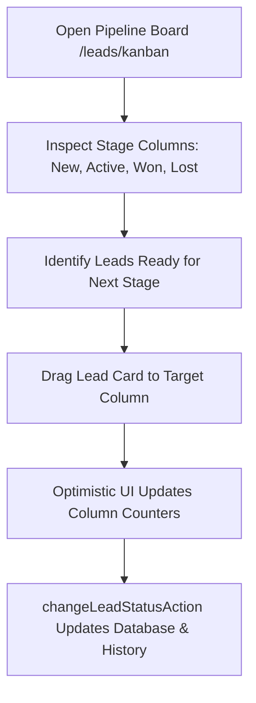
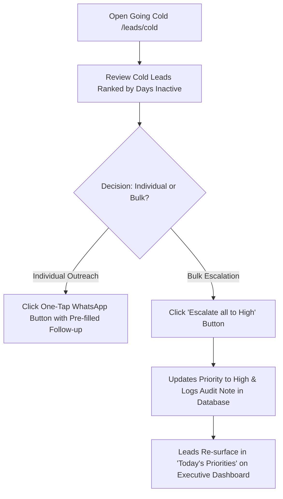

# Ridhzo "Pipeline Board" & "Going Cold": Product & Marketing Specification

> **Document Type:** Product Architecture, Feature Analysis & Website Marketing Reference  
> **Target Audience:** Sales Directors, Revenue Operations, Account Executives, BDRs, Growth Marketers  
> **Scope:** Pipeline Board (`/leads/kanban`) and Going Cold Engine (`/leads/cold`)  
> **Source Verification:** Verified against live Ridhzo codebase (`src/app/(dashboard)/leads/kanban/page.tsx`, `KanbanBoard.tsx`, `src/app/(dashboard)/leads/cold/page.tsx`, `ReclaimStaleButton.tsx`, `StaleLeadReclamationService.ts`, `CustomStatusSchemaService.ts`, and PostgreSQL/Drizzle schema).

---

## 1. Executive Overview

Ridhzo’s CRM suite features two tightly coupled pipeline execution surfaces that address opposite ends of the sales velocity spectrum:
1. **The Pipeline Board (`/leads/kanban`):** An agile, visual drag-and-drop Kanban interface designed for active deal progression across custom lifecycle stages.
2. **The "Going Cold" Intelligence Engine (`/leads/cold`):** An automated safety net and reclamation system that flags leads falling silent and prevents prospective revenue from decaying.

```
┌────────────────────────────────────────────────────────────────────────────────────────┐
│                                 THE RIDHZO PIPELINE CYCLE                              │
└────────────────────────────────────────────────────────────────────────────────────────┘
                                             │
                                             ▼
                        ┌────────────────────────────────────────┐
                        │      PIPELINE BOARD (/leads/kanban)    │
                        │ Visual Drag-and-Drop Lifecycle Stages  │
                        │   New  ──►  Active  ──►  Won / Lost   │
                        └────────────────────────────────────────┘
                                             │
                                  [No contact for 14+ days]
                                             │
                                             ▼
                        ┌────────────────────────────────────────┐
                        │         GOING COLD (/leads/cold)       │
                        │ Automated Inactivity Detection Radar   │
                        │   • Inactivity days counter            │
                        │   • One-tap WhatsApp re-engagement     │
                        │   • "Escalate all to High" button      │
                        └────────────────────────────────────────┘
                                             │
                            [Reclaimed: Priority set to High]
                                             │
                                             ▼
                        ┌────────────────────────────────────────┐
                        │ Re-surfaces in "Today's Priorities"    │
                        │   on Executive & Sales Dashboards      │
                        └────────────────────────────────────────┘
```

### Why These Features Exist in Ridhzo
In B2B and high-value sales, deals rarely move in a single straight line. As sales reps manage dozens of concurrent conversations, two common operational failures occur:
* **Frictional Status Updates:** Reps fail to update deal stages because clicking into individual dropdown menus is tedious. The **Pipeline Board** eliminates this friction with intuitive drag-and-drop movement and optimistic UI updates.
* **Silent Deal Decay (The "Cold Lead" Trap):** Reps prioritize the loudest inbound inquiries, allowing older leads to slip into inactivity. The **Going Cold** engine continuously monitors communication recency, identifies inactive prospects, and provides one-click bulk reclamation.

---

## 2. Part I: The Pipeline Board (`/leads/kanban`)

### What It Is
The **Ridhzo Pipeline Board** (`/leads/kanban`) is a visual drag-and-drop workspace that displays an organization's active opportunities arranged in vertical stage columns. It provides a visual overview of funnel distribution, allowing sales representatives and managers to advance deals through the pipeline.

### Dynamic Tenant Status Schema (No Hardcoded Columns)
Unlike rigid CRMs that enforce a static 5-column structure, Ridhzo's Pipeline Board dynamically mirrors the organization's configured status schema via `CustomStatusSchemaService`:
* If an enterprise creates custom stages (e.g., `Site Visit Scheduled`, `Legal Review`, `Proposal Delivered`), the Kanban board automatically renders corresponding vertical columns in the exact display order defined in settings.
* Every stage transition executed on the board triggers database status updates and records an audit log in `lead_status_history`.

### Infinite Column Pagination & Performance Architecture
To support enterprise workspaces with tens of thousands of leads without crashing browser memory:
* **Initial Batching:** The server loads an initial batch of 20 leads per column (`LeadService.listLeadsByStage(organizationId, 20)`).
* **On-Demand "Load More":** If a column contains more than 20 leads, a `"Load more (X left)"` button with a spinner appears at the bottom of that column, fetching the next page via `listStageLeadsAction(status, nextPage, 20)`.
* **Zero Layout Shift:** Preserves vertical scroll positions independently within each stage column.

### Optimistic Drag-and-Drop Mechanics
* **Instant Visual Feedback:** When a card is dragged from one column to another, the card moves immediately and the column header counter updates optimistically.
* **Server Synchronization:** Calls `changeLeadStatusAction(id, targetStatus)` in the background.
* **Automatic Rollback Safety:** If the network fails or permissions reject the change, the card snaps back to its originating column and a destructive toast notification informs the user.

---

## 3. Part II: The "Going Cold" Engine (`/leads/cold`)

### What It Is
The **Going Cold Page** (`/leads/cold`) is an automated pipeline safety net that detects, tracks, and reclaims prospective clients who are at risk of being lost to inactivity. 

### Algorithmic Cold Lead Detection (`StaleLeadReclamationService`)
A lead is classified as **"Cold"** if it meets the following database criteria:
1. **Status is Open:** `status IN ('new', 'active')` (resolved deals—won, lost, unqualified—are excluded).
2. **Inactivity Exceeds Threshold:**
   * If the lead has been contacted: $\text{lastContactedAt} < \text{now} - \text{thresholdDays}$.
   * If the lead has never been contacted: $\text{createdAt} < \text{now} - \text{thresholdDays}$.
   * **Default Threshold:** 14 days of silence (customizable via URL parameter `?days=...`).

### The Going Cold Table & Outreach Triggers
The page ranks cold leads from the longest neglected to the most recently stagnant, displaying:
* **Lead Identity:** Clickable name linking to `/leads/[id]`, email, and phone number.
* **Lifecycle Status:** Current status badge (e.g., `active`, `new`).
* **Inactivity Counter:** Explicit duration (e.g., `24d`), accompanied by contextual subtext:
  * *"last contact 24 days ago"* (for stalled conversations)
  * *"added 18 days ago, never contacted"* (for neglected intake leads)
* **One-Tap Re-engagement WhatsApp:** Generates a pre-filled direct WhatsApp message link:
  > *"Hi [Name] — following up, wanted to make sure you didn't slip through the cracks. Any questions I can help with?"*
* **Click-to-Call Link:** Direct `tel:[phone]` dialing trigger.

### One-Click Bulk Reclamation ("Escalate all to High")
When cold leads accumulate, managers can click **"Escalate all to High"** (`ReclaimStaleButton.tsx`):
1. **Priority Mutation:** Atomically updates `leads.priority = 'high'` across all detected cold leads.
2. **Audit Logging:** Injects an activity log into each lead’s audit trail:  
   *`"Lead flagged as stale (X days inactive). Priority escalated to High for immediate re-engagement."`*
3. **Surfacing in Priority Queues:** Because priority is escalated to High, these leads immediately populate the **"Today's Priorities"** banner on the Executive Dashboard (`/`) and the **Smart Segments** bar on the Leads Hub (`/leads`).

---

## 4. Feature Comparison: Pipeline Board vs. Going Cold

| Feature Dimension | Pipeline Board (`/leads/kanban`) | Going Cold (`/leads/cold`) |
| :--- | :--- | :--- |
| **Primary Objective** | Active deal advancement and stage organization | Inactivity detection and relationship recovery |
| **User Interaction** | Drag-and-drop card movement across columns | Targeted outreach and one-click bulk priority escalation |
| **Data Scope** | All active and closed leads organized by stage | Exclusively `new` and `active` leads silent for 14+ days |
| **Pagination Model** | Per-column independent pagination (20 leads/page) | Single prioritized list sorted by days inactive |
| **Direct Action** | Click to view lead, drag to change status | One-tap WhatsApp nudge, click-to-call, Escalate to High |
| **Empty State** | Dashed "Drop leads here" drop zone per column | *"Every new or active lead has been contacted. Nice work."* |

---

## 5. Master Data Points & Operational Metrics

| Metric / Attribute | Source Component / Service | Technical Calculation | Operational Business Value |
| :--- | :--- | :--- | :--- |
| **Stage Column Total** | `KanbanBoard.tsx` | SQL count per status category | Identifies volume accumulation and stage bottlenecks. |
| **Stage Page Size** | `LeadService.listLeadsByStage` | 20 leads per initial fetch | Ensures fast initial page loads regardless of database size. |
| **Days Inactive** | `StaleLeadReclamationService` | $\lfloor (\text{now} - \text{lastContactedAt}) / 86400000 \rfloor$ | Measures how long a prospective buyer has been neglected. |
| **Never-Contacted Flag** | `StaleLeadReclamationService` | `isNull(leads.lastContactedAt)` | Identifies leads that were ingested but never worked. |
| **Reclaim Threshold** | URL param `?days=` (default: 14) | Dynamic date threshold calculation | Allows management to adjust sensitivity (e.g., 7 days vs 30 days). |
| **Escalated Priority** | `reclaimStaleLeadsAction` | `leads.priority = 'high'` | Forces stagnant leads back into executive and rep priority feeds. |

---

## 6. Daily Sales & Management Workflows

### 1. Daily Pipeline Standup (The Kanban Flow)

* **Step 1:** The sales manager opens `/leads/kanban` during morning pipeline review.
* **Step 2:** They identify deals in "Active" where proposals have been delivered.
* **Step 3:** The rep drags cards to "Won" or custom closing stages, immediately updating organizational conversion metrics.

### 2. Weekly Deal Recovery Sprint (The Going Cold Flow)

* **Step 1:** Every Friday afternoon, sales leadership opens `/leads/cold`.
* **Step 2:** They review 15 leads that have had zero touchpoints in over two weeks.
* **Step 3:** For top opportunities, reps tap the **WhatsApp** button to send instant re-engagement nudges.
* **Step 4:** The manager clicks **"Escalate all to High"**, ensuring all remaining cold deals appear on Monday morning priority call lists.

---

## 7. Marketing-Friendly Feature Explanation

### Why Revenue Teams Rely on Ridhzo Pipeline & Reclamation

Closing deals requires momentum. When opportunities are hidden in static lists, reps lose track of deal stages. Worse, when deals go silent, they slip through the cracks and end up signing with competitors. **Ridhzo's Pipeline Board and Going Cold Engine** provide continuous visibility and automated protection for your active revenue.

* **Effortless Pipeline Movement:** Move deals forward with responsive drag-and-drop simplicity. Your board automatically adapts to your custom sales stages, giving you a live picture of your sales funnel.
* **No More Lost Deals to Inactivity:** Ridhzo continuously monitors customer communication recency. The moment a lead goes silent for 14 days, it surfaces on the "Going Cold" radar before the relationship is lost.
* **Frictionless WhatsApp Re-engagement:** Re-open conversations with a single tap. Pre-filled WhatsApp follow-up links allow reps to reach out to cold prospects in seconds without typing repetitive messages.
* **One-Click Executive Escalation:** Reclaim neglected pipeline with one click. Escalate all cold leads to High priority to push them directly to the top of sales rep daily call lists.

---

## 8. Feature List for Website

* **Visual Drag-and-Drop Pipeline Board**  
  An interactive Kanban interface that mirrors your organization's custom sales stages for visual deal progression.

* **Optimistic Real-Time Stage Updates**  
  Instant card movement with automated database synchronization and background rollback protection.

* **Per-Stage Scalable Batch Loading**  
  High-performance per-column batch loading with on-demand pagination supporting high-volume pipelines.

* **Automated Cold Lead Detection Radar**  
  Continuously monitors touchpoint recency to surface active leads that haven't received outreach in 14+ days.

* **Pre-Filled WhatsApp Recovery Links**  
  One-tap re-engagement buttons that open WhatsApp with pre-drafted follow-up messages designed to re-ignite conversations.

* **One-Click Bulk Priority Escalation**  
  Escalate all neglected cold leads to "High" priority simultaneously, logging audit notes and surfacing them in executive priority queues.

* **Inactivity Timeline Transparency**  
  Clear indicators distinguishing between stalled mid-funnel deals and newly ingested leads that were never contacted.

* **Clean Hygiene Empty States**  
  Motivational zero-state confirmations validating that every active prospect has received timely contact.

---

## 9. Page Structures & Blueprints

### Pipeline Board Layout (`/leads/kanban`)
```
+====================================================================================+
| HEADER: Pipeline Board ("Drag and drop leads to update...")        [List View ->]  |
+====================================================================================+
| KANBAN VIEWPORT (Horizontal Scroll, gap-4)                                         |
|                                                                                    |
| [STAGE 1: NEW (14)]  | [STAGE 2: ACTIVE (8)] | [STAGE 3: WON (22)] | [LOST (5)]   |
| +------------------+ | +-------------------+ | +-----------------+ | +----------+ |
| | Sarah Jenkins    | | | Acme Corporation  | | | Global Logistics| | | Old Corp | |
| | sarah@corp.com   | | | +65 9123 4567     | | | deals@glob.com  | | | —        | |
| +------------------+ | +-------------------+ | +-----------------+ | +----------+ |
| | Robert Davis     | | | Nexus Tech        | | | Summit Partners | |              |
| | rob@nex.io       | | | contact@nex.io    | | | $45,000         | |              |
| +------------------+ | +-------------------+ | +-----------------+ |              |
| [Load more (4 left)] |                       |                     |              |
+====================================================================================+
```

### Going Cold Layout (`/leads/cold`)
```
+====================================================================================+
| [<- Back to Leads]  [Snowflake] Going cold                         [Escalate all]  |
| "New or active leads with no contact in 14+ days. Reach out before they're gone."  |
+====================================================================================+
| CARD CONTAINER: "12 cold leads"                                                    |
|                                                                                    |
| LEAD NAME & CONTACT       | STATUS   | INACTIVITY DURATION       | REACH OUT       |
| ------------------------- | -------- | ------------------------- | --------------- |
| Michael Chang             | [Active] | 24d                       | [WhatsApp]      |
| m.chang@apex.com          |          | last contact 24 days ago  | [Call]          |
| ------------------------- | -------- | ------------------------- | --------------- |
| Horizon Advisory          | [New]    | 16d                       | [WhatsApp]      |
| +1 (555) 019-2834         |          | added 16d, never contacted| [Call]          |
+====================================================================================+
```

---

## 10. Technical Reference

### Routes and Entry Points
* **Pipeline Kanban Page:** [`src/app/(dashboard)/leads/kanban/page.tsx`](file:///Users/naveenadicharla/Documents/ridhzo/src/app/(dashboard)/leads/kanban/page.tsx)
* **Going Cold Page:** [`src/app/(dashboard)/leads/cold/page.tsx`](file:///Users/naveenadicharla/Documents/ridhzo/src/app/(dashboard)/leads/cold/page.tsx)

### UI Components (`src/components/leads/`)
* **Kanban Board Component:** [`KanbanBoard.tsx`](file:///Users/naveenadicharla/Documents/ridhzo/src/components/leads/KanbanBoard.tsx)
* **Reclaim Stale Button:** [`ReclaimStaleButton.tsx`](file:///Users/naveenadicharla/Documents/ridhzo/src/components/leads/ReclaimStaleButton.tsx)

### Backend Services & Server Actions
* **Stale Lead Detection & Reclamation:** [`src/domains/leads/staleLeadReclamationService.ts`](file:///Users/naveenadicharla/Documents/ridhzo/src/domains/leads/staleLeadReclamationService.ts) (`detectStaleLeads`, `reclaimStaleLeads`)
* **Custom Status Schema:** [`src/domains/leads/customStatusSchemaService.ts`](file:///Users/naveenadicharla/Documents/ridhzo/src/domains/leads/customStatusSchemaService.ts) (`getTenantStatusSchema`)
* **Per-Stage Batch Fetching:** [`src/domains/leads/service.ts`](file:///Users/naveenadicharla/Documents/ridhzo/src/domains/leads/service.ts) (`LeadService.listLeadsByStage`)
* **Server Actions:**
  * Status Change: [`src/lib/actions/leads.ts`](file:///Users/naveenadicharla/Documents/ridhzo/src/lib/actions/leads.ts) (`changeLeadStatusAction`, `listStageLeadsAction`)
  * Bulk Reclamation: [`src/lib/actions/staleLeads.ts`](file:///Users/naveenadicharla/Documents/ridhzo/src/lib/actions/staleLeads.ts) (`reclaimStaleLeadsAction`)

### Database Tables & Schema Models (`src/db/schema/`)
* `leads` (`src/db/schema/leads.ts`): Queries `status`, `lastContactedAt`, `createdAt`, `priority`, and `updatedAt`.
* `customStatusConfigs` (`src/db/schema/leads.ts`): Supplies dynamic column keys, labels, and order indices.
* `leadStatusHistory` (`src/db/schema/leads.ts`): Records every status change triggered via Kanban drag-and-drop.
* `activities` (`src/db/schema/activities.ts`): Logs automated reclamation notes when leads are escalated.
