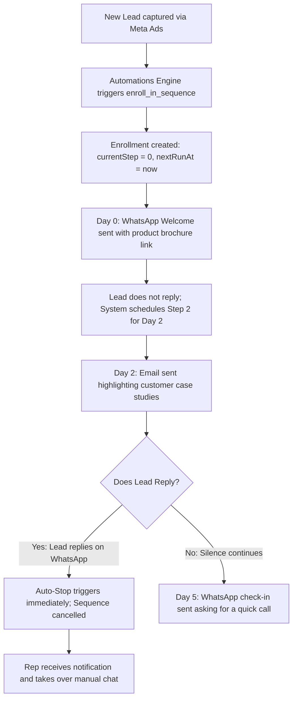

# Ridhzo "Sequences" Engine: Product & Marketing Specification

> **Document Type:** Product Architecture, Feature Analysis & Website Marketing Reference  
> **Target Audience:** Chief Revenue Officers, Sales Directors, Growth Marketers, Account Executives, BDR Managers  
> **Scope:** Sequences Hub (`/sequences`), Sequence Detail & Flow Visualizer (`/sequences/[id]`), Sequence Builder (`SequenceBuilder.tsx`), Interactive Funnel Canvas (`SequenceFlow.tsx`), Automated Worker (`sequenceWorker.ts`), Delivery Engine (`SequenceService.ts`), Send Windows & Quiet Hours (`nextSendableAt`), and Lead Profile Card (`LeadSequencesCard.tsx`).  
> **Source Verification:** Verified against live Ridhzo codebase (`src/app/(dashboard)/sequences/page.tsx`, `src/app/(dashboard)/sequences/[id]/page.tsx`, `SequenceBuilder.tsx`, `SequenceFlow.tsx`, `SequenceRowActions.tsx`, `LeadSequencesCard.tsx`, `sequenceService.ts`, `sequenceWorker.ts`, `src/lib/actions/sequences.ts`, and PostgreSQL schema `src/db/schema/sequences.ts`).

---

## 1. Executive Overview

In high-value sales, customer acquisition is rarely a single-day event. Research proves that prospective buyers take days or weeks to evaluate options, compare competitors, and build internal consensus. When sales teams rely on manual daily reminders to follow up, outreach decays rapidly after day two, leaving massive amounts of pipeline revenue on the table.

**Ridhzo’s Sequences Engine** is an intelligent, multi-channel drip automation system designed to nurture prospects over multi-day or multi-week cadences across **WhatsApp** and **Email**:
1. **Multi-Step Time-Delayed Drips:** Configures ordered communication cadences where steps execute relative to enrollment day (Day 0, Day 2, Day 5, Day 10).
2. **AI-Powered Sequence Drafting:** Revenue leaders describe their objective in plain English (e.g., *"Nurture an enterprise demo lead over 10 days toward a contract review"*), and Ridhzo's AI generates complete multi-step copy, optimal day offsets, and tokenized message bodies.
3. **Interactive Visual Flow & Funnel Tracking (`SequenceFlow.tsx`):** A visual pipeline canvas featuring animated glowing-dot connector rails that illustrates exactly where every prospect is currently positioned in the nurture journey, complete with per-step volume counters and conversion share bars.
4. **Zero-Spam Reply Auto-Stop Protection:** The moment a lead replies via WhatsApp, responds by email, or is marked as `won`, `lost`, or `unqualified`, Ridhzo instantly terminates active enrollments—eliminating embarrassing automated outreach to active conversations.
5. **Timezone-Aware Quiet Hours (`nextSendableAt`):** Steps automatically respect the organization's business hours and timezone, deferring messages scheduled in the middle of the night to the next morning's send window.
6. **Dual-Trigger Enrollment:** Leads can be enrolled manually from their lead profile dossier (`/leads/[id]`) or automatically enrolled by the **Automations Engine** (`/automations`) the moment an inbound ad form is submitted.

```
┌────────────────────────────────────────────────────────────────────────────────────────┐
│                          RIDHZO SEQUENCE LIFECYCLE ARCHITECTURE                        │
└────────────────────────────────────────────────────────────────────────────────────────┘
                                              │
                      ┌───────────────────────┴───────────────────────┐
                      ▼                                               ▼
         [Manual Enrollment on Lead]                       [Automated Enrollment]
          LeadSequencesCard.tsx                             Action: enroll_in_sequence
                      │                                               │
                      └───────────────────────┬───────────────────────┘
                                              ▼
                             ┌─────────────────────────────────┐
                             │  DATABASE: sequence_enrollments │
                             │  currentStep = 0, status=active │
                             │  nextRunAt = now + dayOffset    │
                             └─────────────────────────────────┘
                                              │
                                              ▼
                             ┌─────────────────────────────────┐
                             │  sequenceWorker.ts (BullMQ)     │
                             │  Runs scan every 5 minutes      │
                             │  Atomic 15-minute lease claim   │
                             └─────────────────────────────────┘
                                              │
                                              ▼
                             ┌─────────────────────────────────┐
                             │    SequenceService.runDue()     │
                             └─────────────────────────────────┘
                                              │
                      ┌───────────────────────┴───────────────────────┐
                      ▼                                               ▼
             [QUIET HOURS CHECK]                             [AUTO-STOP GUARDS]
         nextSendableAt(now, window)                      Halts if lead replied on WA/Email
         Defers to morning if off-hours                   or status is won/lost/unqualified
                      │                                               │
                      └───────────────────────┬───────────────────────┘
                                              ▼
                             ┌─────────────────────────────────┐
                             │       MULTI-CHANNEL DISPATCH    │
                             ├────────────────┬────────────────┤
                             │ WhatsApp (BSP) │ Email (Mailer) │
                             └────────────────┴────────────────┘
                                              │
                               [Step Sent Successfully]
                                              │
                                              ▼
                             ┌─────────────────────────────────┐
                             │ Advance: currentStep = step + 1 │
                             │ nextRunAt = createdAt + day * DAY│
                             │ (Status: completed on last step)│
                             └─────────────────────────────────┘
```

---

## 2. Everything Included in the Sequences Subsystem

### A. The Sequences Hub (`/sequences`)
A split-screen productivity interface combining sequence management with rapid authoring:
* **Left Column — Sequence Builder (`SequenceBuilder.tsx`):** Complete authoring studio for creating new sequences from scratch or drafting them via AI.
* **Right Column — Active Directory:** Displays all existing sequences with live step counters (`Layers` icon), active enrollment tallies (`Users` icon), and deep links into detailed funnel flows.
* **Inline Action Bar (`SequenceRowActions.tsx`):**
  * **Pause / Resume (`Play` / `Pause`):** Pauses all outgoing messages across active enrollments with one click.
  * **Edit (`Pencil`):** Navigates to `/sequences/[id]/edit`.
  * **Delete (`Trash2`):** Deletes sequence and cascades cleanup across steps and active runs.

### B. AI-Powered Drip Drafter (`generateSequenceAction`)
Revenue teams no longer need to write 5-step email sequences from scratch:
* **Natural Language Goal Prompt:** Enter an objective (e.g., *"Nurture a new real estate lead over two weeks toward booking an on-site property tour"*).
* **AI Generation (`Sparkles`):** The LLM drafts an optimal multi-step schedule, assigns logical day offsets (e.g., Day 0, Day 2, Day 5, Day 9), selects appropriate channels, and drafts personalized message copy.
* **Instant Customization:** Generated steps populate directly into the editor for review and customization prior to saving.

### C. The Visual Sequence Flow Canvas (`SequenceFlow.tsx`)
Located at `/sequences/[id]`, this visual flow canvas renders the live progression of deals:
* **Dynamic Connector Rails:** CSS-powered vertical rails with glowing dots animating downwards (`seqflow-fall` animation) indicating active prospective traffic.
* **Entry Node (`UserPlus`):** Visual start node indicating total prospective clients currently moving through the sequence (`funnel.active`).
* **Step Cards:**
  * **Numbered Badges:** Distinct step sequencing badges (`1`, `2`, `3`...).
  * **Channel Badges:** WhatsApp (green chip with `MessageSquare` icon) vs. Email (sky-blue chip with `Mail` icon).
  * **Timing Offsets:** Displays execution delay (e.g., `day 0`, `day 2`, `day 5`).
  * **Message Preview:** Truncated message text supporting multi-line spacing.
  * **Attachment Links:** Clickable document chips (`Paperclip` icon) linking to brochures, pricing sheets, or decks.
  * **Live Client Counters:** Displays exact number of leads currently waiting on this step.
  * **Share Distribution Bar:** Dynamic colored progress bar showing what percentage of active leads are positioned on this step.
* **Exit Node (`CheckCircle2`):** Terminal node tracking successfully completed runs (`funnel.completed`) alongside leads removed early due to replies or conversions (`funnel.removed`).

### D. Multi-Channel Message Delivery
* **WhatsApp Cloud API Integration:**
  * Dispatches messages via `WhatsAppService.send`.
  * Formats attachments cleanly: `${rendered}\n\n📎 ${label}: ${attachmentUrl}`.
  * *Mode Guard:* If tenant operates in Personal WhatsApp mode without BSP, automated sends are prevented and logged as manual follow-up notes on the lead's timeline.
* **Rich Email Dispatch:**
  * Dispatched via `sendEmail` with HTML line breaks and embedded attachment links.
  * Logs an activity entry with type `email` and content preview.
* **Dynamic Personalization Tokens (`renderTokens`):**
  * `{{first_name}}` (extracts first name from full name string)
  * `{{name}}` (full customer name)
  * `{{company}}` (client organization name)
  * `{{email}}` (prospect email)
  * `{{phone}}` (contact phone number)

### E. In-Dossier Lead Card (`LeadSequencesCard.tsx`)
Embedded inside the customer profile at `/leads/[id]`:
* **Active Status Display:** Lists all sequences the lead is currently enrolled in, along with status pills (`active`, `completed`, `stopped`).
* **1-Click Manual Enrollment:** Reps can tap **"+ Add to Sequence"**, selecting from a modal list of available sequences.
* **Manual Stop Control:** Reps can click **"Stop"** on any active enrollment to instantly halt further automated outreach.

---

## 3. Autonomous Engine & Reliability Architecture

### Database Schema (`src/db/schema/sequences.ts`)

Ridhzo structures drip campaigns into three normalized relational tables:

```typescript
export const sequences = pgTable("sequences", {
  id: uuid("id").defaultRandom().primaryKey(),
  organizationId: uuid("organization_id").references(() => organizations.id, { onDelete: "cascade" }).notNull(),
  name: varchar("name", { length: 255 }).notNull(),
  description: text("description"),
  isActive: boolean("is_active").default(true).notNull(),
  createdAt: timestamp("created_at").defaultNow().notNull(),
});

export const sequenceSteps = pgTable("sequence_steps", {
  id: uuid("id").defaultRandom().primaryKey(),
  sequenceId: uuid("sequence_id").references(() => sequences.id, { onDelete: "cascade" }).notNull(),
  stepIndex: integer("step_index").notNull(),
  dayOffset: integer("day_offset").default(0).notNull(), // Days from enrollment
  channel: varchar("channel", { length: 10 }).default("whatsapp").notNull(), // 'whatsapp' | 'email'
  body: text("body").notNull(),
  attachmentUrl: varchar("attachment_url", { length: 2048 }),
  attachmentName: varchar("attachment_name", { length: 255 }),
}, (t) => ({
  seqIdx: index("sequence_steps_seq_idx").on(t.sequenceId, t.stepIndex),
}));

export const sequenceEnrollments = pgTable("sequence_enrollments", {
  id: uuid("id").defaultRandom().primaryKey(),
  sequenceId: uuid("sequence_id").references(() => sequences.id, { onDelete: "cascade" }).notNull(),
  leadId: uuid("lead_id").references(() => leads.id, { onDelete: "cascade" }).notNull(),
  organizationId: uuid("organization_id").references(() => organizations.id, { onDelete: "cascade" }).notNull(),
  currentStep: integer("current_step").default(0).notNull(),
  status: varchar("status", { length: 10 }).default("active").notNull(), // 'active' | 'completed' | 'stopped'
  retryCount: integer("retry_count").default(0).notNull(),
  nextRunAt: timestamp("next_run_at"),
  createdAt: timestamp("created_at").defaultNow().notNull(),
}, (t) => ({
  dueIdx: index("sequence_enrollments_due_idx").on(t.status, t.nextRunAt),
  leadIdx: index("sequence_enrollments_lead_idx").on(t.leadId),
}));
```

---

## 4. Operational Intelligence & Safety Guards

### 1. The Zero-Spam Auto-Stop Radar (`stopForLead`)
A fatal flaw in standard email marketing tools is sending automated "Just following up!" emails to prospects who are already actively conversing with a sales rep.

Ridhzo enforces automated cross-system cancellation via `SequenceService.stopForLead(leadId, reason)`:
* **WhatsApp Inbound Reply:** When a customer replies to a WhatsApp message, the webhook listener immediately halts all active sequences:
  ```typescript
  await SequenceService.stopForLead(lead.id, "lead replied on WhatsApp");
  ```
* **Email Inbound Reply:** When an inbound email arrives via mailhooks:
  ```typescript
  await SequenceService.stopForLead(lead.id, "lead replied by email");
  ```
* **Deal Won or Lost:** When a rep moves a deal to `won`, `lost`, or `unqualified`:
  ```typescript
  await SequenceService.stopForLead(p.leadId, `lead marked ${p.newStatus}`);
  ```
* **Timeline Audit Logging:** Every auto-stop injects a clear explanation onto the lead timeline:  
  *`"Sequence stopped — lead replied on WhatsApp."`*

### 2. Timezone-Aware Quiet Hours (`nextSendableAt`)
Ridhzo prevents messages from waking clients up at 3:00 AM:
* Evaluates tenant organization configuration: `organizations.timezone`, `sequenceWindowStart`, and `sequenceWindowEnd` (e.g., 09:00 to 18:00).
* **Wrap-Around Support:** Supports overnight quiet periods (e.g., 20:00 to 06:00).
* **Automatic Deferral:** If a sequence step becomes due at 11:00 PM, `nextSendableAt` detects the window violation and defers `nextRunAt` to 9:00 AM the following morning.

### 3. Atomic Lease Claiming & Concurrency Protection
To prevent duplicate messages when multiple background workers or serverless containers execute:
* In `SequenceService.runDue`:
  ```sql
  UPDATE sequence_enrollments 
  SET next_run_at = now + 15 minutes 
  WHERE id = :id AND status = 'active' AND next_run_at <= now 
  RETURNING id;
  ```
* Only the worker that successfully claims the 15-minute lease executes the send. Concurrent workers see `nextRunAt` pushed into the future and safely skip it.

### 4. Exponential Retry Backoff & Permanent Failure Detection
* **Transient Network Errors:** If an external API (Meta or Mailer) fails temporarily, the enrollment retries up to 3 times with a 10-minute linear backoff (`retryCount + 1 * 10 minutes`).
* **Permanent Delivery Blocks:** If a lead lacks an email or phone number, or the organization has no WhatsApp Business API configured, the engine flags the failure as permanent. It advances the sequence rather than stalling, logging a manual reminder:  
  *`"Sequence step (whatsapp) not sent — send manually."`*

---

## 5. Master Data Points & Operational Metrics

| Metric / Attribute | Source Component / Service | Technical Calculation | Operational Business Value |
| :--- | :--- | :--- | :--- |
| **Active Enrollments** | `SequenceDetailPage` / `SequenceFlow` | `COUNT(enrollments) WHERE status='active'` | Measures current live prospective engagement across the sequence. |
| **Completed Enrollments** | `SequenceFlow` (Exit Node) | `COUNT(enrollments) WHERE status='completed'` | Tracks prospective clients who received the entire nurture curriculum. |
| **Removed Early** | `SequenceFlow` (Exit Node) | `COUNT(enrollments) WHERE status='stopped'` | Measures leads who converted, replied, or were unenrolled before the final step. |
| **Step Client Density** | `SequenceFlow` (Step Card) | `COUNT(enrollments) WHERE currentStep = stepIndex` | Identifies bottlenecks and drop-off points in the nurture flow. |
| **Step Share (%)** | `SequenceFlow` (Share Bar) | $\frac{\text{Clients at Step}}{\text{Total Active Enrolled}} \times 100$ | Visualizes pipeline flow distribution across stages. |
| **Total Duration** | `SequenceDetailPage` | $\max(\text{steps.dayOffset})$ | Displays the total lifespan of the nurture cadence (e.g., "over 14 days"). |

---

## 6. Daily Sales & Management Workflows

### 1. Inbound Lead Auto-Nurture Flow


### 2. The Rep's One-Click Profile Enrollment
1. **Discovery Complete:** Rep finishes a call with a prospect on `/leads/[id]` who isn't ready to buy today.
2. **Open Lead Sequences Card:** Rep clicks **"+ Add to Sequence"**.
3. **Select Campaign:** Rep chooses *"30-Day Long-Term Stay-in-Touch"* and clicks **Enroll**.
4. **Autonomous Execution:** The prospect receives automated check-ins over the next month without the rep having to remember manual calendar reminders.

---

## 7. Marketing-Friendly Feature Explanation

### Why Revenue Teams Rely on Ridhzo Sequences

In modern B2B sales, 95% of your target market is not ready to buy today. If your sales reps only focus on the 5% with immediate budget, 95% of your lead generation spend is wasted. Yet asking reps to manually check in with hundreds of cold prospects every few days is impossible.

**Ridhzo Sequences turns forgotten leads into closed deals with autonomous multi-channel drips.**

* **Put Long-Term Nurturing on Autopilot:** Automatically guide prospects across multi-day WhatsApp and email sequences that keep your company top-of-mind until they are ready to purchase.
* **Never Spam an Active Deal:** Ridhzo’s intelligent reply radar listens across WhatsApp and email. The second a customer replies or books a call, the sequence stops instantly—ensuring your team always looks professional.
* **AI-Generated Campaigns in Seconds:** Stop staring at a blank screen. Describe what you want to achieve, and our AI drafts complete multi-step sequences with proven messaging and timing.
* **Respect Business Hours Automatically:** Never worry about sending automated messages at midnight. Ridhzo’s quiet-hours intelligence ensures every message lands cleanly during business hours in your customer's timezone.
* **Visual Flow Analytics:** Watch deals move through your sequence with our animated pipeline flow visualizer. See exactly how many prospects are at each step and where conversions happen.

---

## 8. Feature List for Website Marketing

* **Multi-Channel WhatsApp & Email Sequences**  
  Nurture prospects across the channels they check most, combining direct WhatsApp messaging with formal email follow-ups.

* **AI-Powered Drip Sequence Generator**  
  Turn a one-sentence sales goal into a full 5-step nurture sequence complete with copy and time offsets in seconds.

* **Instant Reply Auto-Stop Protection**  
  Automatically halts sequences the moment a prospect replies on WhatsApp, responds via email, or is marked Won or Lost.

* **Interactive Animated Funnel Visualizer**  
  A visual flow canvas with glowing-dot connector rails illustrating active customer density and step-by-step conversion rates.

* **Timezone-Aware Quiet Hours Engine**  
  Automatically defers messages scheduled during off-hours, ensuring outreach arrives cleanly during working business windows.

* **Relative Day Offset Scheduling**  
  Steps execute automatically relative to enrollment day (Day 0, Day 2, Day 7, Day 14) with zero manual rescheduling.

* **Clickable Document & Media Attachments**  
  Deliver product brochures, pricing guides, and presentation decks directly within WhatsApp and email sequence steps.

* **Dynamic Personalization Tokens**  
  Personalize outreach at scale with automatic token substitution for `{{first_name}}`, `{{name}}`, `{{company}}`, and `{{phone}}`.

* **1-Click Profile Dossier Enrollment**  
  Enroll individual prospects or entire segments directly from lead profile pages or via automated workflow rules.

---

## 9. Page Blueprints & Wireframes

### Sequences Hub Layout (`/sequences`)
```
+====================================================================================+
| [GitFork] Sequences                                                                |
| "Multi-step WhatsApp & email drips. Enroll leads from any lead page."               |
+====================================================================================+
| NEW SEQUENCE (LEFT COLUMN)                 | YOUR SEQUENCES (RIGHT COLUMN)         |
|                                            |                                       |
| Name: [ Inbound Demo Follow-up           ] | +-----------------------------------+ |
| Describe goal (AI will draft):             | | New Lead Welcome & Nurture        | |
| [ Follow up after demo over 10 days ]      | | [Layers] 4 steps  [Users] 28 active| |
| [Sparkles Draft with AI]                   | | [Pause] [Edit] [Trash]            | |
|                                            | +-----------------------------------+ |
| STEPS                                      | | Enterprise Long-Term Stay-in-Touch| |
| +----------------------------------------+ | | [Layers] 6 steps  [Users] 92 active| |
| | Day [ 0 ]  [ WhatsApp               v] | | [Play] [Edit] [Trash]             | |
| | Message: Hi {{first_name}}, thanks for | +-----------------------------------+ |
| | Attachment: [Brochure] [https://...]   | | Lost Deal Re-engagement           | |
| +----------------------------------------+ | | [Layers] 3 steps  [Users] 14 active| |
| | Day [ 2 ]  [ Email                  v] | | [Pause] [Edit] [Trash]            | |
| | Message: Wanted to share our case study| +-----------------------------------+ |
| +----------------------------------------+ |                                       |
| [+ Add step]           [Save sequence]     |                                       |
+====================================================================================+
```

### Sequence Flow Detail View (`/sequences/[id]`)
```
+====================================================================================+
| [<- Back]  Inbound Demo Follow-up           [Active]  [Pencil Edit]                |
| "4 steps over 10 days"                                                             |
+====================================================================================+
| [UserPlus] New leads enter here                                                    |
| Enrolled manually or by an automation                        [ 28 in sequence ]    |
+------------------------------------------------------------------------------------+
|                                     : (animated glowing rail)                      |
+------------------------------------------------------------------------------------+
| [1] [WhatsApp]  [Clock Day 0]                                                      |
| "Hi {{first_name}}, thanks for joining today's walkthrough! Here is the deck..."   |
| [Paperclip Presentation Deck]                                [ 12 people here ]    |
| [====================================              ] 43% share                     |
+------------------------------------------------------------------------------------+
|                                     :                                              |
+------------------------------------------------------------------------------------+
| [2] [Email]  [Clock Day 3]                                                         |
| "Wanted to check if you had a chance to review the pricing options..."             |
|                                                              [  9 people here ]    |
| [===========================                       ] 32% share                     |
+------------------------------------------------------------------------------------+
|                                     :                                              |
+------------------------------------------------------------------------------------+
| [3] [WhatsApp]  [Clock Day 7]                                                      |
| "Quick check-in — would you like to schedule a 15-minute Q&A with our engineer?"   |
|                                                              [  7 people here ]    |
| [=====================                             ] 25% share                     |
+------------------------------------------------------------------------------------+
|                                     :                                              |
+------------------------------------------------------------------------------------+
| [CheckCircle2] Finished the sequence                                               |
| 14 removed early (replied on WhatsApp)                       [ 142 completed ]     |
+====================================================================================+
```

---

## 10. Technical Reference

### Routes & Page Controllers
* **Sequences Directory:** [`src/app/(dashboard)/sequences/page.tsx`](file:///Users/naveenadicharla/Documents/ridhzo/src/app/(dashboard)/sequences/page.tsx)
* **Sequence Detail:** [`src/app/(dashboard)/sequences/[id]/page.tsx`](file:///Users/naveenadicharla/Documents/ridhzo/src/app/(dashboard)/sequences/[id]/page.tsx)
* **Sequence Edit:** [`src/app/(dashboard)/sequences/[id]/edit/page.tsx`](file:///Users/naveenadicharla/Documents/ridhzo/src/app/(dashboard)/sequences/[id]/edit/page.tsx)

### UI Components (`src/components/sequences/`)
* **Interactive Canvas:** [SequenceFlow.tsx](file:///Users/naveenadicharla/Documents/ridhzo/src/components/sequences/SequenceFlow.tsx)
* **Sequence Builder:** [SequenceBuilder.tsx](file:///Users/naveenadicharla/Documents/ridhzo/src/components/sequences/SequenceBuilder.tsx)
* **Row Actions:** [SequenceRowActions.tsx](file:///Users/naveenadicharla/Documents/ridhzo/src/components/sequences/SequenceRowActions.tsx)
* **Lead Dossier Card:** [LeadSequencesCard.tsx](file:///Users/naveenadicharla/Documents/ridhzo/src/components/leads/LeadSequencesCard.tsx)

### Core Engine & Services
* **Sequence Domain Service:** [`src/domains/leads/sequenceService.ts`](file:///Users/naveenadicharla/Documents/ridhzo/src/domains/leads/sequenceService.ts) (`create`, `update`, `enroll`, `runDue`, `stopForLead`, `nextSendableAt`, `deliver`)
* **AI Generation Action:** `generateSequenceAction` in [`src/lib/actions/ai.ts`](file:///Users/naveenadicharla/Documents/ridhzo/src/lib/actions/ai.ts)
* **Server Actions:** [`src/lib/actions/sequences.ts`](file:///Users/naveenadicharla/Documents/ridhzo/src/lib/actions/sequences.ts) (`createSequenceAction`, `updateSequenceAction`, `enrollLeadsAction`, `stopEnrollmentAction`, `setSequenceActiveAction`, `deleteSequenceAction`)

### Background Distributed Workers
* **Sequence Cron Runner:** [`src/lib/jobs/workers/sequenceWorker.ts`](file:///Users/naveenadicharla/Documents/ridhzo/src/lib/jobs/workers/sequenceWorker.ts) (`createSequenceWorker`, `scheduleSequenceScan` on queue `sequence-runner` every 5 minutes)

### Database Schema Tables (`src/db/schema/sequences.ts`)
* `sequences`: Sequence metadata, name, and active toggle.
* `sequenceSteps`: Step definitions, day offsets, channels, message bodies, and attachment URLs.
* `sequenceEnrollments`: Lead run records with `currentStep`, lease locks on `nextRunAt`, status, and retry counts.
